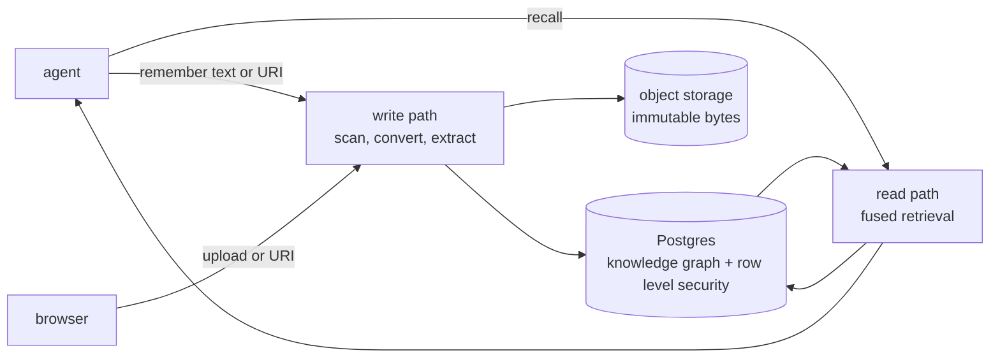

<div align="center">

<!-- [](https://phvv.me/aizk) -->

[](https://github.com/phvv-me/aizk/actions/workflows/ci.yml)
[](https://github.com/phvv-me/aizk/actions/workflows/publish.yml)
[](https://pypi.org/project/aizk/)
[](https://pypi.org/project/aizk/)
[](https://phvv.me/aizk)
[](https://github.com/phvv-me/aizk/actions/workflows/ci.yml)

</div>

[🇧🇷](https://phvv.me/aizk/pt-BR/) [🇲🇽](https://phvv.me/aizk/es/) [🇯🇵](https://phvv.me/aizk/ja/) [🇨🇳](https://phvv.me/aizk/zh/)

A self-hosted shared memory engine for people, teams, and MCP agents

## What this is

aizk is a memory an AI assistant can actually keep. Text, files, and public HTTPS sources become an
entity and fact knowledge graph, addressed by meaning so the same knowledge extracted twice never
duplicates. PostgreSQL owns all authority, metadata, temporal state, and queued work. Immutable
file bytes live in private S3-compatible storage. Row level security enforces who can see what at
the database layer, so private notes, shared projects, and overlapping groups never cross. It
speaks MCP, so Claude or any other MCP-capable assistant calls it directly. Full explanation at
[phvv.me/aizk](https://phvv.me/aizk).

## Quickstart

One command brings up PostgreSQL, object storage, malware scanning, document conversion, model
services, and one hardened Aizk image. Compose runs
that image as a one-shot migration service, a forced-RLS MCP server, and a private background
worker. Its public profile also runs a SvelteKit browser interface and a forced-RLS browser
JSON API behind one Caddy origin. Public processes never receive the database-owner
credential.

```sh
docker compose --env-file .env -f src/deploy/docker-compose.yml up -d
```

Then call its tools from any MCP client.

```python
from fastmcp import Client

async with Client("http://localhost:8080/mcp") as client:
    await client.call_tool("remember", {"text": "aizk runs entirely on local hardware."})
    result = await client.call_tool("recall", {"query": "where does aizk run?"})
    print(result.data)
```

Every secret and deployment override is documented in `src/deploy/.env.example`. The committed
nonsecret Logto role and permission policy lives in `src/deploy/logto.conf`, and `.env` overrides any
matching value. Copy the example to `.env`, generate independent database passwords, and run
Compose from the package root. Every host port binds to loopback. The optional public profile
opens an outbound Cloudflare Tunnel, reconciles Logto, and starts MCP only after its authentication
preflight succeeds. See
[Operations](https://phvv.me/aizk/operations/) for storage and backups, and
[Security](https://phvv.me/aizk/security/) for the production release gate.
See [Onboarding](ONBOARDING.md) to add a collaborator, create a shared organization, and connect
Claude Code, Codex, or OpenCode.

## The flows



Writing turns authored text or Docling-normalized artifacts into a typed entity and fact graph,
one content row shared by meaning plus
one scoped, bi-temporal claim per owner. Reading fuses five retrieval lanes behind one Postgres
round trip, filtered to exactly what the caller's own scopes make visible before a row is ever
considered. The full breakdown of both, with a diagram for each stage, lives in
[Engine](https://phvv.me/aizk/engine/).

Text is the preferred memory input. When exact source bytes matter, AIZK accepts an original up to
10 MiB, scans it, compresses it when worthwhile, and stores only that original as an object Blob.
Companion text, normalized Markdown, Docling JSON, and metadata stay in PostgreSQL. Unsupported
conversion still yields a recallable metadata document. Sharing creates a new authorized scope
reference to the same physical Blob instead of uploading another copy.

The optional observability profile collects every Compose service log through Alloy and Loki into
a loopback-only Grafana. Durable PostgreSQL usage events separately account for recalls, memories,
file transfers, shares, logical scope storage, physical Blob bytes, and compression savings.

Self-describing Markdown may declare any live ontology kind with `- Type <kind>` and any typed
relation with `- <predicate> [<object kind>] <object name>`. Projects and areas use this generic
ontology path rather than dedicated metadata fields.

Generic source tags use `#<kind>: <entity name>`. A same-name tag declares the heading as that live
ontology kind, while other tags connect the note to typed entities through `related_to`. For
example, supporting AIZK notes can use `#project: AIZK Productization` and `#area: Business` without
adding Project or Area to application enums.
