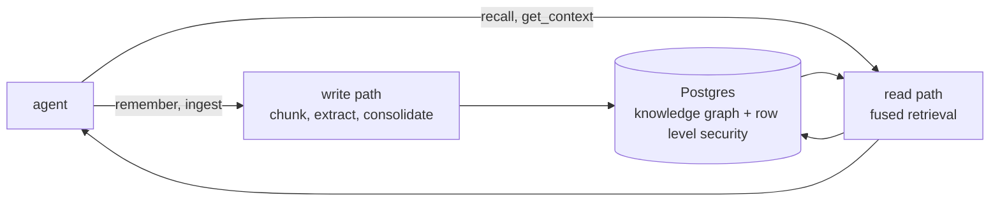

<div align="center">

<!-- [](https://phvv.me/aizk) -->

[](https://github.com/phvv-me/aizk/actions/workflows/ci.yml)
[](https://github.com/phvv-me/aizk/actions/workflows/publish.yml)
[](https://pypi.org/project/aizk/)
[](https://pypi.org/project/aizk/)
[](https://phvv.me/aizk)
[](https://github.com/phvv-me/aizk/actions/workflows/ci.yml)

</div>

[🇧🇷](https://phvv.me/aizk/pt-BR/) [🇲🇽](https://phvv.me/aizk/es/) [🇯🇵](https://phvv.me/aizk/ja/) [🇨🇳](https://phvv.me/aizk/zh/)

A self-hosted multi-tenant memory engine that turns a Zettelkasten into scoped agent-queryable memory over MCP

## What this is

aizk is a memory an AI assistant can actually keep. Text goes in, an entity and fact knowledge
graph comes out, addressed by meaning so the same knowledge extracted twice never duplicates.
Everything lives in one self-hosted Postgres, and row level security enforces who can see what
at the database layer, private notes, shared projects, and overlapping groups never cross. It
speaks MCP, so Claude or any other MCP-capable assistant calls it directly. Full explanation at
[phvv.me/aizk](https://phvv.me/aizk).

## Quickstart

One command brings up the whole engine, Postgres, the embed, rerank, and extraction containers,
and one aizk container that is the MCP server, the background worker, and the scheduled auto-backup
at once. It migrates and comes up ready over HTTP with nothing else to run.

```sh
docker compose -f deploy/docker-compose.yml up -d
```

Then call its tools from any MCP client.

```python
from fastmcp import Client

async with Client("http://localhost:8080/mcp") as client:
    await client.call_tool("remember", {"text": "aizk runs entirely on local hardware."})
    result = await client.call_tool("recall", {"query": "where does aizk run?"})
    print(result.data)
```

Every docker-compose knob and every `Settings` default live in one file, `deploy/.env.example`,
copy it to `deploy/.env` and edit, both compose and the app read the same `AIZK_`-prefixed
variables. Running
the server, worker, or backup outside the container is a plain `pip install aizk` and the matching
`aizk` command. See [Operations](https://phvv.me/aizk/operations/) for deployment and backups.

## The flows



Writing turns text into a typed entity and fact graph, one content row shared by meaning plus
one scoped, bi-temporal claim per owner. Reading fuses five retrieval lanes behind one Postgres
round trip, filtered to exactly what the caller's own scopes make visible before a row is ever
considered. The full breakdown of both, with a diagram for each stage, lives in
[Engine](https://phvv.me/aizk/engine/).
