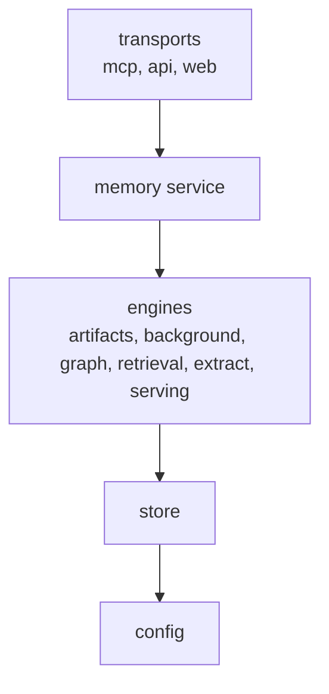

# Architecture rules

This page is the definition of record for how aizk is put together. The eight rules came out
of the architecture audit, each with its one-line rationale, and the import contracts at the
bottom make the layering executable rather than aspirational. Tooling that automates
architecture checks starts from exactly this page.

## Layers

Dependencies point strictly downward. A module may import anything beneath it and nothing
above it.

The diagram shows the spine. The enforced layer contract in `pyproject.toml` is exhaustive
over every top-level package, so the support packages (`admin`, `auth`, `backup`, `cli`,
`common`, `exceptions`, `export`, `integrations`, `ontology`, `ops`, `provenance`,
`runtime`, `storage`, `types`, and `usage`) each hold an explicit layer with the same
downward direction, and a new package fails the lint gate until it is assigned one.
`config` is a leaf that imports nothing internal, which its independent bottom-layer
placement enforces, so any module can read settings without pulling in the rest of the
engine.

## The eight rules

1. **SQL lives in the store.** Every statement is composed inside `store`, and transports and
   services read through `User.exec` or a model method, so the complete query surface is
   auditable in one place.
2. **Queries are model classmethods.** A statement is a classmethod on the model that owns its
   primary table or view, matching the `LiveFact.touching` precedent, so the schema and the
   queries that depend on it change together.
3. **Patos models over `__init__` and manual validation.** Pydantic validators and constrained
   types on the `patos` bases replace hand-written constructors and raise-on-bad-input blocks,
   so invariants are declared once and enforced at every boundary.
4. **Maintained libraries over hand clients.** Generated or maintained clients replace
   hand-rolled HTTP and protocol code, so upstream fixes arrive by upgrade instead of by patch.
5. **Composition root over singletons.** `runtime.py` builds every shared service once from
   settings, so wiring is visible in one file and tests swap dependencies without patching
   globals.
6. **Span-based usage.** Usage accounting reads the spans the code already emits instead of
   threading counters through call sites, so measurement never distorts the code being
   measured.
7. **Template-owned markdown.** Every user-facing markdown surface renders from a Jinja
   template, so prose changes never touch Python and formatting stays in one language.
8. **No duplicate projections.** One row model per projection shape, shared by every reader,
   so a field change cannot silently fork a wire format.

## Enforced contracts

[import-linter](https://import-linter.readthedocs.io/) reads `[tool.importlinter]` in
`pyproject.toml` and fails the lint gate when a contract breaks.

| Contract | Type | What it guarantees |
| --- | --- | --- |
| Every aizk package sits in one enforced layer | layers | the layer diagram made exhaustive over every top-level package, with `mcp` and `api` independent of each other, the leaves (`config`, `types`, `exceptions`, `provenance`, `common`) mutually independent at the bottom, and any unassigned new package breaking the gate |
| Non-SQL packages reach the store only through model methods and `User.exec` | forbidden | every package outside the documented SQL-composing set never imports `sqlmodel` or `sqlalchemy`, and `tests/test_contracts.py` keeps that split exhaustive as packages appear |

Ruff overlays in `src/aizk/mcp/ruff.toml` and `src/aizk/api/ruff.toml` extend the package
configuration and ban `sqlmodel.select` and the session APIs inside the transports through
`TID251`, catching the call sites the import contracts cannot see.

The gate runs as `lint-imports` in the CI lint job, and locally as
`chefe run lint-imports-aizk` from the monorepo root.
