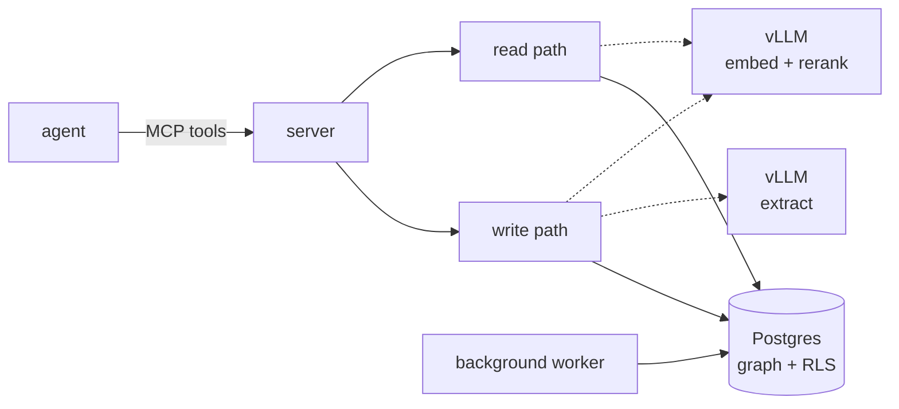

# The engine

aizk is a self-hosted shared brain. One Postgres holds a bi-temporal knowledge graph under
forced row level security, so private notes, project scopes, and implicit intersection graphs
never cross, and every capability is an MCP tool an agent calls. Nothing leaves the building.
New to a term on this page? [Concepts](../concepts.md) covers the vocabulary in plain language
first.

The engine splits into five parts, each with its own page.

- [Write path](write-path.md), how text becomes a knowledge graph at one LLM call per chunk
- [Store](store.md), the content and claim union model and the bi-temporal core
- [Lattice](lattice.md), the scope-set visibility model row level security enforces
- [Read path](read-path.md), five retrieval lanes fused into one recall call
- [Autonomy](autonomy.md), the background passes that maintain the graph

The measured results live in [Benchmarks](../benchmarks.md), the honest side-by-side against
grep, qmd, and the engines the papers came from lives in [Comparison](../comparison.md), and
the map from every mechanism back to its paper lives in [Provenance](../provenance.md).

## Two governing principles

**Agentic first.** Every capability is a tool the agent calls. The logic lives once in the
engine and is exposed over MCP, so a scope name never crosses tenants and there are no UIs.

**Minimize own work.** aizk builds only the differentiated core, the RLS temporal graph, and
rents everything else. Identity is Zitadel, serving is vLLM, the queue is pgqueuer, and the ORM
is SQLModel.
