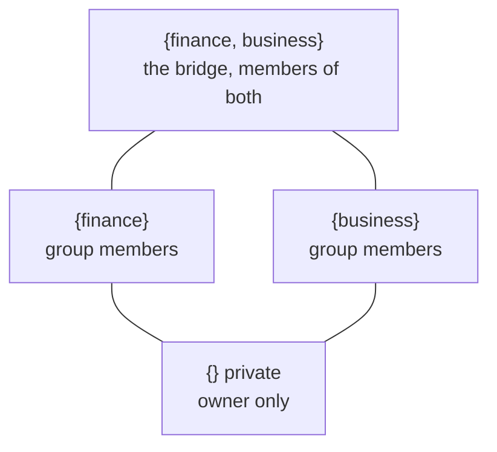

# The scope-set lattice

Every row carries `scopes uuid[]`, a set of groups. The empty set is private to its owner. A
singleton is an ordinary shared group. Any larger set is an implicit intersection graph. A
claim scoped to both finance and business is readable only by someone who is a member of both
groups and writable only with writer standing in all of them, with no administered
finance-and-business group existing anywhere. For a user in n groups, every subset of those
groups is a potential space where knowledge can live.

## The rules

- **Read.** Own the row, or your memberships contain the whole set, or the set is exactly one
  public group's singleton. Public sharing never widens an intersection.
- **Write.** Private, or writer-or-admin standing in every group of the set. Postgres itself
  refuses the insert otherwise, verified live.
- **Lens.** A reading projection. The finance lens shows pure-finance claims only, neither the
  bridge nor your private layer. The combined finance-and-business lens adds the bridge. No
  lens shows your whole visible union.
- **Group deletion demotes, never widens.** Deleting business sends every set containing
  business to private, because removing one element would leak the bridge into plain finance.
- **Curation.** A curated group's facts wait unreviewed and invisible until a group admin
  approves them, and that admin is usually the standing LLM reviewer judging against the
  group's own approved canon. Promotion into a wider set is a deliberate, audited copy that
  outranks equal-scored hits.

## Enforcement

All of it is forced Postgres row level security compiled from declarative policies on the
models. The app role cannot bypass it, anonymous callers get a rate-limited read-only view of
public singletons, and the test suite proves the compiled policies against an independent
Python specification across the full principal, role, scope-set, and lens cross-product. No
open memory engine offers a multi-tenant graph with per-row isolation.

The generic policy machinery ships as its own package,
[phvv-me/rls](https://github.com/phvv-me/rls). A model declares its policies as SQLAlchemy
expressions, a mapper hook collects them, alembic applies them, and a sqlglot comparator diffs
the compiled text against the live catalog.
