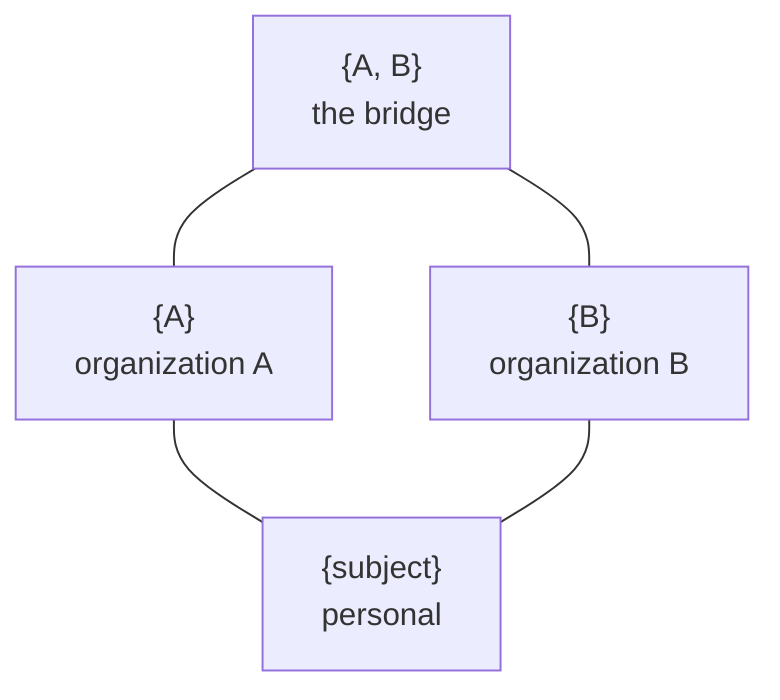

# The scope-set lattice

The intersection lattice is a permanent collaboration rule. Every scoped row carries a sorted,
duplicate-free, nonempty `scopes uuid[]` key. See [Identity and sharing](identity.md).

A personal UUID derived from the Logto subject holds private memory. One organization UUID holds
ordinary team memory. Any larger set is an intersection graph. A claim in Toshiba and SPReAD is
readable only by someone with readable standing in both and writable only with writer standing in
both. No local combined organization needs to exist.

## Why the array stays

The set containing A and B is the bridge corpus that only members of both organizations can read.
Replacing the array with one organization or a local scalar space would remove this capability.
Background work therefore uses the canonical scope set as its partition key.

## The rules

- **Read.** The complete row scope must be contained by the token's readable standing. A public
  organization admits only its singleton and never widens an intersection.
- **Write.** The complete row scope must be contained by writable standing. A personal singleton
  is the default destination. Effective organization permissions returned by Logto let a write
  name one organization or an explicit intersection.
- **Retrieval.** No query-time scope selector exists. The database returns every row contained by
  the User's complete readable standing, so standing in A and B includes A, B, and A-and-B.
- **Provenance.** `created_by` records who or which service produced a row. It grants no read,
  update, share, or delete authority.
- **Public access.** Logto `customData.public` is loaded through a fail-closed M2M directory. An
  anonymous caller has no implicit personal scope and cannot write.

## Enforcement

Forced Postgres row level security compiles from declarative SQLAlchemy expressions on the models.
The app role cannot bypass it. Property tests compare the live policies with an independent Python
scope-containment specification across personal, organization, intersection, public, and
creator combinations.

The generic policy machinery ships as [phvv-me/rls](https://github.com/phvv-me/rls). A model
declares policies as ORM expressions granted to the app role, Alembic applies them, and a sqlglot
comparator diffs their compiled form against the live catalog. The transaction-local settings the
policies read come from one typed `User` context. Pydantic serializes `User.scopes` as one JSON
setting with `read`, `write`, and `public` fields. Policies convert only each JSON permission to a
native `uuid[]`, then compare the bare row `scopes` array with PostgreSQL containment. This keeps
the GIN scope index usable. Every mapped table must either declare policies or opt out explicitly,
and a session binds the same class the predicates read from.
