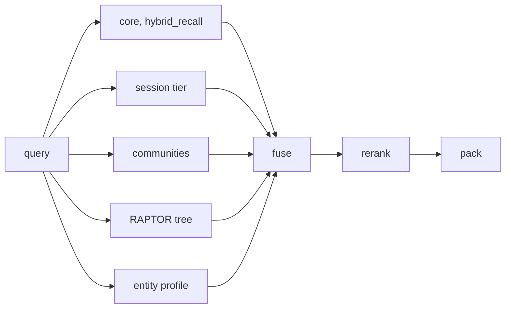

# The read path

`recall()` is the one retrieval verb. Five lanes run concurrently, each on its own
boundary-owned session, and everything visibility-related is the database's problem. The lanes
just query, and row level security composes the caller's world.

## hybrid_recall, one SQL statement

The core lane is a single `language sql, stable` Postgres function. A dense vchordrq scan, a
BM25 lexical scan, reciprocal-rank fusion, a promoted-provenance bonus, a fact lane over the
`live_fact` view, and one-hop neighbors all fuse before the row ever reaches Python, all under
the caller's own row level security since a SQL function carries no privilege of its own.

Two hard-won details live in it. The document join is deferred past the LIMIT because joining
early silently defeated both index scans (89 ms down to 22.7 ms). And reranking truncates
candidates to 320-character snippets because cross-encoder latency scales with text length,
not count (900 ms down to 50 ms).

## Where the time goes, span-measured

| Stage | Warm ms | Share | Note |
|---|---|---|---|
| hybrid_recall SQL | 125 | 44% | index scans confirmed by EXPLAIN under RLS |
| personalized pagerank | 99 | 33% | the recursive CTE re-scans per hop, a MATERIALIZED hint halves it (verified, queued) |
| cross-encoder rerank | 53 | 18% | HTTP round trip to the rerank container |
| total in-process | ~295 | | ~475 ms end to end over stdio MCP with serialization and transport |

Numbers taken on the full graph of 16,162 entities and 20,396 facts. The always-on span
profiler (mainboard) turns this table into one `profile_report()` call, and a disabled span
costs 0.2 microseconds.

## Beyond the lanes

Query routing classifies a query as local, global, or multi-hop and narrows the mix to that
route's lanes. It ships gated behind `AIZK_QUERY_ROUTING` pending an eval A/B, and the config
sweep argues for it, since the cheap-lanes-only config beat the full default on the small eval
set at a third of the latency. An evidence-gap check re-retrieves once with an expanded query
vector when the first round comes back thin.
