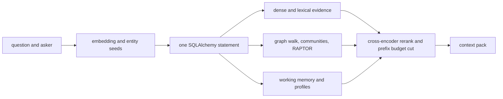

# The read path

`recall()` is the retrieval entry point. It embeds the asker-aware query and always runs the
maximal plan, every lane on in facts-first order, with no query-time route classification. A
misrouted query loses community and RAPTOR evidence the reranker cannot recover, and the
zero-shot router measured 44% accuracy on the eval strata, so PostgreSQL ranks all visible
evidence in one statement and Python cuts the token budget after reranking.

## Typed recall statement

`build_recall_statement()` lays out one SQLAlchemy statement in execution order from mapped table
columns, vector distance operators, PostgreSQL text functions, CTEs, window functions, and unions.
There is no stored recall function and no handwritten runtime query string. SQLAlchemy owns
aliases, parameters, joins, and the compact result shape.

Hybrid source search means that a semantic vector lane and an exact-word lexical lane each collect
a bounded candidate pool. Reciprocal rank fusion combines their positions rather than trying to
compare incompatible raw scores. A result at rank `r` contributes `1 / (rrf_k + r)`, and a chunk
found by both lanes receives both contributions. The document join happens only after fusion,
which preserves index-friendly top-k scans.

Fact retrieval first asks the `FactContent` vector index for a bounded candidate set, then joins
only those rows to current `FactClaim` records. This keeps immutable embeddings separate from
scope and time while avoiding a full scan through the security-barrier view. The graph expansion
is a bounded recursive walk whose lateral adjacency probe uses the subject and object indexes for
each reached entity, and the community and RAPTOR lanes ride the same statement. The eval plan
study keeps the narrower historical shapes constructible for comparison, but production never
selects among them.

RAPTOR means Recursive Abstractive Processing for Tree-Organized Retrieval. It clusters related
memories, summarizes each cluster, and repeats that process into a hierarchy. Global recall reads
the root summaries as broad overviews while ordinary facts remain the grounded evidence below
them.

VectorChord provides the default vector and BM25 indexes. Native PostgreSQL full text and HNSW
remain the portable fallback. ParadeDB was not adopted because its current community deployment
documentation warns that production WAL recovery does not protect its indexes.

Chunk reads inherit visibility from their parent document, while chunk writes still require the
chunk's complete writable scope set. This preserves one authorization boundary for a document and
its spans and lets PostgreSQL use both VectorChord indexes. App connections enable VectorChord
prefilter because organization scopes are normally a strict and cheap filter.

## Perspective and evidence

The asking speaker label enriches query embedding without changing authorization. Speaker-bound
facts retain their author, role, epistemic kind, and perspective key in every hit. Objective world
facts share one consolidation partition. Experiences, observations, opinions, and preferences use
one partition per creator so two collaborators can disagree without overwriting each other.

Profiles rank by summary embedding rather than entity-name embedding. After the cross-encoder
reranks the evidence lanes, a plain Python walk keeps the longest prefix of candidates whose
chars-per-token cost fits the budget. Only selected facts receive access counter updates.

## Authorization

Recall accepts a `User`, not caller-selected scopes. One request-scoped session binds that user's
Logto-derived read and write lattice before executing the query. Forced row level security remains
the complete visibility boundary for facts, chunks, profiles, working memory, and summaries.
