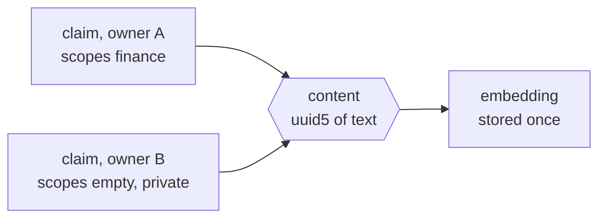
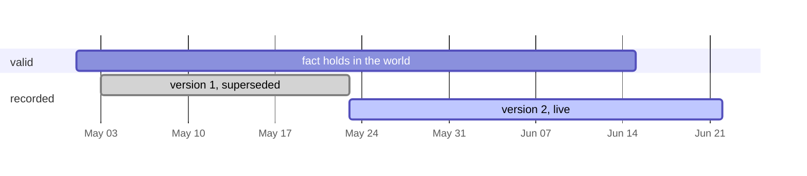

# The store

## Content and claim, a union model

Knowledge splits into two tables per kind. Content is the immutable structure, an entity's
normalized name and type or a fact's subject, predicate, object, and statement, addressed by
`uuid5` of its own normalized text. Two people independently extracting the same knowledge
mint the same row with no lookup and no coordination. Claims are per-container stakes on that
content, carrying the owner, the scope set, the bi-temporal ranges, review state, and access
counters. Dedup across the whole tenancy happens by construction, and nobody's claim leaks
through anyone else's.

## Bi-temporal claims

Every fact claim carries two independent `tstzrange` dimensions. `valid` says when the fact
holds in the world and `recorded` says when this version sat in memory. Nothing is deleted.
A superseding write closes the `recorded` upper bound and inserts a fresh version, so history
is just the closed rows, point-in-time replay is a range predicate the GiST index answers
(measured at 30 ms over 300k claim versions), and Allen-algebra queries come free with the
type.

## The identity rule

Value objects get `uuid5` and events get `uuid7`. Content is what it says, so its id derives
from the text and a rerun converges on the same graph. A claim is the event of someone saying
it, so its id carries a timestamp prefix and lands writes on one edge of the index. The one
fixed id is the anonymous sentinel, uuid zero.

## Declarative everything

SQLModel classes are the single source of truth. Foreign keys and indexes are field kwargs,
one `Timestamped` mixin carries both audit stamps, and views are first-class citizens. A
`ViewBase` subclass declares typed fields plus the `Select` that is the view, registers itself
the moment its class body ends, and compiles into `CREATE VIEW` with `security_invoker` so a
view can never accidentally bypass row security. The whole schema regenerates from the models,
and the drift probe diffs compiled RLS policies against the live catalog through sqlglot and
must come back empty.
