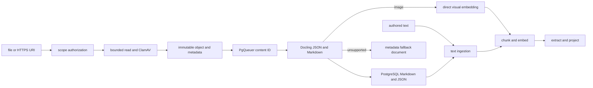
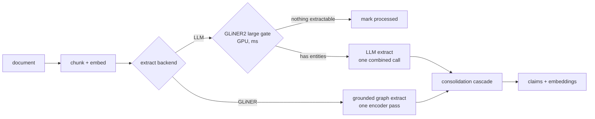

# The write path

There are two entry paths. Authored notes enter as text. Files and public HTTPS sources enter as
immutable artifacts. Both paths converge on the same normalized Markdown ingestion and graph
projection pipeline.

The text path recognizes an optional level-one title, generic ontology tags, a `Type` declaration,
typed relation lines, and dated journal entries. A tag uses `#<kind>: <entity name>`. A same-name
tag declares the heading as that kind. Other tags create `related_to` edges to the typed entities
without Project, Area, or any other user-facing kind appearing in Python enums.

The artifact path accepts a browser upload of at most 10 MiB or one public HTTPS URI. It authorizes
the exact scope destination before reading bytes. URI reads reject credentials, private addresses,
non-HTTPS transport, unsafe redirects, excessive response sizes, and unresolved hosts. ClamAV must
declare the bytes clean before AIZK stores them. A failed or unavailable scanner rejects intake.
The original then receives an opaque object key and immutable metadata in PostgreSQL. Compressible
payloads use Zstandard when doing so saves at least five percent. PgQueuer receives only the
original content ID and its exact scope set. It never carries bytes or a URI.

The worker reads and transparently decodes the already accepted original, verifies its UUIDv8
content fingerprint and original size, and sends those exact logical bytes to the private Docling
Serve container. Docling returns native JSON and Markdown. AIZK stores both in PostgreSQL on the
same original revision, then sends normalized Markdown through ordinary text ingestion.
The resulting `Document` records the logical artifact ID and the exact original content revision.
This makes every later file reference stable even after the same external URI is refreshed.

An accepted image then receives one supplemental direct embedding through the generic embedding
client. The vector stays in a chunk on that same `Document`. Its provenance records the image
modality, media type, direct representation, and exact artifact revision without naming the
current model provider. Docling remains authoritative for OCR, layout, tables, and normalized
text. Audio and video use Docling's transcription path. Frame-level video embeddings are not yet
enabled.

Companion text is part of the same remembered document. It can explain the source, supply missing
context, or make an unsupported file useful. If conversion fails without companion text, AIZK still
creates a metadata document from the filename, size, media type, URI, and failure state. The file
remains recallable and the exact original remains available through an authorized resource read.
Conversion failure is not treated as graph-ready semantic text.

PostgreSQL owns authorization, metadata, processing state, and the PgQueuer queue. The object store
owns bytes. Docling only converts. ClamAV only scans. No Redis service or secondary workflow
database exists.

A document is chunked recursively for prose, embedded once, and then flows through one configured
extractor. The production LLM path uses the cheap relevance gate first. The experimental GLiNER
path performs entity and relation extraction itself and therefore skips that separate gate.

Explicit declarations and model extraction meet at the same `Extraction` value. A declared
subject type is stored on the source document so later chunks retain it, while arbitrary relations
become ordinary ontology facts. Project and Area have no dedicated ingestion branch.

## The gate

GLiNER2 large scores every chunk against the closed ontology's entity descriptions in
milliseconds on GPU. Chunks with nothing extractable skip the LLM entirely. An earlier base-model
measurement on the dense research vault skipped only 2.2 percent of chunks, so the gate matters
more on sparse corpora than on this one.

The gate and direct extractor share one HTTP service boundary and one concurrency throttle. The
server never loads model weights. Missing endpoints fail the job so PgQueuer can retry and retain
the failure for diagnosis.

## Extraction backends

`AIZK_EXTRACT_BACKEND=llm` is the production default. It emits bounded entities and facts through
the strict ontology wire schema. Each fact must include one contiguous quote copied from the
source. A deterministic grounding pass rejects missing or unsupported quotes, unresolved
endpoints, self-relations, and the generic `related_to` predicate before anything reaches the
graph. Markdown backticks are ignored because they change presentation rather than evidence.

`AIZK_EXTRACT_BACKEND=gliner` sends the same live entity and relation descriptions to the sidecar
graph route. Its grounded character spans make source quotes deterministic. The large checkpoint
and a 0.7 confidence threshold remove many weak edges, but its relation semantics and recall are
not strong enough for production. Self-relations are dropped before consolidation.

## One combined LLM call

Entities, facts, and an optional per-fact date come back in a single strict JSON response.
vLLM's XGrammar backend compiles the schema once and caches it. Compact structured output disables
arbitrary JSON whitespace, which prevents a valid response from exhausting its output budget
before it reaches required fields. Graphiti moved to the same combined shape citing better
quality through fewer orphaned nodes. Short wire keys reduce constrained output tokens while
descriptive schema fields still tell the model exactly what each value means.

Explicit source declarations precede model facts. Set-valued facts deduplicate by immutable
content identity before planning. State facts deduplicate by subject, predicate, perspective, and
effective interval because one interval can hold only one value. The first declaration wins. This
prevents differently worded copies of one status from trying to retire the same prior claim twice.

## The consolidation cascade

The old pipeline asked an LLM to judge ADD, UPDATE, or NOOP for every fact, then dated each
with another call. Now rules do almost all of it. An exact content-addressed match is a NOOP by
construction. Cosine at or above 0.9 against an existing fact auto-merges. Only the genuinely
borderline band between 0.75 and 0.9 reaches an LLM, batched into at most one call per chunk.

Dates cascade the same way, first the model's own date field, then a strict absolute-format
parse of the statement, then the document timestamp. Strictness matters. An unrestricted
parser resolved plain prose to today's date and silently corrupted bi-temporal validity, a bug
caught and fixed during this rework.

## Historical E2B throughput

| Build metric | Before | After | Factor |
|---|---|---|---|
| LLM calls per chunk | ~13 | 1.22 | 10.7x |
| Amortized wall-clock per chunk | 4,500 ms | 667 ms | 6.8x |
| Full vault, 1,109 docs and 3,824 chunks | hours | 35.6 min | ~8x |
| Aggregate token throughput | ~400 tok/s | 3,794 tok/s | 9.5x |
| Serving | Ollama, 8 slots | vLLM continuous batching, 48 seqs | |

These numbers describe the earlier E2B deployment and are retained as historical evidence. They
must not be used to size the current 31B deployment. The 31B checkpoint has one dedicated
RTX 3090 at 98.5 percent memory allocation and a 3,072-token context. Its measured 3,494-token
KV cache supports 1.14 full requests, so every LLM-backed graph stage uses at most two in-flight
requests and lets vLLM queue the second. A production RAPTOR run with five concurrent rollups
needed another 100 MiB of activation memory after the GPU had only 76 MiB free and killed the
engine. The two-request limit had already completed all 164 source chunks and is now shared by
source extraction, community summaries, and RAPTOR rollups.

## Model selection, measured not guessed

| Model | Valid / 40 | Faithful | Truncation | VRAM | Verdict |
|---|---|---|---|---|---|
| Gemma 4 31B w4a16 | 20 / 20 facts | 100% deterministic grounding | 0% | 22.8 GB | production on dedicated GPU 1 |
| Gemma 4 E2B w4a16 | 35 / 40 responses | 68.6% judge faithfulness | 12.5% | 7.2 to 9.5 GB | lower resource baseline, not production |
| Gemma 4 E4B | – | – | – | 9.2 GB | cannot emit valid structured JSON on vLLM 0.24, also over budget |
| Qwen3.5-4B | – | – | – | – | Mamba-hybrid cache caps real concurrency near 13 |
| Qwen3.5-0.8B | 11 | 62.5% | 72.5% | 2 GB | entity-explosion truncation collapses yield |
| Gemma 3 270M | – | – | – | – | blocked by an HF gate, and the cascade would offload only 12.5% anyway |

Faithfulness means each statement was judged against its source chunk. Structure-only checks
are blind here because xgrammar makes even tiny models emit valid JSON. Offline `run_batch`
was probed and rejected too, since a warm HTTP server does 37.4 prompts per second while the
batch runner spends 57.6 seconds on cold engine init alone.

The 31B production check on July 17, 2026 used five stored documents covering frontend
architecture, authentication, hashing, artifacts, and the public memory interface. It proposed
twenty facts and grounded all twenty after the wire contract required quotes, compact JSON was
enabled, and the prompt prohibited ellipses and joined passages. A same-host E2B retry used about
9.5 GB but did not become ready after two bounded five-minute waits. That cold-start failure and
the lower historical faithfulness both favor 31B when a dedicated RTX 3090 is available.
