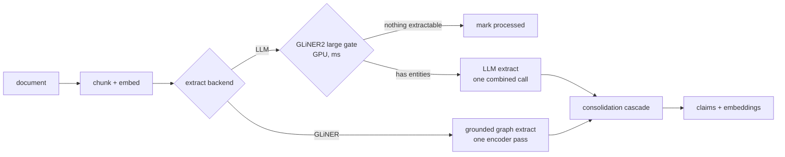

# The write path

Agents send text rather than filesystem objects. A small deterministic parser recognizes an
optional level-one title, generic ontology tags, a `Type` declaration, typed relation lines, and
dated journal entries. A tag uses `#<kind>: <entity name>`. A same-name tag declares the heading as
that kind. Other tags create `related_to` edges to the typed entities without Project, Area, or any
other user-facing kind appearing in Python enums. It does not parse PDFs or own a file-format layer,
since the calling agent supplies the paper's Markdown and original URL. A document is chunked
recursively for prose, embedded once, and then flows through one configured extractor. The
production LLM path uses the cheap relevance gate first. The experimental GLiNER path performs
entity and relation extraction itself and therefore skips that separate gate.

Explicit declarations and model extraction meet at the same `Extraction` value. A declared
subject type is stored on the source document so later chunks retain it, while arbitrary relations
become ordinary ontology facts. Project and Area have no dedicated ingestion branch.

## The gate

GLiNER2 large scores every chunk against the closed ontology's entity descriptions in
milliseconds on GPU. Chunks with nothing extractable skip the LLM entirely. An earlier base-model
measurement on the dense research vault skipped only 2.2 percent of chunks, so the gate matters
more on sparse corpora than on this one.

The gate and direct extractor share one HTTP service boundary and one concurrency throttle. The
server never loads model weights. Missing endpoints fail the job so PgQueuer can retry and retain
the failure for diagnosis.

## Extraction backends

`AIZK_EXTRACT_BACKEND=llm` is the production default. It emits bounded entities and facts through
the strict ontology wire schema. `AIZK_EXTRACT_BACKEND=gliner` sends the same live entity and
relation descriptions to the sidecar graph route. Its grounded character spans make source
quotes deterministic. The large checkpoint and a 0.7 confidence threshold remove many weak edges,
but its relation semantics and recall are not strong enough for production. Self-relations are
dropped before consolidation.

## One combined LLM call

Entities, facts, and an optional per-fact date come back in a single strict-JSON response.
vLLM's xgrammar backend compiles the schema once and caches it, so constrained decoding is
near-free. Graphiti moved to the same combined shape citing better quality through fewer
orphaned nodes. Wire keys are deliberately mixed, single letters for categorical fields and
full names for prose fields, because the 2.3B-effective model emits the literal string
`"true"` into two-letter free-text keys. That oddity is measured model behavior, not style.

## The consolidation cascade

The old pipeline asked an LLM to judge ADD, UPDATE, or NOOP for every fact, then dated each
with another call. Now rules do almost all of it. An exact content-addressed match is a NOOP by
construction. Cosine at or above 0.9 against an existing fact auto-merges. Only the genuinely
borderline band between 0.75 and 0.9 reaches an LLM, batched into at most one call per chunk.

Dates cascade the same way, first the model's own date field, then a strict absolute-format
parse of the statement, then the document timestamp. Strictness matters. An unrestricted
parser resolved plain prose to today's date and silently corrupted bi-temporal validity, a bug
caught and fixed during this rework.

## Throughput

| Build metric | Before | After | Factor |
|---|---|---|---|
| LLM calls per chunk | ~13 | 1.22 | 10.7x |
| Amortized wall-clock per chunk | 4,500 ms | 667 ms | 6.8x |
| Full vault, 1,109 docs and 3,824 chunks | hours | 35.6 min | ~8x |
| Aggregate token throughput | ~400 tok/s | 3,794 tok/s | 9.5x |
| Serving | Ollama, 8 slots | vLLM continuous batching, 48 seqs | |

The known next lever is the database connection pool. Twenty connections sit behind a 48-wide
semaphore held across both extraction and the write, capping effective concurrency near 16.
The GPU is not the wall.

## Model selection, measured not guessed

| Model | Valid / 40 | Faithful | Truncation | VRAM | Verdict |
|---|---|---|---|---|---|
| Gemma 4 E2B w4a16 | 35 | 68.6% | 12.5% | 7.2 GB | champion, reliable structured JSON across 3,205 real chunks |
| Gemma 4 E4B | – | – | – | 9.2 GB | cannot emit valid structured JSON on vLLM 0.24, also over budget |
| Qwen3.5-4B | – | – | – | – | Mamba-hybrid cache caps real concurrency near 13 |
| Qwen3.5-0.8B | 11 | 62.5% | 72.5% | 2 GB | entity-explosion truncation collapses yield |
| Gemma 3 270M | – | – | – | – | blocked by an HF gate, and the cascade would offload only 12.5% anyway |

Faithfulness means each statement was judged against its source chunk. Structure-only checks
are blind here because xgrammar makes even tiny models emit valid JSON. Offline `run_batch`
was probed and rejected too, since a warm HTTP server does 37.4 prompts per second while the
batch runner spends 57.6 seconds on cold engine init alone.
