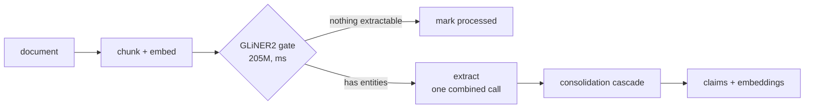

# The write path

Agents send text. There is no parser and no file-format layer, since the calling agent already
reads PDFs and the like. aizk's responsibility starts at prose. A document is chunked
(recursively for prose, AST-aware for code), embedded once, and then flows through a
three-stage extraction line whose whole design goal is one LLM call per chunk where the old
pipeline spent thirteen.

## The gate

A 205M GLiNER2 encoder scores every chunk against the closed ontology's entity types in
milliseconds on CPU. Chunks with nothing extractable skip the LLM entirely. On the dense
research vault only 2.2% of chunks skip, so the gate earns its keep on sparser corpora while
costing almost nothing here.

## One combined call

Entities, facts, and an optional per-fact date come back in a single strict-JSON response.
vLLM's xgrammar backend compiles the schema once and caches it, so constrained decoding is
near-free. Graphiti moved to the same combined shape citing better quality through fewer
orphaned nodes. Wire keys are deliberately mixed, single letters for categorical fields and
full names for prose fields, because the 2.3B-effective model emits the literal string
`"true"` into two-letter free-text keys. That oddity is measured model behavior, not style.

## The consolidation cascade

The old pipeline asked an LLM to judge ADD, UPDATE, or NOOP for every fact, then dated each
with another call. Now rules do almost all of it. An exact content-addressed match is a NOOP by
construction. Cosine at or above 0.9 against an existing fact auto-merges. Only the genuinely
borderline band between 0.75 and 0.9 reaches an LLM, batched into at most one call per chunk.

Dates cascade the same way, first the model's own date field, then a strict absolute-format
parse of the statement, then the document timestamp. Strictness matters. An unrestricted
parser resolved plain prose to today's date and silently corrupted bi-temporal validity, a bug
caught and fixed during this rework.

## Throughput

| Build metric | Before | After | Factor |
|---|---|---|---|
| LLM calls per chunk | ~13 | 1.22 | 10.7x |
| Amortized wall-clock per chunk | 4,500 ms | 667 ms | 6.8x |
| Full vault, 1,109 docs and 3,824 chunks | hours | 35.6 min | ~8x |
| Aggregate token throughput | ~400 tok/s | 3,794 tok/s | 9.5x |
| Serving | Ollama, 8 slots | vLLM continuous batching, 48 seqs | |

The known next lever is the database connection pool. Twenty connections sit behind a 48-wide
semaphore held across both extraction and the write, capping effective concurrency near 16.
The GPU is not the wall.

## Model selection, measured not guessed

| Model | Valid / 40 | Faithful | Truncation | VRAM | Verdict |
|---|---|---|---|---|---|
| Gemma 4 E2B w4a16 | 35 | 68.6% | 12.5% | 7.2 GB | champion, reliable structured JSON across 3,205 real chunks |
| Gemma 4 E4B | – | – | – | 9.2 GB | cannot emit valid structured JSON on vLLM 0.24, also over budget |
| Qwen3.5-4B | – | – | – | – | Mamba-hybrid cache caps real concurrency near 13 |
| Qwen3.5-0.8B | 11 | 62.5% | 72.5% | 2 GB | entity-explosion truncation collapses yield |
| Gemma 3 270M | – | – | – | – | blocked by an HF gate, and the cascade would offload only 12.5% anyway |

Faithfulness means each statement was judged against its source chunk. Structure-only checks
are blind here because xgrammar makes even tiny models emit valid JSON. Offline `run_batch`
was probed and rejected too, since a warm HTTP server does 37.4 prompts per second while the
batch runner spends 57.6 seconds on cold engine init alone.
