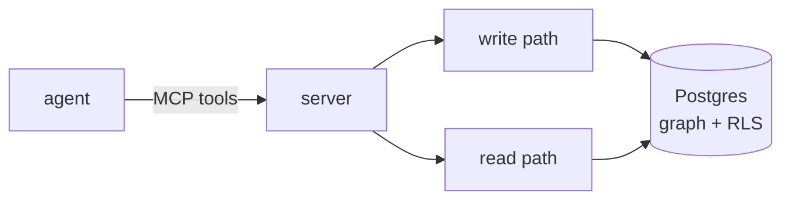

<div class="hero" markdown>

{ .hero-logo }

# aizk

A self-hosted multi-tenant memory engine that turns a Zettelkasten into scoped agent-queryable memory over MCP

</div>

## What this is

Ask an AI assistant something today and tomorrow it remembers none of it. aizk is a memory it
can actually keep, a single Postgres database holding the entities and facts it pulls out of
whatever text you give it, connected into a knowledge graph and searchable by meaning rather
than exact words. It speaks [MCP](concepts.md#agent-and-mcp), so Claude or any other
MCP-capable assistant calls it directly with no custom integration code.

It runs entirely on hardware you control. Nothing written to it leaves the building, and
nothing about the design assumes a cloud AI subscription, model serving and search both run
locally.

New to a term like row level security or bi-temporal? [Concepts](concepts.md) defines each one
in plain language before the deeper pages use them freely.

## The problem it solves

One assistant forgetting between sessions is one problem. A team or household sharing an
assistant is a second, harder one that most memory tools never address: some knowledge is
private, some belongs to one project, and some belongs to an overlapping intersection of people
that never gets its own name, the finance-and-legal people, say, without anyone standing up a
group called exactly that. aizk's [scope-set lattice](engine/lattice.md) is built to answer
that, enforced by the database itself so a bug in application code can never leak a private
note into a shared scope.

## How it works, briefly

Text comes in, notes, references, ingested files, and a small local model pulls out the
entities and facts worth remembering, arriving as knowledge-graph rows rather than another wall
of text. A question comes back out through five retrieval techniques running at once,
meaning-based search, exact-word search, graph traversal, thematic summaries, and person or
project profiles, fused into one compact, sourced answer. Row level security enforces who sees
what at the database layer, not in application code that could get it wrong.



The full breakdown, with a diagram for each stage, lives under [Engine](engine/index.md).

## Where the ideas came from

Almost nothing here is invented from a blank page. The bi-temporal fact model follows Zep and
Graphiti's work on temporal knowledge graphs for agents. The mostly-rule-based consolidation
cascade follows Mem0's approach to deciding whether a new fact adds, updates, or repeats old
knowledge. The retrieval stack borrows a graph-walk technique from HippoRAG, thematic community
summaries from GraphRAG, and a recursive summary tree from RAPTOR. The scope-set lattice and
its row level security enforcement are original to aizk, no other open memory engine offers a
multi-tenant knowledge graph with this kind of per-row isolation.

The full map from every mechanism back to its paper, project, or post lives in
[Provenance](provenance.md). The measured numbers behind every claim on this page live in
[Benchmarks](benchmarks.md), and an honest side-by-side against grep, a notes-search tool, and
the engines the papers came from lives in [Comparison](comparison.md).

## Install

```sh
pip install aizk
```

## Use

Bring up Postgres and the model containers with `docker compose up`, start the server with
`aizk serve-mcp`, then call its tools from any MCP client.

```python
from fastmcp import Client

async with Client("http://localhost:8000/mcp") as client:
    await client.call_tool("remember", {"text": "aizk runs entirely on local hardware."})
    result = await client.call_tool("recall", {"query": "where does aizk run?"})
    print(result.data)
```

The full tool surface, `recall` and `remember` through group governance and maintenance, is
documented in [API](api.md).

## Project files

| file | purpose |
|---|---|
| `README.md` | the problem, install, first use |
| `CHANGELOG.md` | release notes and user-visible changes |
| `docs/` | the durable documentation this site builds from |
| `docs/concepts.md` | plain-language definitions for the terms the rest of the docs use |
| `docs/hooks/llms.py` | builds `llms.txt` into the docs site for LLM-assisted use |
| `.github/workflows/` | CI, docs deploy, and version-driven publish |
