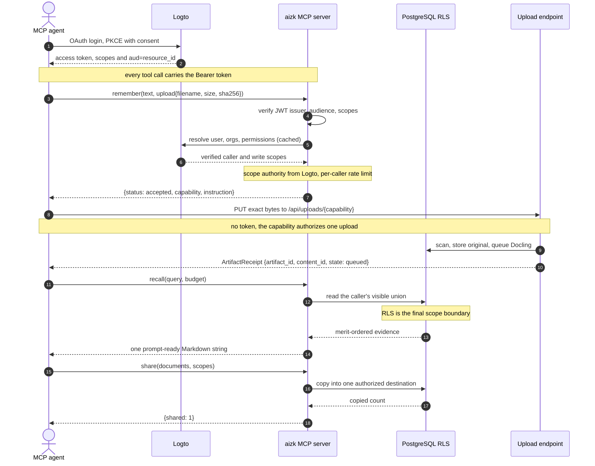

The public network surface has four MCP tools. Maintenance and evaluation stay on the SSH-only
CLI so a client token cannot rebuild, export, promote, or erase data.

## MCP tools

| Tool | Purpose |
|---|---|
| `status(days)` | Return the caller, organization directory, durable usage, and processing state |
| `recall(query, budget)` | Return one Markdown string from the token-budgeted context pack |
| `remember(text, source_uri, observed_at, expires_at, scopes, preserve_source, upload)` | Store text, preserve and queue one public HTTPS source, or mint a private local-file upload ticket |
| `share(documents, scopes)` | Copy visible documents into one authorized destination and return the copied count |

Every tool derives scope authority from the verified Logto user. The MCP path uses a short
coalesced Logto Management API cache, so repeated tool calls do not reload the same account and
organization directory. A failed refresh closes shared authority, while a successful organization
mutation evicts affected entries. The optional browser uses a separate uncached resolution path for
account access and organization management.

### A client session over MCP

One authenticated session logs in through Logto once, then reuses the resulting access token on
every tool call. The server verifies the token and derives scope authority from Logto, while
PostgreSQL row security stays the final boundary. A local-only upload takes the extra ticket
round trip, redeemed by a tokenless `PUT`.



`status` returns safe profile fields, global roles, durable usage totals, and processing estimates.
Each organization carries its Logto name, description, custom data, members, member roles, caller
roles, effective permissions, public flag, and derived writable flag. Its optional `days` input
selects the bounded usage window from 1 through 365 days. Processing stages include queued,
running, failed, throughput, and ETA fields without exposing private source content.

Recall reads the caller's complete visible union, including personal, organization, and eligible
intersection rows. Each evidence item names its exact scope set, and the response includes the
Logto description of every shared organization represented in the result. Use `status` for roles,
permissions, public standing, write authority, usage, and queue progress.
Writes default to the personal singleton. Passing organization names chooses one explicit
destination, including an intersection such as A and B, and succeeds only when the caller may write
every member.
`created_by` records provenance and never grants access. Sharing leaves the source unchanged and
creates a provenance-linked copy in the destination.

The first level-one Markdown heading becomes the internal retrieval title. A generic source tag uses
`#<kind>: <entity name>`, where kind is any live database ontology kind. If the entity name matches
the heading, the tag declares that heading as the kind. Otherwise AIZK creates a generic
`related_to` edge from the titled source to that entity. Project, Area, Paper, Method, Tool, and
future kinds all use this one form.

An explicit `- Type <kind>` line remains available. A relation line uses
`- <predicate> [<object kind>] <object name>` when the exact predicate matters. For example, a
Project can declare `- part_of [Area] Research` and `- has_status [Status] Active`. Tags express
association and never imply status, ownership, access, or a more specific predicate. These
declarations stay in the source text so clients never send a second conflicting metadata payload.
`source_uri` is only for an actual external source. When `text` is present and `preserve_source` is
false, it records provenance and stable refresh identity without downloading bytes. When `text` is
omitted, AIZK fetches the source once, scans and stores its immutable bytes, and queues Docling
conversion. Set `preserve_source` only when both text and the exact original should belong to the
same remembered document. The text then becomes companion information rather than a second source.
Browser users can upload a file directly from the personal dashboard. MCP clients never embed a
large file in a tool call. An agent sends a public HTTPS URI or uses the `remember` file-upload mode
when the file only exists locally.

Text is the preferred input. Preserve a file when the exact bytes may be needed later, such as a
contract, form, paper, signed record, or presentation. The file limit is 10 MiB. If Docling cannot
parse an accepted file, AIZK still creates a recallable metadata document from its filename, size,
media type, source URI, conversion state, and companion text. Only the original is an object Blob.
Markdown, Docling JSON, companion text, and conversion metadata live in PostgreSQL.

## Agent uploads

The file-upload mode of `remember` preserves a local file that has no public URI. The agent declares
the exact `filename`, `media_type`, byte `size`, and lowercase `sha256`, with optional `scopes`.
`text` becomes companion information. File upload cannot be combined with `source_uri`,
`preserve_source`, `observed_at`, or `expires_at`.

Compute the declaration from the same file that will be PUT.

```sh
sha256=$(sha256sum file | cut -d' ' -f1)
size=$(wc -c < file)
```

The agent then calls `remember` with the declaration.

```text
remember(
  text="Companion information for this exact original.",
  upload={
    "filename": "file",
    "media_type": "application/octet-stream",
    "size": <size>,
    "sha256": "<sha256>"
  }
)

{
  "status": "accepted",
  "capability": "<opaque capability>",
  "instruction": "PUT the exact declared bytes once to the private single-use upload endpoint."
}
```

The accepted response is a ticket mint, not a stored artifact receipt. Redeem the opaque capability
by PUTting exactly the bytes whose size and SHA-256 were declared.

```sh
capability='<opaque capability returned by remember>'
curl -fsS -T file "https://aizk.phvv.me/api/uploads/$capability"
```

The endpoint is a short-lived, single-use private bearer upload ticket. It is never a public or
downloadable URL. The PUT carries no Logto token because possession of the unexpired capability
authorizes its one upload. Aizk rejects a different size or content hash before artifact intake.
A successful reply is the artifact receipt, and the original then flows through the normal safety
scan and Docling conversion intake.

## Agent-managed lifecycle and temporal inputs

AIZK has no review system and will not gain one. `remember` stores a source immediately. Agents own
selection, scope choice, provenance, correction, and temporal meaning. The worker only builds
reproducible projections and never approves or rejects the source. Human operators maintain the
service rather than process memory.

`observed_at` and `expires_at` are optional. Ordinary durable notes omit both.

| Input | Meaning | Use it when | Omit it when |
|---|---|---|---|
| `observed_at` | when the statement became applicable | the known applicability time differs materially from capture | capture time is an adequate approximation |
| `expires_at` | the known instant after which the statement is no longer true | an external event, agreement, access grant, or announced policy supplies a real cutoff | the content merely might change or should remain maintained |

Expiration is a hard validity boundary. PostgreSQL excludes an expired document from source
retrieval and gives its extracted open facts the same valid-time upper bound. AIZK retains temporal
history. Expiration creates no reminder, task, notification, or refresh job.

Do not use `expires_at` for documentation with no scheduled end, research findings, design
decisions, project briefs, ordinary project status, uncertainty, maintenance intervals, or a desire
to inspect something later. When durable knowledge changes without a known cutoff, an agent recalls
the current source and writes a correction. A maintained website or paper source reuses the same
`source_uri` and exact scope set. When in doubt, omit expiration.

## Short examples

The values below are illustrative. `status` reflects the current Logto account and recall content
depends on what that caller may read.

```text
status()

{
  "name": "Pedro Valois",
  "username": "pedro",
  "avatar": null,
  "roles": ["aizk-user"],
  "organizations": [
    {
      "name": "Docs",
      "description": "Public docs on tools, libs, languages, and more. Includes AIZK concepts, onboarding, and note-taking guidance.",
      "custom_data": {"public": true},
      "members": [
        {"name": "Pedro Valois", "username": "pedro", "avatar": null, "roles": ["editor"]}
      ],
      "roles": ["editor"],
      "permissions": ["write:memory"],
      "public": true,
      "writable": true
    }
  ]
}
```

```text
recall(query="What is the current SPReAD goal?")

## Scopes

- `SPReAD` Shared work on sparse recovery

## Evidence

1. **Source excerpt** from scope `SPReAD`

    The current goal is to validate sparse recovery on the RTX 4090.
```

Recall first builds a typed `RecallResult`. Each evidence object contains a machine-readable
provenance value, its text, and the complete scope objects with their names and descriptions. A
small Jinja template renders the MCP string. `Source excerpt`, `Derived memory`, and `Recent session
memory` are the only public provenance labels. Facts, profiles, communities, overviews, and the
other retrieval lanes remain internal implementation and evaluation details.

```text
remember(
  text="# SPReAD decision\n\n- Type Decision\n\nUse the fixed operating point for the next comparison."
)

{"id": "019f6623-3ff5-712d-b63f-689fd779e0da"}
```

The omitted `scopes`, `source_uri`, `observed_at`, and `expires_at` keep this authored durable note
private and avoid false external provenance.

```text
remember(
  source_uri="https://example.org/paper.pdf",
  text="Primary paper for the current retrieval design.",
  preserve_source=true,
  scopes=["Research"]
)

{
  "artifact_id": "019f6623-3ff5-712d-b63f-689fd779e0da",
  "content_id": "019f6623-467b-7fe2-97fc-06bbc61a6f29",
  "state": "queued"
}
```

The receipt identifies one immutable original revision. Companion text belongs to that revision.
Conversion happens asynchronously. Recall
continues to return compact text evidence. Evidence grounded in an artifact can also name an exact
resource such as
`aizk://artifacts/019f6623-3ff5-712d-b63f-689fd779e0da/contents/019f6623-467b-7fe2-97fc-06bbc61a6f29`.
The client reads that resource only when the task needs original bytes. The resource handler
rechecks current identity, PostgreSQL row security, the exact revision, original size, and digest.
Recall never transfers file bytes automatically.

```text
share(
  documents=["019f6623-3ff5-712d-b63f-689fd779e0da"],
  scopes=["SPReAD"]
)

{"shared": 1}
```

A managed Project can declare its ontology type with a same-name `#project` tag and associate itself
with an Area through `#area`. Exact `part_of` and `has_status` relations remain explicit when the
management catalog needs those semantics. PostgreSQL builds query-relevant catalogs from declared
subjects and live graph endpoints, groups them by exact scope set, and joins current state
relations. Missing status or area facts remain knowledge gaps. Association tags, checkboxes,
profiles, and file activity do not declare current state.

There is no bulk vault importer. An agent examines one subject in context and sends only its current
brief or durable finding through `remember`. A storage cleaner cannot decide whether old prose is
current, relevant, or safe to promote into working memory.

Sharing an artifact creates destination-scoped metadata and a provenance-linked `Document` while
reusing the same physical Blob. The original is not uploaded again. Each destination remains an
independent RLS boundary and later source revisions do not silently change an earlier shared
snapshot.

## CLI

Run commands through `chefe run aizk` from the monorepo root.

| Command group | Commands |
|---|---|
| `aizk auth` | `login`, `logout`, `status` |
| `aizk` | `recall`, `remember`, `share`, `status` |
| `aizk admin server` | `mcp`, `api`, `worker` |
| `aizk admin queue` | `status`, `doctor`, `retry conversion`, `retry graph` |
| `aizk admin database` | `setup`, `migrate`, `make-migration`, `install-queue`, `check-rls`, `backup`, `restore`, `reset` |
| `aizk admin graph` | `rebuild`, `decay`, `reembed`, `communities`, `raptor`, `forget`, `diagnose-extraction` |
| `aizk admin ontology` | `define-entity`, `define-relation`, `list` |
| `aizk admin data` | `ingest`, `promote`, `export`, `audit` |
| `aizk admin auth` | `audit`, `apply`, `check-public`, `check-web` |
| `aizk admin settings` | `show`, `validate` |
| `aizk admin api` | `openapi` |

Client commands use the same authenticated MCP contract as an agent. `remember` accepts text,
public source URLs, and local file paths. Local paths are hashed, declared, and uploaded by the
CLI, so callers do not handle upload tickets.

```sh
aizk remember report.pdf notes.md
aizk remember report.pdf --text "Companion information for the exact original."
```

There are no local user, organization, membership, role, or acceptance commands. Logto is the source
of truth for those concerns.
