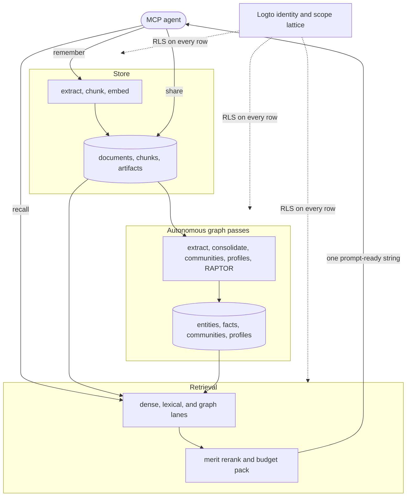

A short plain-language primer for the words the rest of these docs use freely. Read this first
if terms like MCP, row level security, or bi-temporal are unfamiliar. Skip it otherwise.

## The whole picture at a glance

Everything below is one loop. An agent writes with `remember`, the store keeps the raw source,
autonomous passes project it into a knowledge graph, and `recall` reads across both to return a
single prompt-ready string. One identity and its scope lattice gate every layer through row level
security. Each deeper page zooms into one box of this diagram.



## Agent and MCP

An agent here means an AI assistant, Claude or similar, that calls tools instead of only
answering in text. MCP, the Model Context Protocol, is the wire format that lets an assistant
discover and call a program's tools the same way no matter who wrote them. aizk speaks MCP, so
any MCP-capable assistant calls `recall`, `remember`, and the rest of its tool surface directly,
no custom integration code per assistant.

## Knowledge graph, entities, and facts

Rather than storing memory as a pile of documents, aizk pulls out the pieces worth remembering,
people, projects, decisions, results, and links them with statements such as "the team decided
to use vLLM for extraction." A thing is an entity, a statement connecting two things is a fact.
The whole web of entities and facts is the knowledge graph, and it is what makes "what did we
decide about this three weeks ago" answerable instead of a search through old notes.

## Areas, Projects, and source tags

AIZK combines the action layer of PARA with the linked knowledge layer of a Zettelkasten. PARA
distinguishes short-term outcomes from ongoing responsibilities. A Zettelkasten keeps durable ideas
in one network and uses structure notes as maps instead of moving every useful note into a folder.
AIZK follows both ideas. Knowledge stays independently recallable while source tags connect it to
the work where it is useful.

An Area is an ongoing responsibility, identity, or standard of care with no finish line. Health,
Research, and Business are typical Areas. An Area states what good care means, its current
condition, and the finite Projects serving it.

A Project is a finite effort toward one concrete outcome inside one Area. It has a beginning, a
success condition, and an end. A maintained Project brief is the structure note for that outcome.
It summarizes current state, problems, next actions, and success without absorbing every supporting
finding or source.

Any note can associate itself with live ontology entities through generic source tags.

```md
# Upload security decision

#project: AIZK Productization
#area: Business
```

The general form is `#<ontology kind>: <entity name>`. Project and Area are examples rather than
reserved application fields. A tag whose entity name matches the level-one heading declares that
heading as the tagged kind. Other tags create generic `related_to` graph edges from the titled
source to the tagged entities. This same mechanism can use Paper, Method, Tool, or a future kind
defined only in the database ontology.

Tags express association. They do not encode status, ownership, access, or exact domain predicates.
An exact relation such as `part_of` or `has_status` remains an explicit typed relation in the source.
The Project tag never means Active, and the Area tag never changes the write scope.

```md
# AIZK Productization

#project: AIZK Productization
#area: Business

- part_of [Area] Business
- has_status [Status] Active
```

The current brief remains authoritative. Supporting notes keep their own purpose and use tags to
join the same knowledge neighborhood. This preserves the Zettelkasten principle that durable
knowledge should outlive one Project while retaining PARA's action-oriented context.

## Embeddings and retrieval

An embedding turns a piece of text into a list of numbers positioned so that similar meanings
land near each other, which is how aizk finds the right memory even when a search uses none of
the original words. Retrieval is the general term for turning a question into the handful of
facts, snippets, and summaries worth showing back. aizk's retrieval blends several techniques at
once, meaning-based search, exact-word search, and graph traversal, rather than picking one, see
[Read path](/engine/read-path).

## Scopes and the lattice

A scope is a group knowledge can be shared with, a team, a project, a household. aizk lets one
piece of knowledge belong to several scopes at once, and only someone standing in every one of
those groups can see it, which is what "the scope-set lattice" means in the deeper pages, see
[Lattice](/engine/lattice). The several-scope form is a real intersection corpus, not a request
to choose one active organization. Logto owns the organizations and memberships while aizk stores
only the stable scope IDs derived from their signed identifiers, see
[Identity and sharing](/engine/identity).

Public means readable by every authenticated AIZK user. It does not mean writable by everyone and
it does not currently mean readable without login. Only organization members whose effective Logto
permissions include `write:memory` can write into that organization, whether it is public or
private.

## Row level security

Row level security, RLS, is a Postgres feature that filters which rows of a table a query is
even allowed to see, enforced by the database itself rather than trusted to application code.
aizk compiles its scope rules straight into RLS policies, so a mistake in a Python function
cannot leak a private note into a shared scope, the database refuses the read before a bug ever
gets the chance.

## Bi-temporal

Most memory only tracks when it learned something. aizk tracks two independent clocks, when a
fact was true in the world, and when aizk itself recorded it. That second clock lets a later
correction coexist with the original claim rather than overwrite it, so the engine can honestly
answer what it believed on a given day in the past, see [Store](/engine/store).

## Agent-managed currentness

AIZK has no review system and will not gain one. A source does not wait for approval after an agent
calls `remember`. It becomes available immediately, and background jobs create graph facts,
profiles, and summaries as replaceable projections. Agents own the knowledge lifecycle. They recall
before writing, select an authorized scope, preserve provenance, correct changed information, and
decide whether a real temporal boundary exists. Human operators maintain authentication, storage,
backups, and model services rather than process a knowledge queue.

Changed knowledge does not need a scheduled inspection date. An agent encounters new evidence,
recalls the current source, and writes the correction or updates the maintained external source
through the same `source_uri` and scope set. Bi-temporal claims preserve what was previously known
without presenting closed claims as current truth.

## Observation and expiration

`observed_at` answers when the information became applicable. It is useful when that time is known
and materially different from when the agent captured it. Most notes omit it because capture time
is close enough.

`expires_at` answers when the information stops being true. It is a hard validity boundary rather
than a reminder. After that time, ordinary recall excludes the source and its derived current facts,
while temporal history remains stored. Expiration does not create a task, notification, or automatic
replacement.

Use `expires_at` only when the outside world supplies a known cutoff. An event schedule with a stated
end, a temporary access grant, or a policy with an announced replacement date qualifies. Living
documentation, project briefs, research findings, design decisions, and software instructions with
no scheduled end do not. The possibility that something may change someday is not an expiration
condition. Neither are uncertainty, a maintenance interval, or a desire to inspect the note later.

When in doubt, omit `expires_at`. A durable source should remain current until an agent observes a
change and corrects it.

## Self-hosted and local-first

Self-hosted means aizk runs on hardware under your own control, one Postgres database and, for
the local model path, a GPU serving small open models rather than a cloud AI subscription.
Nothing about how it works needs the internet, and nothing it stores leaves the building.
