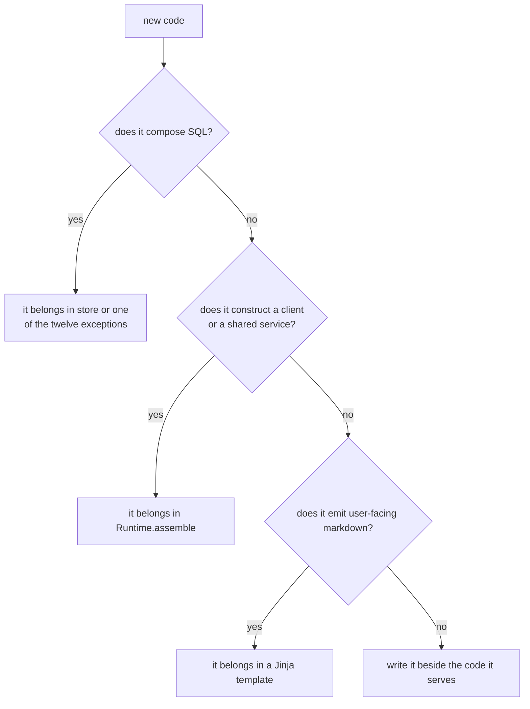

These are the rules that decide the shape of new code. They came out of an architecture audit and
they are worth reading before a first contribution, because half of them are enforced by a gate
and the other half are only conventions that reviewers hold you to. This page says which is which,
verified against the code rather than repeated from the old architecture note. It assumes you have
read [Layers and import contracts](/docs/dev/architecture/layers/).

## Agentic first

The primary caller is an agent, not a person. The MCP server is the interface that gets designed
first, and it exposes four tools, `status`, `recall`, `remember` and `share`, plus one resource
for reading an exact artifact revision. That is the whole surface, and it is deliberately small
enough that a model can hold it in working memory without a per-tool prompt.

The consequences run deep. `recall` returns evidence rather than an answer, because an agent can
weigh evidence and cannot check an answer. Writes are cheap and asynchronous, because an agent
that has to wait on extraction stops writing. The web app is a second-class citizen by design and
calls the same `Memory` service in `src/aizk/memory.py` that the MCP tools do.

## Minimize our own work

Everything that is not the memory model itself is somebody else's maintained project. This is the
rule that keeps the codebase small enough to hold in your head.

| Concern | Who does it |
|---|---|
| identity, organizations, membership | Logto |
| document conversion | Docling |
| malware scanning | ClamAV |
| object storage | SeaweedFS, reached through `obstore` |
| vector search | VectorChord inside PostgreSQL |
| job queuing | PgQueuer, on the same PostgreSQL |
| model serving | vLLM |
| chunking | `chonkie` |
| the MCP protocol | FastMCP |
| row level security machinery | the house `rls` package |

The one model server we write is `src/services/gliner/app.py`, and only because GLiNER has no
vLLM-compatible image. When you are tempted to write a client, a queue or an index, the default
answer is that one already exists and the work is choosing it.

## The eight rules and what actually enforces them

**1. SQL lives in the store.** Enforced, with documented exceptions. The forbidden import contract
stops seventeen packages from importing `sqlmodel` or `sqlalchemy` at all, and ruff overlays in
`src/aizk/mcp/ruff.toml` and `src/aizk/api/ruff.toml` stop the two transports from building a
statement or opening a session. Twelve packages do compose SQL, so the honest version of this rule
is that SQL lives in the store or beside the query it serves, and never in a transport.

**2. Queries are model classmethods.** Convention, and a strong one. A statement is a classmethod
on the model that owns its primary table or view, so `Document.scope_sets` and `Usage.Event.capture`
sit on the models they read. Nothing checks this directly, but rule 1 makes the alternative
awkward from a transport, which is most of the enforcement in practice.

**3. Patos base models over hand-written constructors.** Convention. Ninety-one files in
`src/aizk/` import from `patos`, and the pattern is that constrained types and validators on
`Model` or `FrozenModel` replace `__init__` bodies and raise-on-bad-input blocks, so an invariant
is declared once and checked at every boundary. No gate counts this.

**4. Maintained libraries over hand clients.** Convention, and the table above is its evidence. In
practice a reviewer will ask which upstream project you considered before merging a hand-rolled
protocol client.

**5. One composition root.** Convention with structural help. `Runtime.assemble` in
`src/aizk/runtime.py` builds every shared service once from settings, and the layer contract puts
`runtime` above the transports so nothing below it can construct one. Two boundaries are
deliberately still process-global and the class docstring says so, which are the cached
`Database.app()` and `Database.owner()` engine pair, because every `User` session resolves its
engine there, and the Logto snapshot cache TTLs, which are bound at class build time. A third
softer exception is the module-level `settings` object that several modules import directly.

**6. Span-based usage accounting.** Enforced by construction in `src/aizk/usage.py`. Handlers call
`annotate_operation`, which stamps the operation, the touched scopes and the item count onto the
current OpenTelemetry span, and transport middleware in `src/aizk/api/middleware.py` and
`src/aizk/mcp/middleware.py` measures request and response bytes and duration around the call. No
counter is threaded through a call site. The one nuance worth knowing is that the ledger row is
built from a `ContextVar` that mirrors the span attributes, because a span is write-only, so the
accounting state lives in two places on purpose.

**7. Template-owned markdown.** Real, and narrower than it sounds. There are exactly two
templates, `src/aizk/retrieval/templates/recall.md.j2` for the recall answer and
`src/aizk/artifacts/templates/source.md.j2` for the artifact header, both rendered through the
async Jinja environment in `src/aizk/common/templates.py`. The rule is that a new user-facing
markdown surface adds a third template rather than a formatting function.

**8. No duplicate projections.** Convention. One row model per projection shape, shared by every
reader. `StatusReport` in `src/aizk/status.py` is the clean example, since the MCP `status` tool,
the browser API `/status` route and the CLI client all return the same class, so a field change
cannot fork the wire format between them.

## The scoreboard

| Rule | Enforced by |
|---|---|
| SQL lives in the store | import-linter, ruff `TID251`, `tests/test_contracts.py` |
| Queries are model classmethods | review, helped by rule 1 |
| Patos base models | review |
| Maintained libraries | review |
| One composition root | review, helped by the layer contract |
| Span-based usage | the design of `usage.py` |
| Template-owned markdown | review |
| No duplicate projections | review |

That split is the useful part. Four of the eight are checked by a machine on every push, and the
rest survive only because somebody reads the diff. If you find one of the four conventions being
broken in the tree, that is a bug in the tree rather than a stale rule, and the honest fix is
either to repair the code or to write the gate that would have caught it.

## Next

- [Repository tour](/docs/dev/architecture/repository/) shows where each rule lands in the tree.
- [Style and typing](/docs/dev/contributing/style/) covers the smaller rules about Python itself.
- [Testing](/docs/dev/contributing/testing/) explains the coverage gate that backs all of this.

