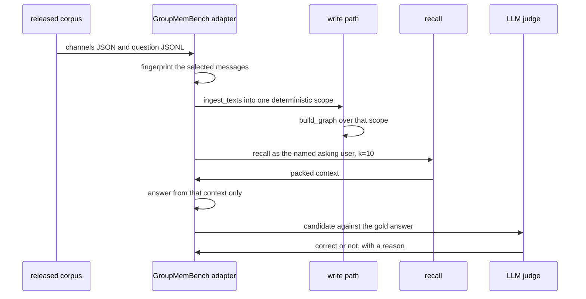

An external benchmark is the only level that compares aizk with anything, and it is the level
where aizk currently has no number to show. This page assumes you have read
[how we evaluate](/docs/dev/eval/approach/) and know the isolation rules on
[the eval CLI](/docs/dev/eval/cli/).

## The GroupMemBench adapter

`src/eval/groupmem.py` reads the released conversation and question schemas directly. It does not
copy the upstream implementation, whose repository currently declares no license. Messages come
from `data/final/<Domain>/synthetic_domain_channels_rolevariants_<Domain>.json` and questions come
from `questions/<Domain>/<kind>.jsonl`, both validated into frozen models before anything is
stored.

Structure is preserved rather than flattened into text. Every message keeps its author, role,
channel, reply target, phase, topic, decision marker and source time, and those become a
`CaptureContext` on the ingested source. Every question is asked as the user who asked it, so a
first-person question resolves against the right speaker.



The scope is derived from `benchmark:GroupMemBench:<domain>:<fingerprint>`, and the fingerprint is
a SHA-256 over the adapter version and the exact selected messages. Two revisions of a corpus
therefore cannot share prepared state. Preparation is idempotent and verified, because
`corpus_state` counts the imported documents and any chunk that has not finished graph extraction,
and the runner refuses to score a corpus that is short a document or still has pending chunks. The
scope is purged after the run unless you pass `--keep`.

## The six question kinds

They stay separate in the report, so an overall score cannot hide a failure in one family.

| Kind | What it tests |
|---|---|
| `multi_hop` | combining facts that no single message holds |
| `knowledge_update` | preferring the current value over a superseded one |
| `temporal` | when something was true, not only that it was |
| `user_implicit` | resolving first-person language from the asking speaker |
| `term_ambiguity` | telling apart terms a team uses in two senses |
| `abstention` | refusing when the memory genuinely does not hold an answer |

An abstention case is only correct when the system abstains and invents nothing, which is why the
answer model returns a typed `BenchmarkAnswer` with an explicit `abstained` flag rather than a
sentence a judge has to interpret.

## Publishable is a computed flag

`BenchmarkReport.publishable` is not a decision somebody makes when writing up a result. It is the
conjunction of five conditions, and the rendered scorecard says `publishable` or `diagnostic`
accordingly.

```text
  complete_corpus        no --message-limit was used
  not sampled_questions  no --question-limit was used
  solvability_filtered   the domain is Finance or Technology
  reference_protocol     k = 10 and both agent and judge are gpt-5
  failed == 0            no network, generation, database or evaluator failure
```

Healthcare and Manufacturing stay useful as diagnostic domains, but their released questions are
unfiltered, so a score there is not comparable to the published protocol. Reusing the local LLM
also drops the run to diagnostic, and an operational failure is never turned into an ordinary
wrong answer.

## The honest status

No aizk GroupMemBench score exists. The adapter is implemented and unit-tested and the runner
executes the complete path, but a full run needs the deployed embedding and extraction lanes
against the whole 30,000 message domain, and that has not been completed. A synthetic estimate is
not an acceptable substitute, so there is no head-to-head claim on this page and there will not be
one until a run comes back publishable.

For difficulty context only, the GroupMemBench paper reports its best evaluated system at 46
percent overall. That is a reference for how hard the task is, not an aizk result and not a
target anybody here has hit.

## Running one

A small diagnostic run is the normal way to check that a corpus directory parses and that the
whole path still works end to end.

```sh
chefe run aizk-eval groupmem /path/to/GroupMemBench \
  --domain Finance --question-limit 2 --out /tmp/groupmem-smoke.json
```

That reroutes to the isolated evaluation database, resets it, imports the messages, builds the
graph, answers and judges, and then purges the scope. Because `--question-limit` is set it comes
back marked `diagnostic`, which is the correct label and not a warning to work around. Drop both
limits, point the answering and judging models at the reference protocol, and the same command
produces a publishable report or tells you which of the five conditions failed.

## Forgetting-aware scoring

`FAMAScore` in `src/eval/metrics.py` implements the Memora paper's per-question equation.

```text
score = max(0, MPA - weight * (1 - FAA))

  MPA     memory presence accuracy, the current memories the answer got right
  FAA     forgetting absence accuracy, the invalidated memories it correctly left out
  weight  forgetting criteria divided by all criteria
```

It penalizes exactly the failure a retrieval score misses. An answer that finds every relevant
current memory and also repeats an invalidated one scores a perfect MPA and still loses credit,
proportionally to how much of the question was about forgetting. When a question declares no
forgetting criteria the absence term defaults to 1.0 and the score reduces to plain presence
accuracy.

It is available and tested rather than in use. The GroupMemBench runner currently scores
correctness with an LLM judge, so no report on this page carries a FAMA number yet.

## The adapters that do not exist

`src/eval/` holds exactly one external adapter today. LongMemEval-V2, Memora and Mem2ActBench are
read, cited and used to shape the design, and briefs for each live in the corpus, but no code
imports their corpora and no score for them exists. If a page anywhere claims otherwise it is
wrong.

## The action-memory boundary

Everything measured across these pages is retrieval and extraction. A retrieval score says that
the right evidence reached the top of a packed context. It says nothing about whether an agent
then chose the right action, because aizk generates no actions and no benchmark here scores any.

That boundary matters because action-memory benchmarks are the ones people most want a memory
system to win. Reporting a retrieval number against them would be a category error, so when a
comparison needs an action-selection claim, the honest answer is that aizk has not measured it.

## Next

<div class="not-content">

- [How we evaluate](/docs/dev/eval/approach/) explains why the levels never borrow authority.
- [The eval CLI](/docs/dev/eval/cli/) has the `groupmem` flags and the isolation rules.
- [Comparison](/docs/dev/prior-art/comparison/) places aizk beside other memory systems.
- [References and lineage](/docs/dev/prior-art/references/) has the papers these adapters read.

</div>
