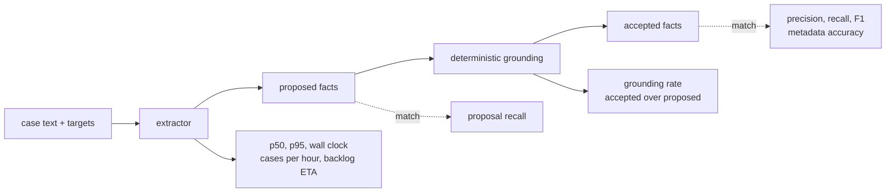

Retrieval can only find what extraction wrote, so the graph writer gets its own benchmark. This
page assumes you know how [extraction and the gate](/docs/dev/write/extraction/) work and how
[grounding](/docs/dev/write/consolidation/) rejects a fact. The command surface is on
[the eval CLI](/docs/dev/eval/cli/).

## The benchmark

`chefe run aizk-eval extraction` takes a JSONL file of human-verified cases. Each line is one
source span and the graph facts a correct extraction would produce, where a target names the
acceptable subject names, the predicate, the acceptable object names, and optionally the
epistemic kind and the valid-from date.

Scoring the same targets twice is the point. Proposal recall says what the model saw, accepted
precision, recall and F1 say what survived grounding, and the gap between them is the grounding
rate. A model that proposes beautifully and grounds badly is not a better model, it is a slower
way to write nothing.

Matching is normalized and one-to-one. Names are case-folded with whitespace collapsed, each
target consumes at most one fact, and metadata accuracy is only computed over the fields a target
actually declared, so a case that pins no date cannot dilute the score. Latency reports p50 and
p95 per request plus the wall clock of the whole run, and from the wall clock it derives completed
cases per hour and the projected `--backlog` ETA, defaulting to a backlog of 10,704 chunks.

Failures are retained rather than absorbed. A `LengthFinishReasonError`, an HTTP error, unexpected
model behavior or a validation error becomes a case with zero matches and its error string, and
the rendered line always carries `failed=` beside the F1. A benchmark that drops its failures
measures the subset that happened to work.

## Model selection, measured not guessed

Faithfulness here means each statement was judged against its source chunk. Structure-only checks
are blind at this job, because XGrammar makes even tiny models emit valid JSON.

| Model | Valid | Faithful | Truncation | VRAM | Verdict |
|---|---|---|---|---|---|
| Gemma 4 31B w4a16 | 20 / 20 facts | 100% deterministic grounding | 0% | 22.8 GB | previous production baseline |
| Gemma 4 12B w4a16 | not yet measured | not yet measured | not yet measured | 10.3 GB weights | current extractor, production validation pending |
| Gemma 4 E2B w4a16 | 35 / 40 responses | 68.6% judge faithfulness | 12.5% | 7.2 to 9.5 GB | lower resource baseline, not production |
| Gemma 4 E4B | not measured | not measured | not measured | 9.2 GB | cannot emit valid structured JSON on vLLM 0.24, also over budget |
| Qwen3.5-4B | not measured | not measured | not measured | not measured | Mamba-hybrid cache caps real concurrency near 13 |
| Qwen3.5-0.8B | 11 | 62.5% | 72.5% | 2 GB | entity-explosion truncation collapses yield |
| Gemma 3 270M | not measured | not measured | not measured | not measured | blocked by an HF gate, and the cascade would offload only 12.5% anyway |

Offline batching was probed and rejected in the same pass. A warm HTTP server does 37.4 prompts
per second while vLLM's `run_batch` spends 57.6 seconds on cold engine init alone.

The July 17, 2026 production check ran 31B on GPU 1 against five stored documents covering
frontend architecture, authentication, hashing, artifacts and the public memory interface. The
final wire contract proposed twenty facts and grounded all twenty. Three earlier cells on the same
documents had each failed for an interface reason rather than a model reason. A nullable wire
quote let the model omit evidence, legal JSON whitespace exhausted a bounded response, and the
phrase shortest quote encouraged ellipses spanning separate source spans. Requiring a quote,
enabling compact XGrammar output, and requiring one contiguous character-for-character substring
fixed all three.

The same host then tried Gemma 4 E2B with an 8,192 token context and 95 percent GPU allocation.
It used about 9.5 GB of the 24 GB card and never became healthy inside two bounded five minute
windows, so the service was stopped as stalled and production returned to 31B. That is an
operational failure rather than a quality result, and it does not erase E2B's earlier numbers,
but it does mean E2B neither meets the dedicated-card requirement nor offers a safer path.

## GLiNER against the LLM

Two smoke cells, both small, both on real chunks.

The first, on 2026-07-14, compared the two selectable backends on four recent dense research
chunks from the live Crimson database. GLiNER ran in 10.9 to 15.5 seconds on CPU while the LLM
took 20.1 to 60.1 seconds on its GPU. The LLM produced 31 facts across the four chunks, GLiNER
base produced eight and emitted nothing at all on two of them. Exact triple agreement was zero,
and manual inspection found several GLiNER relations that did not express the source meaning.

The second cell moved GLiNER onto the same GPU stack and fixed its missing long-text integration,
then compared base, large and the LLM on the latest four dense vault chunks.

| Backend | Setting | Result |
|---|---|---|
| GLiNER2 base | threshold 0.5, 1.5 GB VRAM | 11 relations in 2.76 s including first-request warmup |
| GLiNER2 large | threshold 0.5, 2.4 GB VRAM | 13 relations in 2.84 s, some obvious errors removed |
| GLiNER2 large | threshold 0.6 | 6 relations, one empty chunk, several wrong predicates retained |
| GLiNER2 large | threshold 0.7 | 2 plausible relations, two empty chunks, 0.27 s after warmup |
| LLM | production contract | 32 far more coherent facts, no empty chunk, 75.51 s, strict quote check clean in three chunks and at least one mismatch in the fourth |

Both GLiNER checkpoints still emitted self-relations and predicates that contradicted the source
at every threshold that returned useful volume. The conclusion follows directly. The LLM stays the
production graph writer, and GLiNER2 large on GPU is the shared cheap gate and a selectable
experimental writer at the safer 0.7 threshold. The large model is nearly free beside the existing
lanes, but speed cannot compensate for wrong graph edges.

Gate value is corpus dependent and worth replaying rather than assuming. An earlier base-model
measurement over the dense research vault skipped only 2.2 percent of chunks, so the gate earns
much more on a sparse corpus than on that one. `chefe run aizk-eval gate` is how you find out for
yours.

A whole-stack cell on 2026-07-14 exercised the deployed Crimson stack with three vendored papers,
one repository guide and five source files. Extraction completed all 220 chunks and produced 2,086
entities, 2,033 facts and 2,079 profiles. A manual reading of eight cross-document questions found
three strong answers, two partial answers and three justified abstentions, with median recall at
6.81 seconds and median answer generation at 1.42 seconds on the two RTX 3090 host.

## Trying an external model

An external OpenAI-compatible endpoint uses the same extraction path and the same benchmark, which
is the whole reason `--model` is the string actually sent rather than a report label. One URL and
one key can therefore compare several hosted models in sequence.

| Provider | How it is configured | What was learned |
|---|---|---|
| OpenRouter | `AIZK_RUNTIME_LLM_URL`, a dedicated key, and `AIZK_LLM_EXTRA_BODY` requiring Zero Data Retention and strict schema support with reasoning disabled | extraction pays nothing for hidden reasoning tokens, and a provider must be pinned per run so a comparison does not silently swap quantizations or hosts |
| Modal | a catalog endpoint plus a private proxy token pair in `AIZK_LLM_HEADERS`, OpenAI compatible and scaling to zero | run quality at concurrency 1 first, then throughput at 8, and only try 16 once 8 shows no schema failures, rate limits or worsening p95. Global placement keeps the base price while broad regions cost 1.5 times and narrow ones 1.75 times |
| Cerebras through OpenRouter | pinned with `provider.only` and fallbacks disabled | listed on 2026-07-20 at $0.99 input and $1.49 output per million tokens with roughly 1,800 generated tokens per second |

That Cerebras throughput is a provider planning number and not a backlog promise. At 500 output
tokens for each of 10,704 pending chunks, generation alone has a sequential arithmetic floor near
50 minutes, and four fully parallel requests reach about 12.4 minutes only if the advertised rate
holds independently per request and the account rate limit admits that concurrency. So the rule
is to compute the ETA from measured cases instead, which is `pending * wall_seconds / completed`,
and to report p50 and p95 beside it so a few slow or retried requests stay visible.

Everything on this page is a small diagnostic on real data, not a published quality benchmark.
None of these cells has enough cases to support a claim about a model in general.

## Next

- [Extraction and the gate](/docs/dev/write/extraction/) is the pipeline these numbers measure.
- [Grounding and consolidation](/docs/dev/write/consolidation/) explains what grounding rejects.
- [Retrieval results](/docs/dev/eval/retrieval/) is the read side of the same posture.
- [Hardware and cost](/docs/dev/run/hardware/) turns these model choices into a machine.

