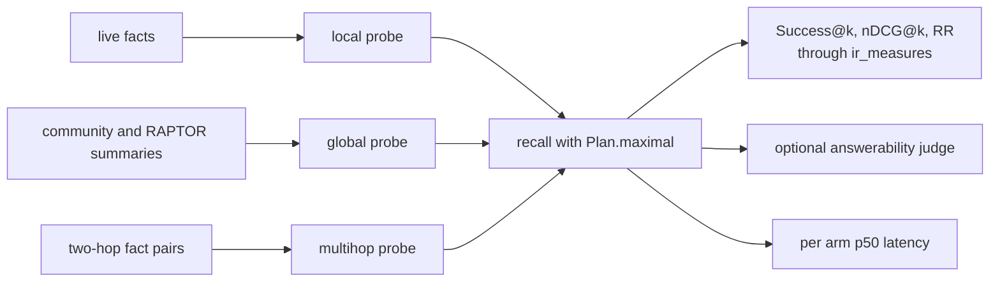

This is a level two page in the sense of [how we evaluate](/docs/dev/eval/approach/). Everything
below is a measurement of one deployment's own memory, so it is a regression instrument rather
than a score anybody can compare against another system. The commands live on
[the eval CLI](/docs/dev/eval/cli/).

## What the bench measures

`chefe run aizk-eval bench` never invents a question. It reads what the corpus already holds, has
the LLM turn each sample into a probe, and then scores the single plan production recall always
uses.

Relevance is decided by the source text the probe came from. `question_scores` walks the ranked
candidates, marks the first candidate that equals or contains each expected statement as
relevant, and hands the qrels and the run to `ir_measures`, so hit rate, nDCG and reciprocal rank
are computed by a library rather than by us. A multihop probe carries two expected statements and
both have to be matched, one candidate each.

Answerability is separate and off by default. With `AIZK_EVAL_JUDGE` set, the packed context is
rebuilt at a 1024 token budget and an LLM is asked whether that context can answer the question.
It is a second opinion on the packing rather than a correctness score, because the judge sees
only what recall returned.

## The three strata

**Local** probes come from visible current facts, one question per statement, with the proper
nouns kept so the subject stays identifiable. **Global** probes come from community summaries
first and RAPTOR summaries second, and the prompt forbids reusing the summary's own distinctive
words so a surface match cannot answer them. **Multihop** probes come from pairs of facts that
share an entity, where neither fact alone is enough.

The multihop stratum has the guardrails, because it is the easiest one to accidentally cheat.
`graph_edges` reads 32 times as many edges as questions requested so there is slack to find real
chains, `two_hop_paths` refuses a pair that backtracks or repeats a statement, and every
generated question must contain both the starting anchor and the bridge as a contiguous run of
whole words. `mentions` does word-run matching rather than substring matching, so a short anchor
like `AI` cannot match inside `brain`. Unanchored questions are logged and discarded, and
duplicates are dropped case-folded.

## The management contract

`chefe run aizk-eval management` asks a narrower and harder question. It discovers every visible
Area and Project from declared source documents, renders twenty templated questions for each one,
and then checks where that subject's own current brief ranked inside the packed context. Hit
means the brief survived anywhere in the pack. First means it ranked first. Making the current
brief its own retrieval reference is what exposes incidental evidence that would otherwise hide a
correct answer underneath it.

The 2026-07-15 production cell covered all 8 Areas and all 40 Projects, including paused,
completed, cancelled and archived work. It ran 960 questions with four concurrent recalls, an
eight candidate target and the production 2,048 token budget. The intended current brief was
present and ranked first for 960 of 960 questions, every subject scored MRR 1.0, p50 was
1,778.5 ms and p95 was 2,103.1 ms.

The first run of that same cell is the more useful half of the story. It reached 960 hits but
only 945 first place results. Every one of the fifteen misses came from one managed title being
contained inside another, `JLPT N2` inside `JLPT N2 Window Weekly Plan` being the clearest case,
so a question about the shorter subject pulled the longer subject's brief up with it. The fix
gave direct identity authority only to the maximal overlapping title, and it closed all fifteen
cases without touching the maximal retrieval plan.

Be precise about what this proves. It proves source identity and packing correctness, meaning the
right document reaches the top of the pack for a question about its subject. It does not judge
whether an answering model then used every field of that brief correctly, because no answer is
generated.

A second production cell used seven briefs from the vendored memory papers, one focused question
each, covering GroupMemBench, Does Memory Need Graphs, Hindsight, APEX-MEM, LongMemEval-V2,
Memora and Mem2ActBench. All seven ranked their own brief first, and later sequential
representative recalls took about 1.0 to 2.3 seconds.

## The plan ablation and the router

`chefe run aizk-eval plans` exists to keep production honest about the plan it chose. It scores
`maximal` beside `maximal_without_raptor`, `maximal_without_communities`,
`maximal_without_profiles` and `focused` over the same generated questions, so removing one lane
is a paired comparison rather than a rerun. The same command also sweeps the graph seeding arms,
which turn `graph_entity_seeding` off, force exact mention matching, allow fuzzy matching, and
vary the GLiNER confidence floor.

Routing is measured here and nowhere else, because production stopped routing. `Route.classify`
sends the question to GLiNER2's zero-shot text-classification head and the arm compares the
predicted route against the stratum label with a full confusion matrix. That classifier measured
44 percent accuracy on the eval strata, which is why every production recall now runs the maximal
plan and why the `Route` enum survives only as an instrument to measure what query-time routing
would have chosen and what it would have cost.

## The other dated cells

Every one of these is a pinned observation with its conditions attached, and none of them is a
published quality score.

| Date | Conditions | Result |
|---|---|---|
| 2026-07-12 query regression | PostgreSQL 18, VectorChord 1.1.1, 100,000 chunks and 100,000 live facts | local database execution 855 ms to 340 ms, cold multihop 3.02 s to 2.05 s, warm multihop about 0.5 s, temporary I/O removed |
| 2026-07-12 vault check | 23 related notes, 10 explicit source qrels | identical rankings, hit@8 and MRR both 1.0 |
| 2026-07-12 ranking upgrade | planted corpus, 128 topics, 99,840 chunks, 104,448 live facts, ground truth encoding each mechanism | mention-seeded PPR recovered 508 of 512 planted chain facts against 128 for the previous recursive walk, access-decay ranked the fresh twin first in 128 of 128 pairs, the per-document cap lifted distinct sources from 1 to 4 of 8, the 0.65 floor packed zero lines on every noise question |
| 2026-07-12 latency on that corpus | same planted corpus, ordered candidates materialized | local recall about 259 ms p50, multihop about 465 ms p50 |
| 2026-07-12 embedder shootout | real vault chunked by the production chunker into 1,903 spans over 1,156 notes, 1,101 title queries, 1,024 stored dimensions | Qwen3-VL-Embedding-2B hit@5 88.0 percent and MRR 0.794, Qwen3-Embedding-0.6B 89.3 and 0.792, Qwen3-Embedding-4B 90.1 and 0.802, rising to 90.3 and 0.807 at its native 2,560 dimensions |
| 2026-07-12 reranker cell | both Qwen3 reranker checkpoints through vLLM, reranking the embedder's own top 8 for 253 real vault queries | without the official prompt scaffold both collapsed MRR from 0.90 to about 0.40, with it the 0.6B still fell to 0.77 while the 4B held 0.91 against a 0.90 baseline |

Two readings of that table matter. The 0.65 relevance floor is not a tuned constant, it comes
from real Qwen3-VL geometry where relevant vault chunks landed at cosine distance 0.27 to 0.49
while off-corpus questions bottomed out at 0.60 to 0.75. And cross-model distance comparisons say
nothing at all, because absolute cosine values under instruction-asymmetric embedding are
model-specific geometry and only margins carry meaning.

## Next

- [Retrieval tuning](/docs/dev/read/tuning/) is every setting these cells moved.
- [Fusion and reranking](/docs/dev/read/ranking/) explains the lane the reranker cell scored.
- [Extraction and models](/docs/dev/eval/extraction/) covers the write side of the same posture.
- [External benchmarks](/docs/dev/eval/external/) is the only level that compares systems.

