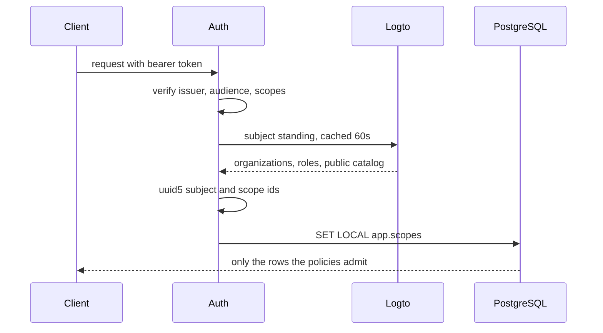

This page assumes you know what a [scope](/docs/user/concepts/scopes/) is. The array that carries
one is explained on [Scope sets in depth](/docs/dev/identity/scope-sets/), and this page only
covers where the values in it come from.

## There is no identity table

Search the schema for a users table, an organizations table or a memberships table and you will
not find one. Logto owns all three. `src/aizk/store/identity/` holds two Pydantic models, `User`
and `OrganizationStanding`, and neither is a SQLModel table. `User` is an `rls.Context`, so its
only job is to be serialized into transaction-local PostgreSQL settings.

A mirror can disagree with its source. If aizk copied membership, somebody removed from a team in
Logto would keep reading that team's memory until a sync ran. With no copy there is no window.

## What one request derives

`Auth` in `src/aizk/auth.py` is the entire boundary and it is a `TokenVerifier`.

Verification happens first. `get_verifiers()` reads the tenant's OIDC discovery document once and
builds one `JWTVerifier` per advertised signing algorithm, each pinned to the discovered issuer,
to the audience `settings.mcp_resource_id`, and to the required scopes. That audience is
`{mcp_public_url}/mcp` exactly, so a token minted for any other resource fails. The required
scope set defaults to `{"control"}`.

Only then does identity resolution run. `identify()` validates the verified claims into `Claims`,
which carries `iss`, `sub`, `aud`, `exp`, `iat` and three optional display names. A
`ValidationError` there is logged and returns nothing, which fails closed.

Stable IDs are derived, never stored. `Settings.subject_id` and `Settings.scope_id` are both
UUID5 over `identity_url`, which defaults to `https://aizk.phvv.me`.

```python
uuid.uuid5(uuid.NAMESPACE_URL, f"{namespace}/subjects/{subject}")
uuid.uuid5(uuid.NAMESPACE_URL, f"{namespace}/scopes/{external_id}")
```

The same Logto subject always lands on the same aizk user ID, and the same organization always
lands on the same scope ID, on any machine, with no lookup table.

## Standing does not ride in the token

The token proves who the caller is. It does not say what they may read. `LogtoClient.user_subject`
does that, reading the subject's organizations, the public organization catalog and the tenant
roles from the Management API, then calling `User.authorized` with three sets. Read is the caller
plus every organization they see, write is the caller plus every organization whose permissions
include `logto_write_permission`, which `src/deploy/logto.conf` sets to `write:memory`, and public
is the public catalog.

Be aware of one stale comment. `src/web/src/hooks.server.ts` says organization standing rides in a
custom `aizk_groups` claim, and uses that as the reason to leave the `urn:logto:scope` organization
scopes out of the sign-in request. Nothing in the Python server reads such a claim. Leaving those
scopes out is still correct, because standing is resolved server side, but the reason the comment
gives no longer describes the code.

## The authority cache

Calling the Management API on every request would be slow and fragile, so `LogtoClient` wraps each
read in `alru_cache` with `ttl=settings.logto_cache_seconds`, which defaults to 60 seconds.

| Cache | Key | Holds |
|---|---|---|
| `_cached_user_orgs`, `_cached_account`, `_cached_user_roles` | subject | one person's standing |
| `_cached_organization_members` | organization id | one member directory |
| `_cached_organizations`, `_cached_public_orgs` | none | the tenant catalog |
| `_cached_organization_roles` | none | the shared role template |

`SnapshotCaches` groups them so a mutation evicts only what it invalidated, and `invalidate_all()`
clears everything after a policy change reshapes roles tenant wide.

Every cached read goes through `_closed`, which catches transport and validation errors, logs a
warning and returns the empty fallback. An empty read set means nothing is visible rather than
everything, so a Logto outage degrades to no access rather than to open access. When Logto is
configured and identity cannot be resolved at all, `Auth.resolve` falls back to
`client.anonymous()`, which grants public read and nothing else.

Some decisions cannot tolerate a stale answer, so directory reads take `fresh=True`. That path
bypasses the caches, raises instead of falling back, and screens the account. A deleted or
suspended account, or one lacking the `aizk-user` role, raises `LogtoAccessError`.

## MCP and the browser differ only at the edge

The MCP server hands FastMCP an `OIDCProxy` built by `Auth.provider()` and reads the request's
token through `get_access_token()`. The browser API declares an `HTTPBearer` dependency and calls
`Auth.bearer(token)`, which returns a `Caller` carrying both the resolved `User` and the raw Logto
subject. The API needs that raw subject because organization management calls act as the person
making them. Everything after those two lines is identical.



## Policy lives in a file

`src/deploy/logto.conf` is the committed, nonsecret authorization policy. It names the API
resource, the required scope `control`, the managed role prefix `aizk-`, the three organization
roles admin, editor and viewer, and the permissions each one carries.

`aizk admin auth audit` reports drift between that file and the live tenant, and exits 1 when the
report is not clean. `aizk admin auth apply` reconciles, replanning after each batch for up to
eight passes before it gives up, and evicting every cached snapshot afterward. `LogtoPolicy` only
touches the configured resource, its scopes, global roles under the managed prefix, and the named
organization roles and permissions. Anything else in the tenant is left alone.

## Next

<div class="not-content">

- [Scope sets in depth](/docs/dev/identity/scope-sets/) covers what the derived IDs are used for.
- [Background work](/docs/dev/identity/background/) covers jobs that carry no token at all.
- [Row level security](/docs/dev/store/rls/) has the policies these values are checked against.

</div>
