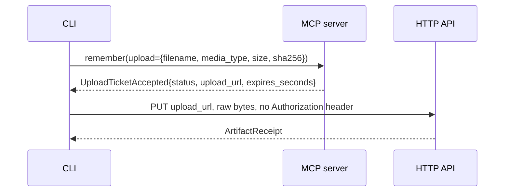

This page assumes you know what the MCP tools do, which [MCP tools](/docs/user/reference/tools/)
covers, and what the owner role is, which [Row level security](/docs/dev/store/rls/) covers. The
code is `src/aizk/cli.py`, `src/aizk/commands/` and `src/aizk/admin.py`.

## Two halves that share a name

`aizk` is one cyclopts app with two halves that never meet.

```text
  aizk
   ├── auth login | logout | status     ── talks MCP over the network
   ├── recall | remember | share | status
   │
   └── admin ...                        ── talks to PostgreSQL and Logto directly
        ├── health
        ├── server   mcp | api | worker
        ├── queue    status | doctor | retry {conversion,graph,profile}
        ├── database setup | migrate | make-migration | install-queue
        │            check-rls | backup | restore | reset
        ├── graph    rebuild | diagnose-extraction | decay | reembed
        │            communities | raptor | forget
        ├── data     ingest | promote | export | audit
        ├── ontology define-entity | define-relation | list
        ├── auth     audit | apply | check-public | check-web
        ├── settings show | validate
        └── api      openapi
```

The client half is what a person installs. It holds no database credential and reaches a server
only through the four MCP tools, so anything it can do, an agent could also do. The admin half is
what an operator runs next to the deployment, and it needs credentials the client half never sees.

`main()` catches `FileNotFoundError`, `PermissionError`, `ProtocolError`, `ValidationError`,
`ValueError` and `httpx.HTTPError`, prints one `error: ...` line and exits 2. Everything else keeps
its traceback, because an unexpected failure is a bug worth seeing.

## The client half

Every client command takes `--server` to override the selected profile and `--json` to print the
model rather than a rendered summary.

| Command | What it calls |
|---|---|
| `aizk auth login [server]` | interactive OAuth, then `status` to prove the session |
| `aizk auth logout` | clears this server's OAuth material only |
| `aizk auth status` | validates stored credentials without opening a browser |
| `aizk recall [query]` | the `recall` tool, reading stdin when the argument is absent |
| `aizk remember [paths...]` | the `remember` tool, in text, URI or upload mode |
| `aizk share <ids...>` | the `share` tool |
| `aizk status` | the `status` tool, rendered as account, usage and processing lines |

Two stores back this. `ProfileStore` writes the nonsecret server selection under the XDG config
root. Tokens go to the system keyring through `KeyringStore`, never to that file.

## Signing in and sending a file

`aizk remember ./contract.pdf` is worth tracing, because it is three round trips and no credential
ever touches the upload.



The declaration is made before any bytes move, so an oversized or duplicate file is refused
cheaply. The ticket is one-time and short-lived, and `MemoryClient.upload` streams the file in one
megabyte chunks with a plain `httpx` client rather than the authenticated one. Passing several
paths loops the whole exchange once per file and returns a `RememberBatchResult`.

Two size limits apply and they are far apart. The application ceiling is
`AIZK_OBJECT_STORE_UPLOAD_BYTE_LIMIT`, which defaults to 100663296 bytes, 96 MiB. ClamAV is
configured with `MaxFileSize`, `MaxScanSize` and `StreamMaxLength` all at `10M`, and scanning fails
closed, so **10 MiB is the practical limit** and 96 MiB is the theoretical one.

File paths cannot be combined with `--source-uri`, `--observed-at`, `--expires-at` or
`--preserve-source`, and the CLI rejects that before contacting the server.

## What needs the owner credential

`User.owner` opens the RLS-bypassing engine built from `settings.admin_database_url`, and it
raises `PermissionError` unless the caller is the system identity. Anything that provisions,
inspects across tenants, or rewrites rows in place needs it.

| Needs the owner DSN | Why |
|---|---|
| `admin health` | reads schema, roles and row counts through the admin engine |
| `admin database *` | migrations, queue install, backup, restore and reset |
| `admin queue status`, `admin queue doctor` | queue tables sit outside row security |
| `admin server worker` | `scope_roster()` reads distinct scope arrays past RLS |
| `admin graph reembed` and `admin graph raptor` | rewrite stored vectors and summary tiers in place |
| `admin graph diagnose-extraction` | loads one chunk by ID with no caller |

The rest run as an ordinary caller through the app role. `admin data ingest`, `promote`, `export`
and `audit`, `admin graph rebuild`, `decay`, `communities` and `forget`, and the `admin ontology`
commands all open `User.system(scopes)` and are filtered by the same policies a request would be.
They take
`--user` to act as a specific identity and `--scopes` where a destination is needed.

Three groups touch no database at all. `admin auth audit` and `apply` talk only to Logto and are
covered on [The Logto boundary](/docs/dev/identity/logto/). `admin settings show` prints the
effective configuration with every field named in `_SENSITIVE_FIELDS` or ending in `_api_key`,
`_password`, `_secret` or `_token` replaced by `<redacted>`. `admin api openapi` builds a throwaway
API around an `InertIntake` and writes `src/web/openapi.json`.

## Exit codes worth knowing

`admin queue doctor` exits 1 when the report is not healthy, `admin database check-rls` exits 1 and
prints each violation, and `admin auth audit` exits 1 when the tenant has drifted from
`src/deploy/logto.conf`. All three are meant for a release gate rather than a person reading
output.

`admin database reset` takes a `--confirm` argument that must match `settings.db_name` exactly, and
raises otherwise. Run every one of these with `chefe run` from the monorepo root.

## Next

<div class="not-content">

- [The MCP server](/docs/dev/interfaces/mcp/) is what the client half talks to.
- [First start](/docs/dev/run/first-start/) walks the admin commands in order.
- [The release gate](/docs/dev/run/release-gate/) uses the three commands that exit 1.

</div>
