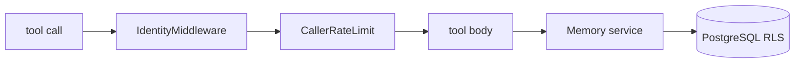

This page assumes you know how a caller is verified, which
[The Logto boundary](/docs/dev/identity/logto/) covers, and what the tools do from a user's point
of view, which [MCP tools](/docs/user/reference/tools/) covers. Here we look at
`src/aizk/mcp/` as code.

## One class, assembled once

`AizkMCP` in `src/aizk/mcp/server.py` subclasses `FastMCP`. It takes an `Auth`, a `ByteStore`, an
`UploadBox`, an `ArtifactIntake` and the `Settings`, and `aizk admin server mcp` builds exactly one
per process from `Runtime.assemble`.

Its constructor does four things in order. It calls `super().__init__(name, auth=auth.provider())`,
adds `IdentityMiddleware`, adds `CallerRateLimit`, then registers four tools and one resource
template.

The tools are not module-level functions. Each is built by a method that closes over
`self.settings`, so bounds like `mcp_recall_query_max_chars` and `mcp_remember_max_chars` are read
when the server is constructed rather than at import time. That is what lets a deployment change a
limit without a code change.

| Tool | Identified | What it does |
|---|---|---|
| `status` | yes | caller authority plus durable usage and processing health |
| `recall` | no | visible evidence for one question, rendered as Markdown |
| `remember` | yes | store text, preserve a URI original, or mint an upload ticket |
| `share` | yes | copy visible documents into one authorized destination |

`AizkMCP.user(context, identified=True)` is what enforces that column. It reads the caller bound by
the middleware and raises `ToolError` when an anonymous caller tries to write, so
`recall` is the only tool the read-only anonymous identity can reach.

The resource template is `aizk://artifacts/{artifact_id}/contents/{artifact_content_id}`. It reads
one exact original revision, checks visibility with `user.exec[_ArtifactObject]` rather than in
Python, and attributes the read to the artifact's own scopes rather than the caller's.

## The upload mode

`remember` with an `upload` declaration is the one tool call that does not write memory. It refuses
to be combined with `source_uri`, `preserve_source`, `observed_at` or `expires_at`, mints a grant
through `UploadBox.mint`, and returns exactly this.

```python
UploadTicketAccepted(status="accepted", upload_url=..., expires_seconds=...)
```

The caller PUTs the bytes to that URL, which the HTTP API serves. Callers never build the URL
themselves.

## The middleware chain



The order is load bearing. `IdentityMiddleware.resolve` calls `Auth.resolve()`, stores the `User`
on the request context under the `aizk_user` state key, opens an accounting context and a serving
span, measures the request JSON size, runs the handler, then queues one durable usage event with
the reply size. Because accounting happens after the handler returns, a failed call is not charged.

`CallerRateLimit` then reads that bound user and raises `ToolError` if none was resolved, which is
why it cannot run first. Its bucket is keyed by the aizk user ID, sized `round(rate * 5)` with a
refill of `mcp_request_rate_per_second`, and held in an `OrderedDict` capped at 4096 entries with
LRU eviction. This is burst control inside one process, not a durable quota. Tool calls and
resource reads drain the same bucket.

## The OAuth proxy

`Auth.provider()` returns a FastMCP `OIDCProxy` pointed at the tenant's discovery document, or
`None` when `logto_url` or `mcp_public_url` is unset, which is explicit local mode. Two of its
arguments matter. `extra_authorize_params={"prompt": "consent"}` forces the consent screen, and
`extra_token_params={"resource": settings.mcp_resource_id}` makes Logto mint a token whose audience
is this server. Reference tokens live `oauth_reference_token_seconds`, which defaults to 31536000,
one year.

The proxy accepts dynamic client registration, so an MCP client that has never seen this
deployment can register itself at `/register` without an operator minting credentials. That is
what makes `claude mcp add` work against a fresh server.

Registrations and token state have to outlive a restart or every client would have to log in
again after a deploy. FastMCP writes them to a `FileTreeStore` wrapped in a
`FernetEncryptionWrapper`, under `FASTMCP_HOME`, in a subdirectory named after a fingerprint of the
derived encryption key. `src/deploy/docker-compose.yml` sets `FASTMCP_HOME=/oauth` and mounts a
named volume there, which `volume-init` creates as mode 0700 owned by the runtime user. So a
container restart or recreate keeps logins, and a change to the underlying key material lands in a
different fingerprint directory and forces re-registration instead of failing.

Caddy forwards the proxy's paths to this process explicitly, `/mcp`, both
`.well-known` documents, `/authorize`, `/token`, `/register`, `/auth/callback` and `/consent`.

## Errors are translated, never leaked

Every expected failure becomes a `ToolError` with text a model can act on, and the original is
chained as the cause. `remember` maps `MalwareRejectedError`, `MalwareUnavailableError`,
`ObjectStoreError`, `httpx.HTTPError` and `ValueError`, and the artifact resource maps
`IntegrityMismatch` and store outages to `ResourceError`. Nothing lets a stack trace or an internal
message reach a client.

## Sharing a service, not a layer

The tools do not implement memory. `AizkMCP.memory(user)` builds a `Memory` from
`src/aizk/memory.py` bound to that caller, and the HTTP API builds the same object from the same
class. Recall, ingestion, scope authorization and graph projection are defined once there, and each
transport keeps only its own identity resolution and its own input limits.

`src/aizk/mcp/ruff.toml` keeps that honest. It extends the root config and bans `sqlalchemy.select`,
`sqlmodel.select`, both `Session` types and `aizk.store.engine.Database` inside this package. A
transport that cannot build a statement or open a session has to go through a model classmethod or
`User.exec`, which is where the scope rules already live. `src/aizk/api/ruff.toml` carries the same
overlay.

## Next

<div class="not-content">

- [The HTTP API](/docs/dev/interfaces/http-api/) is the other transport over the same service.
- [The CLI](/docs/dev/interfaces/cli/) drives these tools from a terminal.
- [Layers and import contracts](/docs/dev/architecture/layers/) explains the ban lists in full.

</div>
