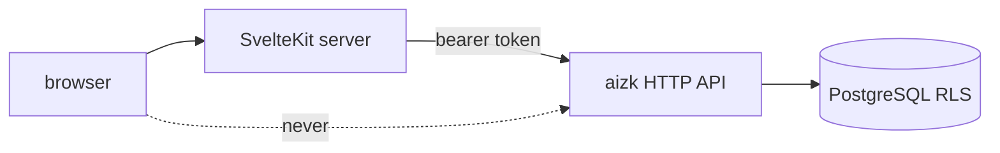

This page assumes you have read [The HTTP API](/docs/dev/interfaces/http-api/), because the app is
that API's only consumer and holds nothing of its own. What it looks like to a person is on
[The web app](/docs/user/using/web-app/). The code is `src/web/`, a SvelteKit 2 project on Svelte 5
built with `@sveltejs/adapter-node`.

## The route map

Everything a signed-in person sees lives under `/app/`. That prefix is not cosmetic. It is what
lets one origin carry the marketing page, the whole documentation site, the MCP server and the app
without a routing rule per page.

```text
  /                     static landing page          (not this app)
  /docs/...             this documentation site      (not this app)
  /healthz              container healthcheck        ── +server.ts, returns "ok"
  /auth/sign-in         redirect into Logto
  /auth/sign-up         same, firstScreen=register
  /auth/sign-out        POST only, so a link cannot end a session
  /auth/sign-in-callback  handled by the Logto hook
  /events/processing    server-sent events, proxied from the API
  /app/dashboard        /app/recall
  /app/sources          /app/findings   /app/subjects   /app/themes
  /app/usage            /app/processing
  /app/organizations
```

`src/lib/nav.ts` is the single source for the sidebar and groups those nine pages into Knowledge,
Explore, Operations and Collaboration. Adding a page means adding a route directory and one entry
there.

`src/deploy/Caddyfile` forwards exactly `/app`, `/app/*`, `/auth/*`, `/events/*` and `/_app/*` to
this process and sends everything else to the static site. A new documentation page therefore never
needs a routing change.

`/healthz` returns a plain `ok` and is the container healthcheck, because every other path either
needs a session or belongs to the static site.

## Sessions

`src/hooks.server.ts` builds the Logto handle lazily on the first request, so a build never needs
runtime environment variables. It requests `openid`, `profile`, `email`, `offline_access` and
`control`, and one resource, the shared `{AIZK_MCP_PUBLIC_URL}/mcp` audience. The session cookie is
encrypted with `AIZK_WEB_SESSION_SECRET`.

One quirk is handled there explicitly. The Logto hook always finishes sign-in by redirecting to
`/`, which the static landing page owns and this server never sees, so the hook catches that
redirect and sends the caller to `/app/dashboard` instead.

`src/routes/app/+layout.server.ts` guards the whole application. No `locals.user` means a redirect
to `/auth/sign-in`. A broken token exchange, recognized by `authBroken`, also restarts sign-in. A
4xx from the API surfaces as a real error, and only an unreachable or failing API degrades into an
offline shell with `apiOnline: false` and a label taken from the Logto session.

## The generated client

`src/lib/api/generated/` is written by `@hey-api/openapi-ts`, never by hand. The chain runs
`aizk admin api openapi` to dump `src/web/openapi.json`, then `pnpm generate` in `src/web`.

`src/lib/server/api.ts` wraps that SDK in one `ApiClient` class. Every call mints a fresh access
token for the API resource, builds a per-call client with an `Authorization` header, and unwraps
the result through `unwrap`, which turns any rejection into an `ApiError` carrying the status and
the API's own `detail` string. `failure` converts one of those into a SvelteKit form failure a page
can render.



The token never reaches the browser. Loads and form actions run on the SvelteKit server, which is
also why the processing stream has its own route at `/events/processing` rather than the browser
opening the API's `text/event-stream` directly.

## The rules this app must not break

**It calls the API and nothing else.** There is no database driver in `package.json` and no
connection string in `src/lib/server/settings.ts`. The settings module reads seven `AIZK_*`
variables and fails fast on any missing one, and none of them is a DSN.

**It duplicates no logic.** No recall ranking, no extraction, no graph traversal, no permission
check and no scope arithmetic exists in TypeScript. A page renders what a route returned. If a view
needs a number the API does not have, the fix is a new field on a Python response model, not a
computation in a `+page.server.ts`.

**It renders Markdown safely.** Recall answers come back as Markdown and go through `marked` and
then `dompurify` before reaching the DOM.

## The user-facing renaming

The app deliberately does not use the store's vocabulary. Three names are translated at the API
boundary, in `src/aizk/api/explorer.py`, and the frontend only ever sees the friendly ones.

| The app says | The store means | Backed by |
|---|---|---|
| Findings | facts | `Explorer.finding_rows` over the live fact view |
| Subjects | entities | `Explorer.subject_rows` over visible entity claims |
| Themes | communities | `Explorer.theme_rows` over `Community` |

Sources keep their name. When you are reading TypeScript and looking for the graph, `FindingPage`
is the fact catalog and `ThemePage` is the community list. The developer half of these docs uses
the store's names throughout, so
[Entities, facts, ontology](/docs/user/concepts/graph/) and
[Graph tables](/docs/dev/store/graph-tables/) are where the underlying objects are explained.

Scope arrays are translated too. `View` subclasses call `User.scope_labels`, so a row arrives at
the browser carrying Private, an organization name, or Shared, and never a UUID.

## Next

<div class="not-content">

- [The HTTP API](/docs/dev/interfaces/http-api/) is the contract this app is generated from.
- [Graph tables](/docs/dev/store/graph-tables/) has the real names behind the friendly ones.
- [Deployment topology](/docs/dev/run/topology/) shows where this process sits.

</div>
