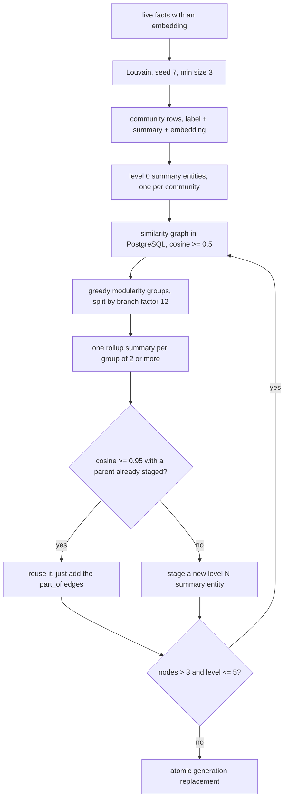

These two passes build the coarse end of retrieval. Recall can already find individual facts, so
what is missing is the answer to a broad question that no single fact carries. This page assumes
you know how a [scheduled job](/docs/dev/passes/jobs/) fans out per scope set and what the
`community` and `entity` tables look like, which [Graph tables](/docs/dev/store/graph-tables/)
covers. The web app calls a community a Theme.

## The growth gate

Both passes are expensive and both are pointless when nothing changed, so both sit behind
`run_if_grown()` in `src/aizk/background/jobs/maintenance.py`.

It counts every fact claim ever recorded in the exact scope set, with the live gate skipped so
closed and archived claims still count and the number only ever rises. It compares that to a
stored watermark, and when the difference is under the threshold it logs a skip and returns
without touching a model. Otherwise it builds and then writes the new count back.

The two passes use two different watermark kinds so they never consume each other's growth.
`Watermark.Kind` has four values in total, `fact_count` for communities, `raptor_fact_count` for
RAPTOR, `entity_dirty` for the profile queue, and `config` for stored settings. Both thresholds
default to 50 new facts, through `communities_every_n_facts` and `raptor_every_n_facts`.

## Detecting communities

`build_communities()` in `src/aizk/graph/communities.py` runs in three phases with short database
transactions between them, because model calls should never hold a connection open.

The snapshot reads every live fact in the scope that has an embedding, projected down to
`subject_id`, `object_id` and `statement`, plus the names of every entity those facts touch.

`detect()` then builds an undirected `networkx` graph whose edges are the facts that have an
object, so a unary fact contributes nothing to the topology. Partitioning is Louvain through
`networkx.algorithms.community.louvain.louvain_communities`, seeded with `settings.louvain_seed`,
which is 7, so a rebuild over an unchanged graph gives the same partition. The backend comes from
`settings.community_backend` and defaults to `"networkx"`, in which case the keyword is not passed
at all, because the in-process default and a registered accelerator such as nx-cugraph take
different dispatch paths. Clusters smaller than `community_min_size`, which is 3, are dropped.

Each surviving cluster becomes a prompt holding up to `community_entities_k` sorted member names
and up to `community_facts_k` internal statements, both 64. A statement counts as internal only
when its subject is in the cluster and its object is either absent or also in the cluster, so a
summary is never grounded in an edge leaving the group. The model returns a `CommunitySummary`
with a label and a summary, four clusters at a time under `community_build_concurrency`, and every
summary is embedded in one batch.

Storage is a generation swap. Inside one transaction the pass deletes every `community` row whose
`scopes` equals this exact array and inserts the new ones, each carrying `label`, `summary`,
`embedding` and the `member_ids` of its cluster. Communities are a projection, so throwing the old
generation away costs compute and never knowledge.

## RAPTOR over the communities

`build_raptor()` in `src/aizk/graph/raptor.py` treats those community summaries as the leaves of a
tree and recursively summarizes upward until few enough roots remain. Fewer than two communities
means there is nothing to roll up and the builder returns immediately.

`leaves()` stages one entity per community, typed `RAPTOR_SUMMARY`, with a deterministic ID
derived from the community label and reusing the community's own embedding. Its claim carries
`level` 0, the summary text, and the source community ID in `attributes`.

Each level then does three things. `similarity_groups()` sends the node embeddings to PostgreSQL
as a values relation and asks for every pair whose cosine distance is at or under
`1.0 - raptor_sim_threshold`, so with the default of 0.5 a pair is joined at cosine similarity 0.5
or better. That graph is partitioned with greedy modularity rather than Louvain, and isolated
nodes are preserved as singleton groups instead of vanishing. Each group is then chopped into
runs of at most `raptor_branch_factor`, which is 12, so no single parent ever summarizes an
unbounded fan-in. If the chopping produced at least as many groups as there were nodes then the
level made no progress and the loop breaks.

`parent()` summarizes one group with `raptor_rollup_system`, feeding each child's label and the
first `raptor_child_summary_chars` characters of its summary, 384 by default. Before staging the
result it checks `redundant_parent()`, which reuses an already-staged parent from this same level
whose summary embedding is within `raptor_redundancy_threshold`, 0.95, of the new one. A reused
parent still collects the new children's edges but is not written twice, which is what keeps a
level from filling with near-identical rollups. A group of exactly one member skips the model
entirely and its node rises unchanged.

`connect()` stages the structure itself. For every child a `part_of` fact is minted with the
statement `is part of <parent label>` and claimed in the same scope set, so the tree is ordinary
graph material that the fact lane can already retrieve. The loop stops once the node count is at
or below `raptor_root_max`, which is 3, or once `raptor_max_levels`, 5, is reached.

## Replacing a generation

`RaptorBuilder.replace()` writes the whole plan or none of it. It takes a transaction-scoped
advisory lock keyed by the canonical scope list, so two concurrent builds of the same scope
serialize rather than interleave, and it reselects the stale generation under that lock so a racer
cannot resurrect or double-delete rows. It deletes the stale `part_of` fact claims first, then the
stale summary entity claims, mints the new contents and claims, and only then deletes content rows
that no claim anywhere points at.

That last ordering matters. Content is global and scope-free while claims are scoped, so a summary
entity another scope set still claims survives the delete and only this scope's assertion of it
goes away. This is the same content and claim split the rest of the store uses.

## Next

- [Profiles, insights, decay](/docs/dev/passes/profiles-insights/) covers the per-entity summaries and aging.
- [The lanes](/docs/dev/read/lanes/) shows how recall actually reads communities and summaries.
- [Graph tables](/docs/dev/store/graph-tables/) has the column-level detail for both.
- [The job system](/docs/dev/passes/jobs/) has the schedules and the fan-out that trigger these.

