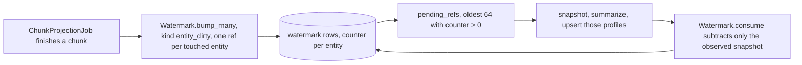

Three passes work on the graph after it exists. One keeps a readable summary per entity, one
reflects over the graph as a whole, and one lets unused claims fade out of default recall. This
page assumes you know how a [scheduled job](/docs/dev/passes/jobs/) reaches one scope set and what
the live view of a claim means, which [The bi-temporal model](/docs/dev/store/bitemporal/)
explains. In the web app an entity is a Subject and a fact is a Finding.

## Profiles

A profile is one evidence-grounded paragraph about one entity inside one exact scope set. The
`profile` table is unique on `(scopes, subject_id)`, so the same person can have a different
profile in your private scope and in an organization, built only from what that scope can see.

`ProfileBuilder` in `src/aizk/graph/profiles.py` runs three phases with short transactions between
them, because a model call must never hold a database connection.

The snapshot loads every claimed entity's name and then its current fact statements through
`Fact.Live.touching(entities, settings.profile_facts_k)`, capped at 40 statements per entity. An
entity with no live facts produces no grounding and therefore no profile at all. Summarizing runs
eight at a time under `profile_build_concurrency` with the `profile_system` prompt, and every
resulting summary is embedded in a single batch. Storage is one bulk upsert that updates `summary`
and `embedding` on conflict, so a rebuild never leaves a gap where the profile is missing.

Three entry points share that builder. `build_profile()` does a single entity and raises
`NotVisibleError` when the entity has no visible facts. `refresh_profiles()` rebuilds every
profile in the scope and is what `ProfileRefreshJob` runs weekly. `refresh_dirty_profiles()` is
the incremental path, and it is the interesting one.

## The dirty queue

Nothing rebuilds a profile because a timer said so. Rebuilds are driven by a counter that
extraction bumps.



`ChunkProjectionJob.handle` calls `Watermark.bump_many` with `Watermark.Kind.entity_dirty` and one
`ref` per entity the chunk touched, so the watermark table holds a per-entity backlog counter.
`ProfileProjectionJob` fires every minute, reads the oldest `profile_batch_size` refs whose counter
is positive, which is 64, rebuilds exactly those profiles, and then consumes.

Consuming is a subtraction, not a reset. `Watermark.consume` lowers each counter by the exact value
it read at the start of the batch, floored at zero, so a bump that arrived while the models were
running still leaves the entity dirty and it gets picked up on the next tick. Retained failures
from this job can be pushed back with `retry_failed_profile_projections()`.

## Insights

`InsightJob` runs weekly and derives observations about the graph rather than about one entity.
`InsightBuilder` in `src/aizk/graph/insight.py` grounds on the newest `insight_facts_k` live
statements, which is 40, explicitly excluding facts whose predicate is already `observes` so the
pass cannot feed on its own output. Fewer than two statements and it logs a skip and writes
nothing.

The model returns observations each carrying a statement and a significance between zero and one.
`kept_observations()` drops anything under `insight_min_significance`, which is 0.6, sorts what
remains by significance, and keeps at most `insight_max`, which is 5. A run that clears the gate
with nothing writes nothing, which is the intended common case.

What survives is written back as ordinary graph material. One entity named `graph observations`
exists per scope set, and each kept observation becomes a fact with that node as subject, no
object, the predicate `observes` and the significance stored on the claim's `attributes`. Because
the fact ID is derived from its own text, `observation_already_claimed()` can check past the live
gate and skip a statement this scope has ever claimed, so a repeated weekly insight is not
re-asserted and an archived one is not resurrected. The upside of writing insights as facts is that
the fact lane retrieves them with no special case anywhere in recall.

## Decay

`DecayJob` runs daily and calls `Fact.Claim.archive_stale`, which decides everything in one
`UPDATE`. Relevance uses the database's own clock, so no timestamp crosses into Python.

```text
  age       = now() - coalesce(last_accessed, lower(recorded))
  relevance = 0.5 ^ (age / half_life) * (1 + access_count)

  half_life = AIZK_DECAY_HALF_LIFE_DAYS,  default 90 days
  floor     = AIZK_DECAY_FLOOR,           default 0.25
```

A claim is archived when its relevance falls under the floor. With the defaults a claim nobody has
ever read is archived after two half lives, so 180 days, and a single read both resets the clock
and doubles the multiplier, which buys it another 90 days on top. Reads are what keep memory
alive, and the counters that feed this are the same ones recall bumps when it returns a fact.

Archiving is not deleting. The update closes the claim's `recorded` range at `now()` and stamps
`attributes` with a `decayed` timestamp. The claim row stays exactly where it was, so it leaves
the live view and drops out of default recall while remaining fully readable to a history query
and to anything asking what was believed on a past date. Only live claims with a currently valid
period are eligible, so a claim already closed by a correction is untouched.

## Dedupe and repair

The two module names are the reverse of what you would guess. `src/aizk/graph/dedupe.py` holds the
idempotent `claim_entity` and `claim_fact` helpers the other passes use, and the actual nightly
merge lives in `src/aizk/graph/repair.py` as `dedup_entities()`, which is what `DedupJob` runs.

The merge groups visible entity content by its type and normalized name, skipping RAPTOR summaries,
sorts by ID bytes so the same duplicate set always elects the same winner, and builds a redirect
map from each loser to the keeper. An entity whose name normalizes to nothing redirects to null,
which means drop.

Applying it is the delicate part, because a fact's content ID is derived from its subject,
predicate, object and statement. For each affected fact the pass snapshots the whole claim history,
deletes the content row, reinserts it under the same ID with the corrected endpoints, and replays
the claims onto it, so no history is lost. A fact that lost an endpoint to a null redirect is
dropped instead. The duplicate entity's own claims are then repointed at the keeper, except where
the keeper already has a claim in the same scope set, in which case the redundant one is deleted
first. Only then does the duplicate content row go away. All of this runs under the database owner,
since a merge by definition spans what any one caller can see.

## Next

<div class="not-content">

- [Communities and RAPTOR](/docs/dev/passes/communities-raptor/) covers the two clustering passes.
- [The bi-temporal model](/docs/dev/store/bitemporal/) explains why archiving closes a range instead of deleting.
- [The lanes](/docs/dev/read/lanes/) shows where profiles and observations enter recall.
- [The job system](/docs/dev/passes/jobs/) has the schedules that trigger all of this.

</div>
