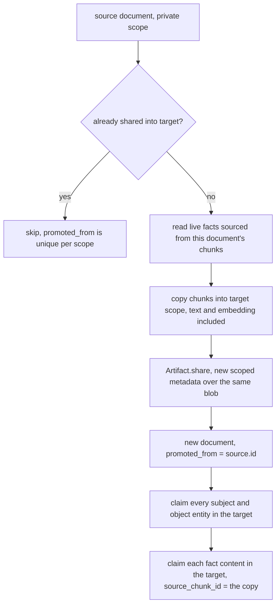

Two different things in aizk are called promotion. One moves a note from fast working memory into
the real graph, and one copies a document from one scope set into another. They share a verb and a
few column names and nothing else. This page assumes you know what a
[scope set](/docs/dev/identity/scope-sets/) is and roughly how
[intake](/docs/dev/write/intake/) turns text into a document with chunks.

## Working memory

`session_item` is the fast tier. A write that should be available immediately but does not deserve
a full extraction pass lands there first. The table is small.

```d2
direction: right

item: "session_item" {
  shape: sql_table
  id: UUID7
  kind: "text, default 'note'"
  text: "the item itself"
  provenance: "jsonb, the capture context"
  embedding: "halfvec(1024)"
  scopes: "uuid[], sorted, GIN indexed"
  promoted_at: "timestamptz, null while working"
  created_at: timestamptz
}

lane: "recall, vector lane" {
  shape: rectangle
}

graph: "document + chunks + facts" {
  shape: rectangle
}

item -> lane: "only while promoted_at is null"
item -> graph: "promote_sessions, then stamp promoted_at"
```

The row carries its own embedding, so an item is retrievable the moment it is written. The vector
lane reads it directly and filters on `promoted_at IS NULL`, so an item is served from working
memory until the graph has a better version of it and never from both at once.

`SessionItem.due_for_promotion()` decides what is ready, and it decides in SQL with two window
functions over the still-working items of one exact scope set. An item is due when it is older
than `session_promote_age_minutes`, which is 60, or when it sits among the oldest items past
`session_promote_threshold`, which is 20. The second condition is the overflow rule, so a burst of
fifty notes in one minute does not sit around waiting for an hour, and results come back oldest
first either way.

`promote_sessions()` in `src/aizk/graph/session_tier.py` runs every 15 minutes under
`SessionPromoteJob`. It takes the due items, rebuilds each one's `CaptureContext` from its stored
`provenance`, and hands them all to `ingest_texts`, which is the same intake path a normal write
uses. Then it stamps `promoted_at` so the items stop being offered and stop appearing in the
session lane, and calls `enqueue_pending()` so the new chunks get projected into the graph. The
item row itself stays, since it is the record of what was captured.

## Sharing

`promote()` in `src/aizk/graph/promote.py` is the implementation behind the `share` MCP tool and
behind `aizk data promote` on the CLI. `Memory.share` resolves the destination through
`user.write_scope(scopes)` first, so a caller can only ever name a scope set they may write to,
and then the whole pass runs inside the caller's own session rather than as the system user. Row
security therefore enforces both halves, since an invisible source document simply is not there to
read and an unauthorized destination fails on insert.



Each step is a copy, not a reference. The new `document` row repeats the title, subject type,
source URI, observed and expiry timestamps and content hash, and records `promoted_from` pointing
at the original. Every chunk is duplicated into the destination scope with its text, lexical
vector, token count, provenance and embedding intact, and the copies are kept keyed by their source
chunk ID so the facts can be rewired to them.

Facts and entities do not get duplicated, because content is already global and scope-free. Only a
new claim is written in the destination for each one, carrying the original's valid range,
attributes and perspective key, pointing its `source_chunk_id` at the copied chunk, and recording
`promoted_from` as the source claim. That is the whole provenance link, and it is what lets the
retrieval side give shared documents a small `promoted_bonus` of 0.01 when fusing chunk ranks.

Sharing twice is a no-op. Before doing anything the pass looks for a document already carrying
`promoted_from = source.id` in the target scopes and skips when it finds one, and the artifact
tables carry a matching `uq_artifact_promotion_scope` constraint.

## Why an artifact share reuses the original bytes

`Artifact.share` is the one place that deliberately does not copy. A `blob` is content-addressed
and immutable, so duplicating a whole PDF just to change who may read it would be pure waste. Instead
the destination gets its own `artifact` and `artifact_content` rows, scoped to the target, whose
`blob_id` points at the very same stored object. Visibility lives entirely on the metadata rows,
so two scopes can hold independent permissions over one physical file.

The method takes a transaction-scoped advisory lock keyed by the destination identity, then looks
for an existing target artifact by `promoted_from` or by matching `source_uri`, reuses an existing
revision when one already references the same blob, and otherwise appends at `max(revision) + 1`.
The lock is what makes the lookup, the blob dedup and the revision number safe against a
concurrent share of the same document. It also fetches the artifact and its content joined
together, so a forged pair whose `artifact_content_id` belongs to some other artifact cannot smuggle
foreign provenance into the destination.

## Sharing snapshots, it does not link

This is the part worth being blunt about. A share copies the facts that were live at that instant.
Nothing watches the original afterward. If you later correct a fact in your private scope, or
close it, or the decay pass archives it, the destination's claim is unaffected and keeps saying
what it said. The reverse is also true, since edits made in the shared copy never reach back.

That is a deliberate trade. A live link would mean a private correction silently rewriting what an
organization already read, and it would mean the destination's visibility depended on a row it
cannot see. A snapshot keeps both scopes independently readable and independently correctable, and
the `promoted_from` columns are still there when you need to know where something came from.
Re-sharing an already-shared document does not refresh it either, since the duplicate guard skips
it, so bringing a correction across today means correcting it in the destination.

## Next

<div class="not-content">

- [Sharing and organizations](/docs/user/using/sharing/) is the same subject without the SQL.
- [Scope sets in depth](/docs/dev/identity/scope-sets/) explains what a destination scope actually is.
- [Artifacts](/docs/dev/write/artifacts/) covers blobs, revisions and the object store.
- [The job system](/docs/dev/passes/jobs/) has the schedule that drives session promotion.

</div>
