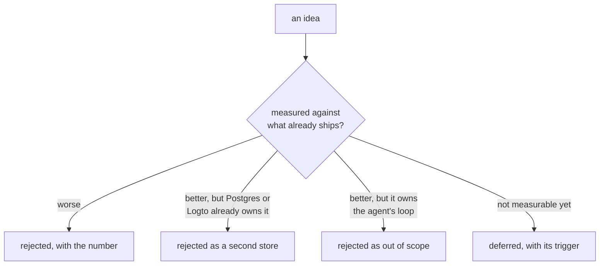

[References and lineage](/docs/dev/prior-art/references/) records what was taken. This page records
what was not, and why. A rejection with no reason attached is worthless to the next reader, who
will simply propose the same thing again, so every row below names the evidence or the boundary
that killed it.

Four things end an idea here.

## Rejected on a measurement

These lost to something already in the tree, and the number is the reason.

| Idea | Why it lost |
|---|---|
| query-time lane routing | the measured classifier was 44 percent accurate, and a wrong route deletes decisive evidence before ranking ever runs. The router survives only as an evaluation instrument |
| fixed lane ordering | facts-first and overview-first each failed on a different evaluation stratum, so neither order is safe as a default |
| `Qwen3-Reranker-0.6B` | reranking the embedder's own top 8 on real vault queries, MRR fell from 0.90 to 0.77 even with the official Qwen3 prompt scaffold, while the 4B checkpoint held 0.91. The small model is never a valid economy |
| swapping in `Qwen3-Embedding-4B` | on 1,903 real chunks and 1,101 title queries it gained one to two points (hit@5 90.1 against 88.0, MRR 0.802 against 0.794), which does not pay for losing the multimodal lane. Native dimensions added under a point, so the 1,024-dimension cut stands too |
| Google LangExtract as the extractor | lost head to head on yield, latency, and vocabulary enforcement. Its character-interval grounding was worth taking, and it became `quote_start` and `quote_end` on the claim |
| GLiNER2 as the graph authority | the large checkpoint is nearly as fast as base and somewhat more precise, but still much weaker than the LLM on relation meaning. It serves the cheap gate instead |
| the recursive graph walk | replaced by an in-statement personalized PageRank, which lifted planted chain-fact recall from 32 of 128 to 123 of 128 inside the final pack and is faster |
| a separate `uv sync` in CI | it drifted from the local environment. A stale lock plus three missing type stubs hid 187 pyrefly errors that the local gate never saw, so CI now builds the same chefe environment |
| pyright as a fourth type gate | its only distinct complaint is a false positive against the `patos` `sql.Field` and `sql.PK` stubs, so gating on it would buy nothing but inline suppressions. It can rejoin once that stub is fixed upstream |

## Rejected because something else already owns it

These were not bad ideas. They were second copies of state that PostgreSQL, Logto, or PgQueuer
already holds, and a second copy is a thing that can disagree.

| Idea | Why it was dropped |
|---|---|
| local `user_`, `group_`, and `membership` tables | identity now derives from the verified token, so the tables, the `aizk user` and `aizk group` CLI verbs, membership grants, the public-group toggle, and the group-delete trigger all went with them |
| a bespoke graph workflow ledger | the graph is a rebuildable projection and PgQueuer already owns durable execution state |
| Redis anywhere in the stack | PgQueuer is the only queue and Docling runs its local worker engine, so nothing needed a second datastore |
| Zitadel as the identity provider | Logto covers organizations, roles, and public metadata with one token claim, and running two identity stacks bought nothing |
| a Reflex Python dashboard | browser concerns moved to a separate SvelteKit app and its own API service, which left MCP as an agents-only surface of five tools rather than the 36 it once carried |
| graph-only authority | source briefs and chunks are more faithful than generated profiles and summaries, so the graph augments evidence and never replaces it |

## Rejected on principle

A human acceptance queue is the one that keeps coming back, and it is permanently out. There is no
pending state, no approve or reject verb, no standing approver pass, and no server-wide admin flag
whose only purpose was cross-tenant reach. Agents write sources directly and correct them when the
evidence changes, so a write is canon the moment it lands, and history rather than review is what
makes a wrong write recoverable.

The external benchmark command was removed for a related reason. It turned isolated questions into
retrieval gold without importing the conversations, speakers, scopes, or temporal state those
questions depend on, so the score it printed did not measure the benchmark it named. A number that
does not measure what it claims is worse than no number.

TRACE-KG style ontology induction was studied and not adopted. A declared ontology with
deterministic validation is easier to reason about and easier to test, and nothing measured yet
justifies letting the schema drift on its own.

## Deferred, with the trigger that would revive it

| Idea | What has to happen first |
|---|---|
| Mem2ActBench | evaluation has to be able to judge tool selection and arguments, not just retrieval |
| a flat baseline over raw messages, summaries, facts, and keywords | it is next in line and blocks nothing, and it is the honest control for every graph lane |
| page-level document images and video frames | measured retrieval quality has to justify the storage and serving cost |
| an import counterpart to scoped export | export shipped first because it is the one needed for backups |
| authenticated invalidation of the public organization directory | the directory is fail-closed today, which is safe but stale |
| narrow erasure and collecting content rows left without claims | needs a careful pass so a shared content row is never orphaned out from under another scope |
| a proactive work layer | aizk supplies memory and does not own an agent's planning or action loop |
| broad ingestion connectors | correctness, access, time, and evaluation come first |
| cross-platform CI | macOS runners carry no service containers, so the suite is a Linux job until that is solved |
| automatic PyPI publishing | the `rls` dependency is a direct git reference, which PyPI rejects. [Releasing](/docs/dev/contributing/release/) has the detail |
| freezing the MCP and operator surfaces | the benchmark results have to settle the defaults first |

## Next

- [References and lineage](/docs/dev/prior-art/references/) is the other half, what was taken and from where.
- [Comparison](/docs/dev/prior-art/comparison/) puts the surviving mechanisms beside other systems.
- [How we evaluate](/docs/dev/eval/approach/) explains what a measurement has to look like to count.

