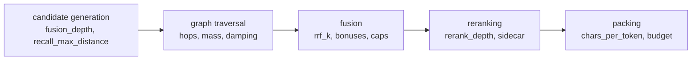

Every value below lives in `src/aizk/config/settings.py`, reads from the environment with the
`AIZK_` prefix, and reaches the SQL as a named bind through `settings.for_statement`. Nothing here
is compiled into the cached statement, so a changed setting takes effect on the very next recall.
Read [how recall runs](/docs/dev/read/overview/) first, because the groups below follow its steps.

The one number that is not a setting is `k`, the per-lane candidate budget. It is a `recall()`
argument defaulting to 8, so a caller changes it per request rather than per deployment.

## Candidate generation

| Setting | Default | Read in | Trades away |
|---|---|---|---|
| `fusion_depth` | 50 | `Chunk.fused`, `LiveFact.dense` | deeper pools find more, but every ranking pays the scan and fusion cost |
| `recall_max_distance` | 0.65 | `QueryContext.floor`, every dense ranking | lower is stricter and returns nothing off-corpus, higher lets weak matches through |
| `fact_candidate_factor` | 2 | `FactLane.merged` | multiplies `k` for facts, so the reranker sees more graph evidence at more scoring cost |
| `recall_per_document` | 3 | `Chunk.hybrid` | higher lets one document dominate the source lane |
| `session_recall_k` | 5 | `VectorLane` working memory | fresh session notes versus room for everything else |
| `profile_recall_k` | 1 | `VectorLane` profile | profiles are long, so more than one crowds the budget |
| `community_recall_k` | 3 | `VectorLane` communities | breadth versus specific evidence |
| `raptor_k` | 3 | `OverviewLane` | same trade at the top of the RAPTOR tree |
| `recall_recency_weight` | 0.1 | `LiveFact.dense` | how far a recently used fact climbs over a semantically closer one |
| `recall_recency_half_life_days` | 30.0 | `LiveFact.dense` | how fast that boost decays |
| `recall_frequency_weight` | 0.02 | `LiveFact.dense` | rewards often-used facts, and too high entrenches whatever was popular |

The `recall_max_distance` default is calibrated, not guessed. The comment in the settings file
records that on real Qwen3-VL query and document embeddings, relevant chunks land at cosine
distance 0.27 to 0.49 while off-corpus questions bottom out at 0.60 to 0.75, which puts 0.65
between the two populations.

## Graph traversal

| Setting | Default | Read in | Trades away |
|---|---|---|---|
| `graph_entity_seeding` | true | `query_entities` | off skips the gate call entirely and seeds nothing, which is the seeding ablation |
| `graph_mention_fuzzy` | true | `QueryContext.fuzzy`, `Entity.seed_mass` | trigram matching catches misspellings and costs a similarity join |
| `graph_mention_mass` | 10.0 | `Entity.seed_mass` | how decisively a named entity outweighs everything else |
| `graph_entity_seed_weight` | 1.0 | `Entity.seed_mass` | fallback mass from dense entity matches |
| `graph_fact_seed_weight` | 0.25 | `Entity.seed_mass` | fallback mass from dense fact endpoints |
| `graph_seed_entities` | 16 | `Entity.seed_mass` | how many dense entities can seed the fallback |
| `multihop_max_hops` | 2 | `Plan.maximal` | more hops reach further and drift further off topic |
| `graph_ppr_frontier` | 32 | `LiveFact.diffused` | the per-hop frontier cut, and the main cost lever of the walk |
| `graph_ppr_damping` | 0.5 | `LiveFact.diffused` | how much mass survives each hop |
| `graph_mass_window` | 80 | `LiveFact.diffused` | how many entities keep accumulated mass |
| `graph_dangling_factor` | 0.5 | `LiveFact.connected` | how much credit a one-endpoint fact keeps |
| `graph_facts_k` | 20 | `LiveFact.connected` | the size of the walk's contribution to the fact lane |

`graph_mention_fuzzy` is the one graph setting that changes the SQL tree rather than a bind, since
it decides whether the trigram branch is compiled. It is therefore part of the statement cache key,
and flipping it simply builds a second cached statement.

## Fusion

| Setting | Default | Read in | Trades away |
|---|---|---|---|
| `rrf_k` | 60 | `reciprocal_rank_fusion` | lower sharpens the top ranks, higher flattens toward agreement across rankings |
| `promoted_bonus` | 0.01 | `Chunk.hybrid` | how much a promoted document outranks a peer on the same fused score |

The named-title bonus is a hard-coded `1.0` in `Chunk.hybrid` with no setting behind it, because it
is a class marker rather than a weight. See [fusion and reranking](/docs/dev/read/ranking/).

## Reranking

| Setting | Default | Read in | Trades away |
|---|---|---|---|
| `rerank_depth` | 50 | `merit_order` | candidates past this depth keep statement order and are never scored |
| `rerank_url` | `http://localhost:8004` | `RerankClient` | where the cross-encoder sidecar lives |
| `rerank_model` | `qwen3-reranker` | `RerankClient` | the served checkpoint |
| `rerank_concurrency` | 8 | `RerankClient` | in-flight requests to one sidecar process |
| `rerank_request_timeout` | 30.0 | `RerankClient` | how long a slow score blocks the whole recall |
| `rerank_query_max_tokens` | 512 | `RerankClient` | truncation point for the question |
| `rerank_document_max_tokens` | 1408 | `RerankClient` | truncation point for one evidence line |
| `rerank_instruction` | see settings | `RerankClient` | the judging instruction the scaffold wraps |
| `rerank_query_template` | Qwen3 scaffold | `RerankClient` | changing it decalibrates every score |
| `rerank_document_template` | Qwen3 scaffold | `RerankClient` | same |

`rerank_document_max_tokens` is set above `chunk_size / recall_chars_per_token` on purpose, so a
full source chunk reaches the cross encoder whole and a late section is not silently cut off before
it is judged.

## Packing

| Setting | Default | Read in | Trades away |
|---|---|---|---|
| `context_token_budget` | 2048 | `recall()`, the MCP tool default | the size of the answer |
| `mcp_recall_budget_max_tokens` | 16384 | `src/aizk/mcp/server.py` | the ceiling a caller may raise the budget to |
| `recall_chars_per_token` | 4.0 | `Candidate.token_count` | estimate accuracy, and it is wrong on CJK and on dense code |
| `chunk_size` | 2048 | `Chunk.source_line` | snippet length per source hit |
| `display_timezone` | `UTC` | `Chunk.source_line` | which timezone observed and expiry dates render in |

## Which knobs are safe to move

Move these freely, since they change how much you get rather than what wins.
`context_token_budget`, `session_recall_k`, `profile_recall_k`, `community_recall_k`, `raptor_k`,
`recall_per_document`, `display_timezone` and `chunk_size` are all in this group. The worst outcome
is a longer or shorter response.

Move these behind an evaluation run. `recall_max_distance`, `rrf_k`, `rerank_depth`,
`fusion_depth`, `promoted_bonus` and the three fact-blending weights all change which evidence
wins, and the effect is not monotonic. `chefe run aizk-eval` is the tool, and
[how we evaluate](/docs/dev/eval/approach/) explains the strata.

Do not move the rerank templates or `rerank_model` without rescoring. The scaffold turns a
classifier into a calibrated score, so an edited template produces numbers that still sort but no
longer mean anything.

The graph settings sit in between. `multihop_max_hops` and `graph_ppr_frontier` are the two that
dominate walk cost, so if recall latency is the problem, start there and measure before touching
the mass weights.

## Next

- [How we evaluate](/docs/dev/eval/approach/) is how to change any of this responsibly.
- [Retrieval results](/docs/dev/eval/retrieval/) has what the current defaults score.
- [The lanes](/docs/dev/read/lanes/) shows where each limit applies.

