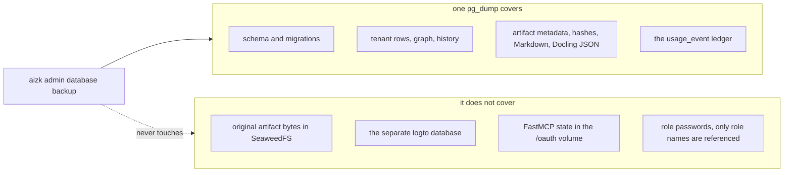

A backup is only as good as the last time somebody restored it. This page covers what
`src/aizk/backup.py` actually writes, what a restore brings back, and the several things it does
not. It assumes you know the role split from
[PostgreSQL and storage](/docs/dev/run/postgres/).



## The scheduled job

`BackupJob` in `src/aizk/background/jobs/maintenance.py` is a `SystemScheduledJob`, so it reads
its cadence and its on switch straight from settings. Only the private `worker` runs it. The
Compose file sets `AIZK_BACKUP_ENABLED: "1"` and `AIZK_BACKUP_DIR: /backups` there, and blanks
both on `server` and `api` alongside the owner credentials.

```sh
AIZK_BACKUP_ENABLED=1
AIZK_BACKUP_DIR=/backups
AIZK_BACKUP_CRON="0 2 * * *"
AIZK_BACKUP_KEEP_DAYS=14
```

Each run writes `aizk-<UTC timestamp>.dump` and then prunes. `prune_backups` deletes files
matching `aizk-*.dump` older than `backup_keep_days`, which means a file you renamed will never
be pruned and a file you copied in with a matching name will be.

## What the dump is

`backup_database` runs `pg_dump --format=custom` and nothing else. Two details matter for the
[security model](/docs/dev/run/security/). The archive file is created through `os.open` with
mode `0600` and then `fchmod`ed to the same, so it is owner-only from the first byte. And the
password travels in `PGPASSWORD` through the subprocess environment rather than in the command
line, so it never appears in a process listing.

You can take one on demand.

```sh
docker compose --env-file .env -f src/deploy/docker-compose.yml exec -T worker \
  aizk admin database backup /backups/aizk-$(date +%F).dump
```

The custom format keeps the complete aizk database, which is the schema, the ontology, every
tenant row, the full bi-temporal history, artifact metadata with its integrity hashes, the
normalized Markdown and Docling JSON, and the durable usage ledger.

## Restoring

```sh
docker compose --env-file .env -f src/deploy/docker-compose.yml exec -T worker \
  aizk admin database restore /backups/aizk-2026-07-17.dump
```

`restore_database` streams the archive into `pg_restore` with `--exit-on-error` and
`--single-transaction`, so PostgreSQL either commits the whole restore or rolls it back at the
first error. When the target is the configured database it also passes `--clean --if-exists`, so
existing objects do not collide with the archive. That is a live replacement, so stop public
traffic and take a fresh dump before running it.

Naming an explicit scratch database instead keeps the two safety flags and drops
`--clean --if-exists`, which means a drill can never silently erase a populated target.

Afterward `ensure_bm25_tokenizer` probes `tokenizer_catalog.tokenize` and recreates the
`aizk_bm25` tokenizer when the archive did not carry that extension state. Without it the lexical
lane comes back broken while everything else looks fine.

## What a restore does not restore

Be specific about this, because each gap needs its own answer.

**Role passwords.** Archives reference the fixed `aizk_admin`, `aizk_app` and `logto` role names.
Initialize a new cluster with `initdb/roles.sh` before restoring anything, and run it again after
any lower-level role restore. Do not restore archived password hashes.

**Logto.** Accounts, organizations, memberships, OAuth clients and consent records live in a
separate database and need their own archive.

```sh
docker compose --env-file .env -f src/deploy/docker-compose.yml exec -T db \
  pg_dump -U aizk_admin --format=custom --file=/tmp/logto.dump logto
```

Move that file out of the container immediately and encrypt it with the rest of the backup set. A
matched pair of aizk and Logto archives is the only thing that restores a working deployment,
because an aizk row whose scope no longer exists in Logto is unreachable.

**Original artifact bytes.** PostgreSQL keeps every hash, every derivative and every piece of
artifact metadata, but the bytes themselves are in SeaweedFS. There is no automated object-store
backup in this repository. That is a real gap, and closing it means copying the SeaweedFS data
directory alongside a matching generation of the database archive and testing both together.

**OAuth state.** The FastMCP dynamic client registrations and upstream tokens in the `/oauth`
volume are not in any dump. Losing that volume means every MCP client signs in again.

**Logs.** Loki retains 30 days and is not a backup of anything.

## The local volume is staging, not a strategy

The backup volume shares the host's power, controller, filesystem, administrator account and
physical location with the data it protects. It survives an accidental `DROP` and nothing else.
Copy every successful dump and every artifact generation to an encrypted destination on another
machine, keep at least one generation outside the normal retention window, and alert when the
copy fails. A dump is a plaintext database archive, so it needs its own encryption even after the
live device uses LUKS.

Run a scratch restore every month. An archive is trusted only after PostgreSQL accepts it, the
schema and RLS checks pass, Logto starts against its own restored database, and a real
authenticated recall returns evidence.

## Next

<div class="not-content">

- [The release gate](/docs/dev/run/release-gate/) turns the drill into a pass or fail item.
- [Upgrades](/docs/dev/run/upgrades/) explains where a backup fits in the upgrade order.
- [PostgreSQL and storage](/docs/dev/run/postgres/) covers roles, tuning and encryption at rest.
- [The job system](/docs/dev/passes/jobs/) explains how scheduled jobs like this one are wired.

</div>
