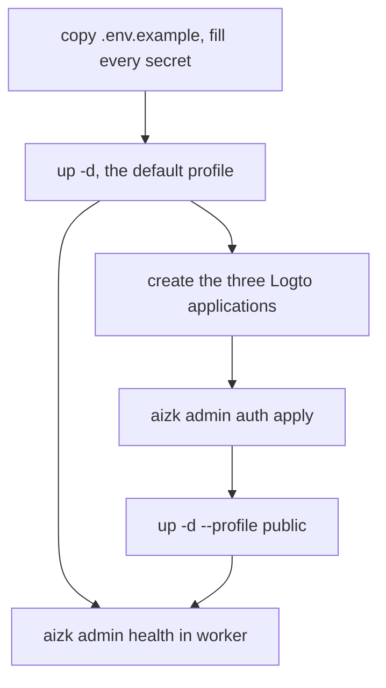

This page takes a host with Docker and an NVIDIA runtime to a deployment that answers a real
recall. It assumes you know which services exist from
[Deployment topology](/docs/dev/run/topology/) and that the machine is big enough per
[Hardware and cost](/docs/dev/run/hardware/).



## Fill the environment

Compose reads one file, the project `.env` at the package root, and every command below names it
explicitly. Start from the committed example.

```sh
cp src/deploy/.env.example .env
openssl rand -base64 32
```

Six values are hard requirements. Compose interpolates them with `:?`, so it refuses to start at
all while any of them is blank.

```sh
AIZK_ADMIN_PASSWORD=
AIZK_APP_PASSWORD=
AIZK_LOGTO_DB_PASSWORD=
AIZK_OBJECT_STORE_ACCESS_KEY=
AIZK_OBJECT_STORE_SECRET_KEY=
AIZK_DOCLING_API_KEY=
```

Generate each one independently. The migration owner, the forced-RLS application role, Logto,
SeaweedFS and Docling must never share a value, because the whole
[security model](/docs/dev/run/security/) rests on those being different principals.

`src/deploy/logto.conf` carries the committed nonsecret authorization policy and Compose loads it
before `.env`, so anything you repeat in `.env` is the deployment override. Keep the secrets only
in `.env`.

## Start the local stack

```sh
docker compose --env-file .env -f src/deploy/docker-compose.yml up -d
```

This is the default profile, which is the engine without any public surface. The first start is
slow because the three vLLM lanes come up one after another and each downloads and loads weights.
`setup` runs the migrations once and exits. Nothing is exposed to the network yet.

## Create the Logto applications

The public profile needs Logto to already know about aizk. Create three applications in the Logto
console and put their credentials in `.env`.

| Application | Kind | Setting pair |
|---|---|---|
| Management API client | machine to machine, role carrying the Management API `all` permission | `AIZK_LOGTO_CLIENT_ID`, `AIZK_LOGTO_CLIENT_SECRET` |
| MCP OAuth upstream | traditional web, redirect is the aizk server callback | `AIZK_OAUTH_CLIENT_ID`, `AIZK_OAUTH_CLIENT_SECRET` |
| Browser app | traditional web, redirect is exactly `${AIZK_WEB_PUBLIC_URL}/auth/sign-in-callback` | `AIZK_WEB_CLIENT_ID`, `AIZK_WEB_CLIENT_SECRET` |

Then set the URLs. `AIZK_LOGTO_URL` is where Logto answers, and `AIZK_MCP_PUBLIC_URL`,
`AIZK_WEB_PUBLIC_URL` and `AIZK_API_PUBLIC_URL` are the one public origin the tunnel serves. All
of them must be HTTPS. Add `AIZK_WEB_SESSION_SECRET` with at least 32 bytes, generated
separately, because `Settings.independent_session_secret` rejects it when it matches the web,
Management API or OAuth client secret. Finally add `AIZK_TUNNEL_TOKEN` from Cloudflare.

Keeping the browser and the API on one origin is a deployment convention that Caddy makes true by
routing, not something the settings validate. It is what keeps both clients same-origin without
publishing a backend port.

## Reconcile the authorization policy

aizk owns a small, committed slice of the Logto policy. There is one global human role,
`aizk-user`, carrying the `control` permission on the aizk API, and three organization roles.
`admin` gets `write:memory`, `manage:member` and `delete:member`, `editor` gets `write:memory`,
and `viewer` is read only. New users receive the global role because it is a Logto default.

```sh
aizk admin auth audit
aizk admin auth apply
```

`audit` reports drift and exits nonzero when the live tenant does not match. `apply` reconciles
it and leaves unrelated roles and permissions alone. Both are idempotent, and
[The Logto boundary](/docs/dev/identity/logto/) explains what aizk does and does not own here.

## Start the public profile

```sh
docker compose --profile public --env-file .env -f src/deploy/docker-compose.yml up -d
```

The ordering here is deliberate and it fails closed. `cloudflared` must report ready before
`logto-setup` runs, because the tunnel is what publishes Logto's canonical issuer. `public-check`
then runs `admin auth check-public` with `AIZK_REQUIRE_AUTH=1`, which constructs `Settings` and
therefore fails when the Logto URL, the public URLs or either OAuth client is missing or only
half filled. `web-check` does the same for the browser settings. The MCP server does not start
until those gates have passed.

## Check it works

Run the health command in the private worker, never in `server`. The public process has no
migration-owner credential on purpose, so a compromised request path cannot turn this diagnostic
into an RLS bypass.

```sh
docker compose --env-file .env -f src/deploy/docker-compose.yml exec -T worker aizk admin health
```

A healthy deployment reports an up-to-date migration, an empty `rls_violations` list, Logto
identity mode, all four model endpoints reachable with matching served aliases, no retained queue
failures, and a `recall` block with candidates and no error. That last field is the one that
matters, because it is a real retrieval through the real models rather than a ping.

## Next

<div class="not-content">

- [PostgreSQL and storage](/docs/dev/run/postgres/) covers tuning before your data grows.
- [Backups and recovery](/docs/dev/run/backups/) should be set up on day one.
- [Observability](/docs/dev/run/observability/) adds the logging profile and the queue doctor.
- [The release gate](/docs/dev/run/release-gate/) is the checklist before real traffic.

</div>
