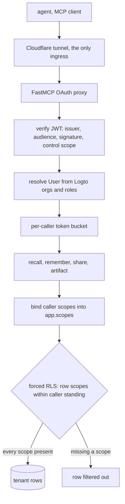
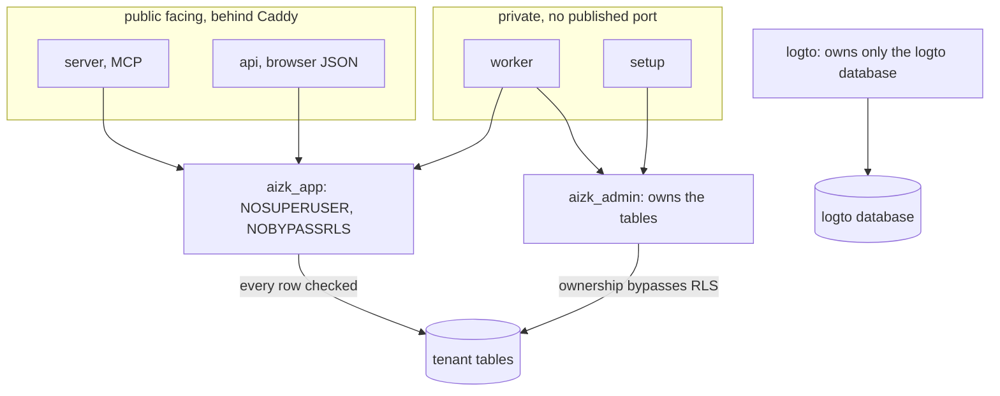

This page states what a production deployment protects, what it deliberately trusts, and where
the guarantees stop. It assumes the single-host Compose deployment from
[Deployment topology](/docs/dev/run/topology/) and the scope model from
[Scope sets in depth](/docs/dev/identity/scope-sets/).

## What is protected

aizk holds private notes, shared team sources, embeddings, graph projections, temporal history,
OAuth sessions, organization standing and database backups. Six goals follow from that.

- One caller never reads or alters another caller's private memory.
- A caller must stand in every scope attached to a shared row.
- Public request handling must not hold a credential that can bypass row security.
- Tokens, client secrets, database passwords and backups stay out of logs and process arguments.
- Stored text stays untrusted data when an agent consumes recall.
- A stolen disk or a copied backup must not be the only path to the memory.

## Trust boundaries

Logto owns users, organizations, memberships, roles, permissions, login and consent. aizk owns
the deterministic mapping from a verified Logto identifier to a PostgreSQL UUID5, and mirrors no
identity rows. Each stage below narrows authority, and the last filter runs inside PostgreSQL
under a role that cannot turn it off.

The MCP server checks the signature, issuer, expiry, the required `control` scope and the exact
aizk resource audience, then resolves organization standing through a short coalesced Management
API cache. A failed refresh closes shared authority rather than keeping it.

The browser does not use that cache for access decisions. Both the authorization callback and
every protected load re-read the account and its global roles. `LogtoClient._screen_account`
rejects a deleted or suspended account and `_screen_roles` rejects one without the `aizk-user`
role, so an account change takes effect on the next decision.

PostgreSQL is the final authority. `aizk_app` is neither a superuser nor a `BYPASSRLS` role and
every tenant table forces row security. Table owners normally bypass RLS, which is exactly why
the public server never receives the owner password. The `chunk` table inherits read visibility
from its document and its write policy also requires matching scope sets, which closes the
foreign-key loophole where a guessed document ID could otherwise carry a child row.
[Row level security](/docs/dev/store/rls/) has the policies themselves.

## Process privilege separation

One image, several services, two database roles.

`setup` holds the owner credential only while migrating. `server` and `api` receive explicitly
blank `AIZK_ADMIN_PASSWORD`, `AIZK_ADMIN_DATABASE_URL` and `AIZK_BACKUP_DATABASE_URL`, so no
owner edge exists for them at all. `worker` keeps both roles because scope discovery, backups and
schema maintenance need the owner. `frontend` holds only the Logto web application and the
session secret and has no database credential. `caddy` holds no secret at all. Model services
hold no credential and reach no database.

Every long-lived aizk container runs as UID 10001 with a read-only root filesystem, no
capabilities, `no-new-privileges`, a bounded process count and a private tmpfs. The one-shot
`volume-init` runs as root with exactly three capabilities, `CHOWN`, `DAC_READ_SEARCH` and
`FOWNER`, creates mode `0700` directories for UID 10001, and exits first.

This bounds the blast radius of a compromised request path. It does nothing against host root
compromise, Docker daemon compromise, a malicious image, or code executed inside `worker`.

## Network exposure

The Cloudflare tunnel is the only ingress and it is outbound. Grafana is the single published
host port and it binds `127.0.0.1`. Caddy refuses every `/api` path except capability upload
`PUT`s, described on [The HTTP API](/docs/dev/interfaces/http-api/).

PostgreSQL TLS is off inside the Compose network, which is acceptable only while the database is
loopback bound and every client is on the same host. ClamAV's TCP protocol has no authentication
or encryption at all and must never leave that network. A future remote database needs
certificate-verified TLS and `sslmode=verify-full`.

Public organizations affect read standing only and never enter writable standing. A write needs
current Logto membership with `write:memory`, and then forced row security applies the same test
again inside PostgreSQL.

Cloudflare should also enforce body size and rate limits on `/authorize`, `/register`, `/token`
and `/mcp`. Application middleware only covers tool calls after FastMCP has built a request
context, so it does not protect discovery, registration or token exchange from floods.

## Work limits

Each resolved user gets an independent five-second token bucket at five calls per second by
default, and a process holds at most 4096 buckets. This is abuse control and not quota
accounting. Tool schemas reject oversized work before it reaches a model or PostgreSQL.

| Input | Default |
|---|---|
| Recall query | 16,384 characters |
| Recall evidence budget | 16,384 tokens |
| Remembered source | 5,000,000 characters |
| Source URI | 4,096 characters |
| Scope names per call | 32 |
| Shared documents per call | 100 |

## Artifact intake

Every byte is treated as hostile. URI intake permits only uncredentialed HTTPS whose DNS answers
are all public, revalidating on each redirect, with bounds on response time, declared size,
streamed size and redirect count. Production should still restrict container egress so DNS
rebinding cannot reach loopback, link-local, private or metadata networks.

ClamAV scans before persistence and fails closed. Malware, an unavailable daemon, a malformed
reply or a size violation all reject the intake.

The two file size limits are worth reading together.
`AIZK_OBJECT_STORE_UPLOAD_BYTE_LIMIT` defaults to 100663296 bytes, which is 96 MiB, and that is
the application ceiling. But ClamAV ships with `MaxFileSize`, `MaxScanSize` and `StreamMaxLength`
all at `10M`, and scanning is fail-closed, so **10 MiB is the real practical limit** and 96 MiB
is theoretical. Raising one without the other only moves where the rejection happens.

Stored objects use opaque random keys with no public bucket access. Reading bytes is always a
separate explicit request that re-resolves the caller, applies row security, requires the exact
revision and verifies the stored digest, so a guessed key grants nothing.
[Artifacts](/docs/dev/write/artifacts/) covers the pipeline.

## Stored text, secrets and supply chain

An authorized source can still be malicious. aizk treats source text as data during extraction
and returns recall as one evidence string, and the client skill establishes that boundary once.
That reduces accidental instruction following and cannot guarantee model behavior. Client agents
must never let recalled text outrank system or user instructions. Write authority stays a real
privilege, because an authorized writer can poison their own scope with false sources.

FastMCP stores registrations and upstream tokens in the persistent `/oauth` volume, encrypted
with keys derived from the OAuth client secret, which is why rotating it is a full session reset.
[Upgrades](/docs/dev/run/upgrades/) covers that.

The image installs from the committed `uv.lock` with frozen resolution. vLLM runs checkpoints
with `trust-remote-code`, so choosing a model repository is choosing executable code. Only
trusted repositories and pinned revisions belong in production, and the Hugging Face cache must
not be writable by untrusted users.

## Next

- [The release gate](/docs/dev/run/release-gate/) turns all of this into a pass or fail list.
- [Row level security](/docs/dev/store/rls/) has the policies and how they are verified.
- [The Logto boundary](/docs/dev/identity/logto/) explains what identity aizk does not own.
- [Backups and recovery](/docs/dev/run/backups/) covers backup confidentiality.

