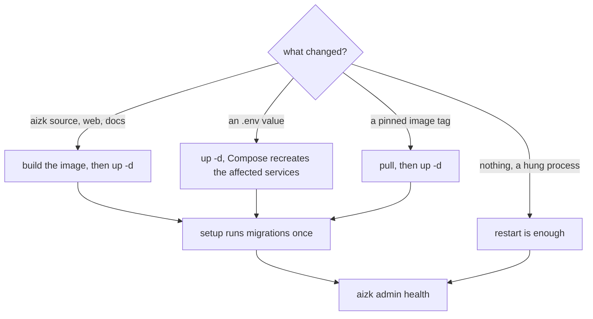

Upgrading aizk is mostly boring, which is the goal. The two things that surprise people are that
the server runs source baked into its image and that rotating one particular secret logs everyone
out. This page covers both. It assumes the service list from
[Deployment topology](/docs/dev/run/topology/) and a working backup routine from
[Backups and recovery](/docs/dev/run/backups/).



## Rebuild, do not restart

`src/deploy/Dockerfile` copies `src` into the image and installs the project into a virtualenv
built at image time. There is no bind mount of the source and no editable install at runtime.
A `docker compose restart` therefore runs exactly the code that was already there.

Any change to Python source, to the SvelteKit app or to these documentation pages needs the image
rebuilt and the container recreated.

```sh
docker compose --env-file .env -f src/deploy/docker-compose.yml build server worker
docker compose --env-file .env -f src/deploy/docker-compose.yml up -d
```

`up -d` recreates only what actually changed, so this is safe to run on the whole project. The
same applies to `frontend` and `docs`, which are separate build targets in the same Dockerfile.

Note that `aizk-runtime` builds with three additional contexts, `mainboard`, `patos` and `rls`,
which are sibling checkouts of the house packages. A build fails if those directories are not
beside the aizk checkout.

## Image pinning

External images fall into two groups. `db`, `objects`, `clamav` and `docling` carry a validated
release tag plus a tested digest, so the exact bytes are fixed. VectorChord Suite only publishes
a floating `pg18-latest` suite tag, which is precisely why its digest is pinned.

The rest carry a version tag alone, which are `vllm/vllm-openai:v0.24.0`, `svhd/logto:1.41.0`,
`cloudflare/cloudflared:2026.6.1`, `grafana/loki:3.7.3`, `grafana/alloy:v1.16.1`,
`grafana/grafana:13.1.0` and `caddy:2.10.2-alpine`.

Moving any of them is a deliberate change. Read the upstream release notes, take both database
archives and an object-store copy, pull, rebuild, and finish with the full health probe.

## Migrations run in one place

`setup` is a one-shot service running `admin database setup`, which upgrades Alembic to head and
installs the PgQueuer schema. It holds the owner credential and exits. `server`, `api` and
`worker` all declare `service_completed_successfully` on it, so no request path ever starts
against an older schema than the one it was built for.

There are two revisions in `src/aizk/store/migrations/versions/`, `0001_init` and
`0002_durable_usage`. [Migrations and DDL](/docs/dev/store/migrations/) explains why the initial
one is fused rather than a long chain.

Never use `down -v` during an upgrade. It removes the named volumes, which takes the database,
the object store, the ClamAV signatures and the OAuth state with it. It is also the only way to
make PostgreSQL re-run `initdb/roles.sh`, so if that is what you want, say so on purpose.

## Rotating secrets

Rotating a database password means updating the role and the deployment secret in one maintenance
window, then recreating only the services that use that role. `initdb/roles.sh` is idempotent and
reconciles every role with the current `.env`, so it is the tool for the database half. If you
replaced that file through an rsync deployment, recreate the `db` container before running it,
because a live bind mount keeps the old inode.

Rotating `AIZK_OAUTH_CLIENT_SECRET` is different and it is not reversible by restarting. FastMCP
stores dynamic client registrations and upstream Logto tokens in the persistent `/oauth` volume,
encrypted with keys derived from that client secret. Changing it invalidates the derived keys, so
every MCP client has to sign in again. Treat it as a deliberate full session reset rather than a
routine rotation, and schedule it with the people who will have to re-authorize.

The web session secret is separate and independent by validation. `Settings` rejects it when it
is shorter than 32 bytes or equal to the web, Management API or OAuth client secret.

## The order that works

Take both database archives and an object-store copy. Pull and rebuild. Bring the stack up so
`setup` migrates. Run `aizk admin health` in `worker` and confirm the migration is at head, RLS
reports no violations, the model endpoints match their configured aliases and the real recall
returns candidates. Only then restore public traffic.

Upstream of all that, the same gate runs in CI on every pull request. `.github/workflows/ci.yml`
runs `chefe run lint`, `chefe run lint-imports`, `chefe run typecheck` and `chefe run test`
against a real VectorChord database with the same restricted app role, so forced row security is
exercised the way production has it. `.github/workflows/docs.yml` builds this site and runs the
page gate. A change that has not passed both should not reach a deployment.

## Next

<div class="not-content">

- [The release gate](/docs/dev/run/release-gate/) is the checklist for the last step above.
- [Backups and recovery](/docs/dev/run/backups/) covers the archives this depends on.
- [Migrations and DDL](/docs/dev/store/migrations/) explains the schema side.
- [Testing](/docs/dev/contributing/testing/) explains what the CI gate actually proves.

</div>
