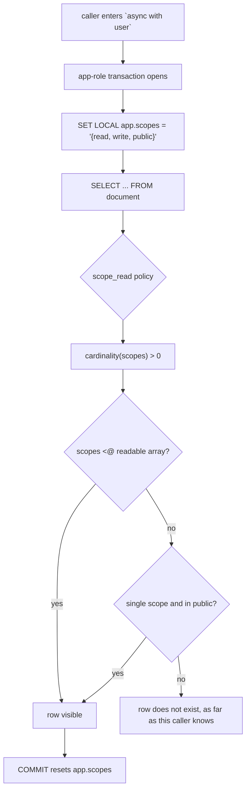

aizk does not filter rows in Python. Every scoped read and write is decided by PostgreSQL under
forced row security, so a missing `WHERE` clause in application code cannot leak anything. This
page assumes you know what a [scope set](/docs/dev/identity/scope-sets/) is and can read a
`CREATE POLICY` statement.

## One read, evaluated



The whole picture matters. The standing is written transaction-local, the policy reads it back
inside the same transaction, and the commit discards it, so a pooled connection cannot carry
one caller's authority into the next request.

## The Scoped mixin emits the policies

`src/aizk/store/mixins/scoped.py` holds one `__rls__` classmethod, and every scoped table in
the schema inherits it. It always emits two policies and conditionally two more.

```python
policies = [
    rls.Policy.select("scope_read", read, roles=(settings.app_role,)),
    rls.Policy.insert("scope_insert", write, roles=(settings.app_role,)),
]
if cls.mutable:
    policies.append(rls.Policy.update("scope_update", write, write, roles=(settings.app_role,)))
if cls.deletable:
    policies.append(rls.Policy.delete("scope_delete", write, roles=(settings.app_role,)))
```

`mutable` and `deletable` are `ClassVar` booleans on the model, both defaulting to false. That
is the point. Mutability is a property of the table declaration rather than something a policy
file has to remember, so `usage_event` is an append-only ledger because it never sets either
flag, and `chunk` is the only source table that can be deleted because it sets both.

The predicates themselves are the lattice. `read` requires a nonempty `scopes` array that is a
subset of the caller's readable set, with one extra branch that lets a single-scope row through
when that scope is in the caller's `public` set. `write` requires a nonempty array that is a
subset of the caller's writable set. Both are array containment with `<@`, which the GIN index
on every `scopes` column serves.

### read_through parent inheritance

A child table can set `read_through` to a parent table name.

```python
class Chunk(Id, Scoped, Embedded, TableBase, table=True):
    read_through: ClassVar[str | None] = "document"
```

The mixin then builds a different pair of predicates. Reading becomes
`document_id IN (SELECT id FROM document)`, which is already fenced by the parent's own policy,
so a chunk is visible exactly when its document is. Writing gains an extra conjunct,
`(document_id, scopes) IN (SELECT id, scopes FROM document)`, so the child's scopes must equal
a visible parent's scopes. A chunk cannot be quietly widened away from the document it belongs
to. `artifact_content` reads through `artifact` the same way.

Content tables use a third shape, described on [The data model](/docs/dev/store/data-model/),
and `blob` a fourth, described on
[Content and artifact tables](/docs/dev/store/content-tables/).

## The rls package owns the generic machinery

Nothing above is aizk-specific except the predicates. The house package at
`packages/rls`, published as `rlsalchemy`, owns policy compilation, the DDL statements, the
Alembic autogenerate plugin, catalog reflection and the typed context. aizk supplies the
lattice and nothing else.

Registration is one line in `src/aizk/store/__init__.py`.

```python
_catalog = rls.Catalog(TableBase.mapper_registry)

def verify_rls(connection: Connection) -> list[str]:
    """Report drift from Aizk's complete row security declaration."""
    return _catalog.verify(connection)
```

`Catalog` walks every mapper in the registry, compiles each `__rls__` declaration onto its
table's `info["rls"]`, and **refuses a mapped table that declares nothing**. A table that
genuinely needs no policy must say so with `rls.Open()`, which is what `entity_kind`,
`relation_kind` and every `ViewBase` do. An unprotected table is therefore always a decision
and never an accident.

## Two roles, and only one of them can bypass

`src/deploy/initdb/roles.sh` provisions the runtime role.

```sql
CREATE ROLE aizk_app LOGIN PASSWORD %L NOSUPERUSER NOBYPASSRLS NOCREATEDB NOCREATEROLE
```

`NOBYPASSRLS` is the guarantee. Even a bug that hands `aizk_app` a raw connection cannot see
another tenant's rows. The role gets `USAGE` on the public schema and default privileges for
`SELECT, INSERT, UPDATE, DELETE` on tables, so new tables inherit access without a follow-up
grant, and `0001_init` adds explicit grants for the tables it creates after that default was set.

The separate owner role, `aizk_admin`, owns the schema, runs migrations, and is the only way to
bypass row security. `Database.owner()` builds its engine and `User.owner` refuses to hand it
out to anybody but the system identity.

```python
if self.id != settings.system_user_id:
    raise PermissionError("only the system caller may use the database owner role")
```

Policies also name `roles=(settings.app_role,)` explicitly, and `app_role` is read from the
username in `database_url` rather than hardcoded, so a deployment that renames the role keeps
its policies pointed at it.

## Caller standing travels as a GUC

`User` subclasses `rls.Context` with `prefix="app"`, so its `scopes` field becomes the
transaction-local setting `app.scopes`, serialized as JSON and written with `set_config` at
`after_begin`. The policy reads it back with `current_setting('app.scopes', true)`, casts to
`jsonb`, picks the `read`, `write` or `public` key, and turns the JSON array into a native
`uuid[]` with `jsonb_array_elements_text`. Both sides of that contract come from the same class,
so a renamed field cannot drift away from the predicate that reads it.

One more listener in `src/aizk/store/events.py` catches the case where nobody opened a user
transaction at all. Any ORM statement touching a protected table without a user in
`session.info` raises `NoTenantContext` rather than quietly running with empty standing.

## The drift check

Declared policy and live policy are compared semantically, not textually. PostgreSQL deparses
what you gave it, so the catalog text never matches the SQLAlchemy rendering byte for byte.
`CompiledPolicy._normalize` in the `rls` package parses both sides with **sqlglot** in the
`postgres` dialect, rewrites away deparser noise such as redundant casts, doubled subqueries and
`= ANY(ARRAY[...])` versus `IN`, normalizes identifiers, and compares the results.
`RLSState.diff` then reports missing policies, drifted policies, undeclared policies and any
table where `enabled` or `forced` is wrong.

Run it with `chefe run aizk database check-rls`, or read the test that fails the suite when it
regresses, `test_live_schema_forces_rls_with_no_violations` in `tests/store/test_catalog.py`,
which asserts the drift list is empty against the migrated database.

## Next

<div class="not-content">

- [Migrations and DDL](/docs/dev/store/migrations/) shows the frozen policy copies in `0001_init`.
- [Scope sets in depth](/docs/dev/identity/scope-sets/) explains where the standing comes from.
- [The security model](/docs/dev/run/security/) places this inside the deployment.
- [Background work](/docs/dev/identity/background/) covers how scheduled passes get standing.

</div>
