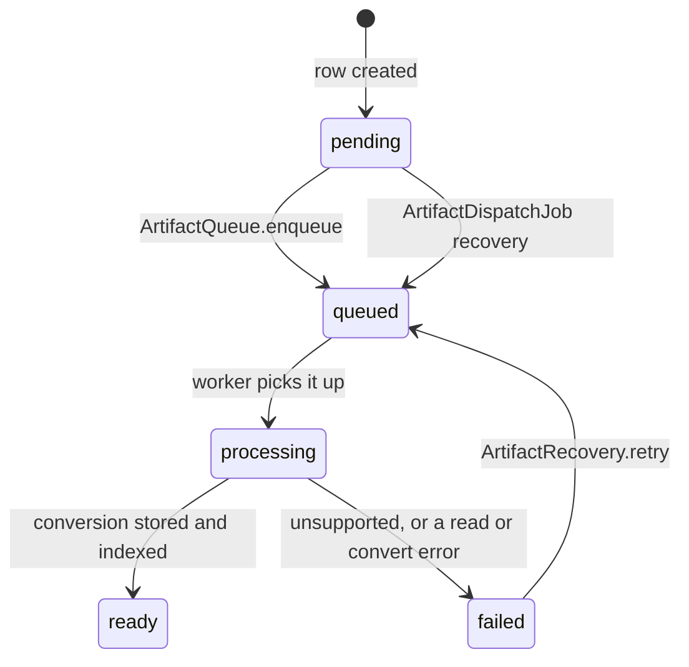

An artifact is bytes somebody else produced, so the pipeline treats them as hostile until a
scanner says otherwise. This page assumes you have read [Intake](/docs/dev/write/intake/), which
covers how a URI or an upload reaches this code, and it hands off to
[Chunking and embedding](/docs/dev/write/chunking/) once conversion produces text.

## The order is the design

`ArtifactIntake.accept` in `src/aizk/artifacts/service.py` runs four steps and the order is the
whole security argument.

1. `ClamAVClient.scan` streams the complete bytes to `clamd` and must return a clean verdict.
2. `ByteStore.put` hashes and stores them behind an opaque key.
3. `ArtifactRepository.create_original` writes the `artifact`, `blob` and `artifact_content` rows.
4. `ArtifactQueue.enqueue` queues a conversion by id, then the state moves to `queued`.

Scanning happens before persistence, so a hostile file is never written to the object store at
all. Persistence happens before queueing, so the queue only ever carries a content id and a scope
set rather than bytes or a URI. If step 3 raises a `SQLAlchemyError`, the stored object is deleted
as compensation, which is the only ordering where an orphan is possible and it is cleaned up.

Scanning is fail-closed and the taxonomy in `src/aizk/integrations/clamav/client.py` is careful
about why. Only the literal `OK` verdict passes. A `FOUND` verdict and the byte-limit refusals
raise `MalwareRejectedError`. A timeout, a connection failure or an unparsable reply raises
`MalwareUnavailableError`, because none of those is an authoritative clean verdict. Scans run on a
dedicated four-worker thread pool so a stranded peer cannot pin the process-wide executor.

## Two size limits, and only one of them bites

The application ceiling is `AIZK_OBJECT_STORE_UPLOAD_BYTE_LIMIT`, default 100663296 bytes, which
is 96 MiB. It bounds the URI reader, the upload body, the scanner and every decompression.

The scanner is configured much lower. `src/deploy/docker-compose.yml` sets `MaxFileSize`,
`MaxScanSize` and `StreamMaxLength` to `10M` each. Since a file the scanner refuses is a file aizk
refuses, **10 MiB is the real practical limit** and 96 MiB is only the theoretical one. Raise the
three ClamAV variables together if you need more, and remember that the whole artifact is held in
memory because scanning, hashing and storing all need the complete bytes.

## Storage

`ByteStore` in `src/aizk/storage.py` writes to an S3-compatible backend. A key is
`objects/` plus `secrets.token_urlsafe(32)`, so it carries 256 bits of randomness and no filename,
scope, media type or checksum. Object storage has no tenant context of its own, so the caller must
authorize the PostgreSQL `blob` row before reading or signing a key.

Compression is adaptive. `encode` compresses with Zstandard at `object_store_compression_level`,
default 3, and keeps the result only when it saves at least `object_store_compression_min_savings`
of the original, default 0.05. Otherwise the bytes are stored as `identity`. Decoding bounds the
decompressor at the upload limit plus one byte and requires `eof`, so a compression bomb is caught
before it can allocate.

The `blob` row records the UUIDv8 content hash, the logical size, the stored size, the encoding
and the object-store version. `ArtifactProcessor.process` reads back with all of those as expected
values, so a silently corrupted or replaced object fails with `IntegrityMismatch` rather than
being converted.

## The state machine

`ArtifactContent.State` is a PostgreSQL enum and is deliberately independent from PgQueuer's own
delivery state. PgQueuer owns leases and retries. This column owns the durable business outcome.



`pending` exists because the row is created before the enqueue call returns. If the process dies
in between, `ArtifactIntake.dispatch_pending` finds the row again, up to
`artifact_dispatch_batch_size` at a time, default 100, on the `artifact_dispatch_cron` schedule of
every minute. `failed` is recovered by `ArtifactRecovery`, which prefers retained queue jobs and
only then enqueues durable failures that have no live job. Conversion jobs run at
`JobPriority.artifact`, which is 75, with `docling_concurrency` of 4.

## Conversion and the fallback document

`ArtifactProcessor` reads the original back, verifies it, and posts it to Docling Serve with
`to_formats` of `json` and `md` and `image_export_mode` of `placeholder`. Docling may use images
while converting, but aizk stores only the JSON and the Markdown.

`DoclingOutput.from_response` accepts `success` and `partial_success` and rejects `skipped`,
`failure`, and any response missing either format. On rejection the processor does not simply give
up. It calls `index` with the state `failed`, which still creates a document from the Jinja
template in `src/aizk/artifacts/templates/source.md.j2`. That fallback document carries the
filename, media type, original size, conversion state and source URI, so an unsupported file stays
findable and its exact bytes stay downloadable through an authorized read.

Companion text is the caller's own prose about the file, capped by
`web_artifact_companion_max_chars`, default 65,536. It is stored on the `artifact_content` row and
rendered at the top of the same document, which is what makes a fallback document worth having.
`ArtifactDocument.semantic` is true only when there is companion text or Markdown, and only a
semantic document is enqueued for graph projection. A metadata-only shell is recallable but never
becomes facts.

An image gets one extra step. `DirectImageEnricher` embeds the original bytes through the same
multimodal embedder and upserts a supplemental chunk at ordinal 2147483647 with `processed_at`
already stamped, so it is retrievable without ever entering the graph build.

## The upload capability

`UploadBox` in `src/aizk/artifacts/uploads.py` never lets an agent stream bytes into the MCP
server. It mints a ticket instead.

The caller declares `filename`, `media_type`, `size` and `sha256`. `mint` refuses a declared size
above the upload limit, authorizes the write scope once, and packs a `TicketRecord` holding only
the minter's id, its label, the authorized target scopes and the declaration. It deliberately does
not keep the caller's full scope table, so a redeemed ticket can write to those target scopes and
nothing wider.

The capability is `secrets.token_urlsafe(32)` stored in the `upload_capability` table under the
system scope, which is what lets the MCP process mint a grant that the separate API process
redeems. It lives for `api_upload_ttl_seconds`, default 600. A caller may hold at most
`api_upload_live_grants_per_caller` live grants, default 8, counted under a transaction advisory
lock after expired rows are swept.

The accepted response is exactly this shape.

```json
{ "status": "accepted", "upload_url": "https://.../api/uploads/<capability>", "expires_seconds": 600 }
```

The URL is built from `api_base_url` and handed over ready to use. Callers must not construct it.

Redemption is single use by construction. `claim` runs `DELETE ... RETURNING` on the capability
row, so a second `PUT` finds nothing and raises `UploadCapabilityError`. `deliver` then refuses any
body whose length or SHA-256 does not match the declaration, and only then calls the same
`ArtifactIntake.accept` every other door uses.

## Next

<div class="not-content">

- [Chunking and embedding](/docs/dev/write/chunking/) covers what happens to the converted text.
- [The job system](/docs/dev/passes/jobs/) covers PgQueuer, priorities and recovery.
- [Content and artifact tables](/docs/dev/store/content-tables/) has the columns in full.
- [The HTTP API](/docs/dev/interfaces/http-api/) has the upload endpoint and its neighbors.

</div>
