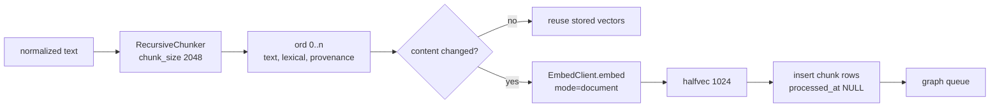

By the time text reaches this stage it is normalized Markdown with a resolved document identity,
which [Intake](/docs/dev/write/intake/) explains. This page covers how that text becomes `chunk`
rows with vectors, and where those rows wait for
[Extraction and the gate](/docs/dev/write/extraction/) to pick them up.

## Splitting

`chunk_text` in `src/aizk/serving/chunk/chonkie.py` is the only splitter in the write path. It
uses Chonkie's `RecursiveChunker`, which walks paragraph, sentence and word boundaries in turn and
falls back to a hard cut only when a single unit is too long. Each returned span is stripped and
empty spans are dropped, so a document of whitespace produces no chunks and
`TextIngestor.prepare` returns nothing for it.

The size is `chunk_size`, default 2048 characters. That number is load bearing in three other
places. It is roughly 700 tokens, which is why the embedding lane runs with a 2048-token context
instead of the model's native 262K. It is also the default `extract_window_size`, so an ordinary
chunk is exactly one extraction call. Chonkie chunkers are cached per size with
`functools.cache`, so repeated calls reuse one instance.

`src/aizk/serving/chunk/chunker.py` holds the file-type side. `is_text` uses the `identify`
library to decide whether a path on disk is text at all, and it is the filter
`ingest_path` applies when walking a directory. `is_code` subtracts the structural tags
`identify` mixes into every result and then asks whether the remaining language tags avoid
`chunk_denylist`. That denylist names the languages that are really prose or configuration rather
than code, meaning `markdown`, `rst`, `asciidoc`, `tex`, `bib`, `plain-text`, the HTML and XML
family, the CSS family, `json`, `yaml`, `toml`, `ini`, `csv`, `tsv` and the dotfile formats. Be
honest with yourself when reading this code, though. `is_code` has no caller in the ingest path
today, so every source is currently chunked as prose and the denylist only shapes a helper that
a future code chunker would use.

## What a chunk row carries

`Chunk` in `src/aizk/store/models/tables/chunk.py` is `Id`, `Scoped` and `Embedded`, with
`read_through` set to `document`, so a chunk is visible exactly when its document is and cannot
be widened away from it.

`ord` is the position inside the document, assigned by `enumerate` in `TextIngestor.document`, and
it is what `Document.chunks` orders on. `provenance` is the JSONB record produced by
`CaptureContext.record`, which carries the speaker label and role along with `observed_at` and
`expires_at`. Recall reads the speaker fields straight out of that column.

`lexical` is the text the BM25 lane indexes when it should differ from `text`.
`contextual_lexical` in `src/aizk/extract/ingest.py` prepends the document title only when
`contextual_bm25` is on, which it is not by default, and otherwise supplies the capture context's
search text. When neither adds anything it returns null and the lane falls back to `text`.

`processed_at` is the graph build's own bookkeeping and stays null until a chunk has been
projected. A partial index, `ix_chunk_pending` on `id` where `processed_at IS NULL`, keeps the
backlog scan cheap no matter how many processed chunks sit beside it.

## Embedding

`EmbedClient` in `src/aizk/serving/embed/client.py` talks to a pooled vLLM lane over the
OpenAI-compatible `/v1/embeddings` route. The served model is `embed_model`, default
`qwen3-vl-emb`, which is `Qwen/Qwen3-VL-Embedding-2B` started with `--runner pooling`. The model
never loads inside the aizk process.

Texts go out in batches of `embed_batch_size`, default 32, and `ordered_results` restores the
request order inside each batch, so the vectors line up with the chunks by position and never by
id.

Instruction prefixes are asymmetric on purpose. `instruction_for` picks
`embed_instruction_query` for a query and `embed_instruction_document` for a document, and
`instructed` wraps each text as `Instruct: {instruction}\nQuery: {text}`. The query instruction
defaults to `Given a search query, retrieve relevant passages that answer it.` and the document
instruction defaults to the empty string, which makes `instructed` a no-op, so stored chunks are
embedded raw while questions carry the retrieval instruction.

Dimensions are Matryoshka. The checkpoint emits 2048 dimensions natively, the Compose service
passes `--hf-overrides '{"is_matryoshka": true}'`, and every request sends
`dimensions=embed_dim`, default 1024. vLLM truncates the native vector to its 1024-dimensional
prefix, which is the supported prefix for this checkpoint, and the store keeps it as
`halfvec(1024)`. Change `embed_dim` and you change the column type, the vector index and the casts
in the graph writer together, so treat it as a migration rather than a knob.

Only changed content is embedded. `TextIngestor._vectors` filters the batch down to plans whose
`content_matches` is false before it calls the embedder, so a re-ingest of an unchanged corpus
sends nothing.

## Images

An image artifact gets one supplemental vector on top of whatever Docling extracted from it.
`DirectImageEnricher` in `src/aizk/artifacts/visual.py` calls `embed_images`, which posts a
chat-shaped body with the image as a data URI and the document instruction as the system message,
into the same 1024-dimensional space as the text.

The vector is upserted as a chunk at ordinal 2147483647 on the same document, with provenance
recording the modality, the media type, `direct_embedding` as the representation, `supplemental`
as the role and the exact artifact revision. It is written with `processed_at` already stamped, so
it is retrievable immediately and never enters the graph build. The enricher refuses to write when
the document's artifact pair does not match the revision it was given.

## Where pending chunks wait

There is no in-memory queue. A pending chunk is a row where `processed_at IS NULL`, and
`pending_chunks` in `src/aizk/graph/build.py` selects them inside one exact scope set, ordered by
`id`, optionally narrowed to one document or to documents whose title matches a pattern.

Three things drain that backlog. `Memory.remember` calls `enqueue_document` right after ingest, so
a fresh document is queued immediately. `ChunkDispatchJob` runs on `chunk_dispatch_cron`, every
minute by default, and enqueues up to `chunk_dispatch_batch_size` pending chunks, default 512,
which recovers anything that missed the direct call. `ChunkRecoveryJob` requeues retained failures
up to `chunk_recovery_batch_size`, also 512, bounded by `chunk_recovery_max_cycles` of 3 so a
poisoned chunk stops retrying.

Jobs are deduplicated on the chunk id, and `ChunkProjectionJob` re-checks visibility, scope
equality and `processed_at` before doing any work, so a duplicate delivery costs one lookup. It
runs at `JobPriority.chunk`, which is 50, with a concurrency limit of `graph_build_concurrency`,
default 4.

## Next

- [Extraction and the gate](/docs/dev/write/extraction/) covers what happens to a pending chunk.
- [The job system](/docs/dev/passes/jobs/) covers PgQueuer, priorities and recovery in full.
- [The lanes](/docs/dev/read/lanes/) covers how these vectors and the BM25 column are queried.
- [Content and artifact tables](/docs/dev/store/content-tables/) has the chunk columns in full.

