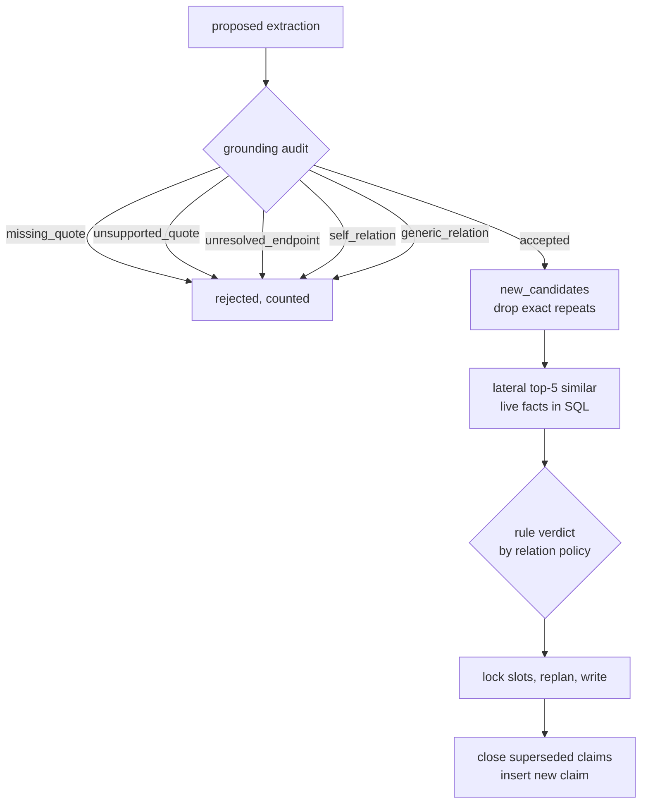

A model has just proposed entities and facts, which
[Extraction and the gate](/docs/dev/write/extraction/) covers. Nothing it said is trusted yet.
This page follows one proposal through the grounding audit, the consolidation cascade and the
writer. It assumes you know how a claim carries two time ranges, which
[The bi-temporal model](/docs/dev/store/bitemporal/) explains. These facts are what the web app
shows as Findings.

## Grounding

`GroundedProjection.from_extraction` in `src/aizk/graph/grounding.py` decides what survives, and
its rules are deterministic. `rejection` returns the first reason that applies, in this order.

| Reason | Meaning |
|---|---|
| `missing_quote` | the fact carries no quote, or only whitespace |
| `unsupported_quote` | the quote cannot be located in the chunk text |
| `unresolved_endpoint` | the subject, or a named object, is not one of the extraction's own entities |
| `self_relation` | subject and object normalize to the same name |
| `generic_relation` | the predicate is the catch-all `related_to` |

An accepted fact is rewritten so its subject and object carry the canonical entity name rather than
whatever the model spelled, and only entities that some accepted fact actually used are kept.
Everything is counted into `ProjectionQuality`, which `model_extraction` logs on a bound logger
with the chunk id, so the accepted-over-proposed ratio and the per-reason breakdown are queryable
per chunk rather than being a vague quality feeling.

`generic_relation` deserves a note. Declared source tags legitimately produce `related_to` edges,
but those come from `source_extraction` and never enter this audit, so the rule only rejects a
model that fell back to the vacuous predicate instead of choosing a real one.

## Aligning the quote without losing offsets

`quote_interval` tries `text.find(quote)` first, which is the common case and costs nothing. When
that misses it falls back to `normalized_map`, which folds the text and the quote the same way
while recording, for every character it emits, the offset it came from in the original.

The fold drops Markdown backticks, collapses any run of whitespace to a single space, and
casefolds. Backticks are dropped because they carry presentation rather than evidence and models
routinely omit them from an otherwise verbatim quote. The offset list is the point of the whole
exercise. After finding the folded quote inside the folded text, the interval is translated back
through `offsets`, so the returned span points at real characters of the untouched source.

`GraphWriter.grounding` stores that interval as `quote_start` and `quote_end` in the claim's
`attributes`, which is how a reader can later highlight the exact evidence in its chunk.

## The consolidation cascade

The old pipeline asked a model whether every fact was new. Now rules do nearly all of it and each
tier is cheaper than the one after it.

**Tier one is free.** `GraphWriter.new_candidates` deduplicates within the batch and then removes
anything already claimed. A fact's identity is a UUID5 over its resolved subject, predicate, object
and normalized statement, so an exact repeat collides by construction and is simply dropped. State
relations deduplicate differently, on subject, predicate, validity window and perspective, because
one interval can hold only one current value and letting two through would revise the same claim
twice in one write.

**Tier two is one SQL query.** `_fact_matches` builds the candidates into a typed input relation
and joins it laterally against live fact claims sharing the same subject, predicate, scope set and
perspective key, ordered by cosine distance and limited to `similar_facts`, default 5. One query
ranks the whole chunk.

**Tier three is `Consolidator.decide`**, which reads the relation's policy from the ontology.
With no matches the verdict is `ADD`. A `state` relation with exactly one match on the same object
is a `NOOP`, and any other `state` case is an `UPDATE` superseding the nearest match. For `set` and
`event` relations the thresholds decide. `consolidation_auto_merge_threshold` is 0.9 and
`consolidation_borderline_floor` is 0.75, which the module turns into distances of 0.1 and 0.25.
Similarity at or above 0.9 with the same object is a `NOOP`, meaning an auto-merge. Similarity
below 0.75 is an `ADD`.

**Tier four is one batched model call.** Similarity from 0.75 up to, but not including, 0.9 leaves
the rule verdict empty. `GraphWriter.resolve_ambiguous` collects those undecided candidates and
`Consolidator.resolve` sends each one with its own catalog of similar facts in one numbered prompt.
The reply is validated as `BatchConsolidationVerdict` with at most eight verdicts. An `UPDATE` may
only supersede a fact from that candidate's catalog. A missing verdict or an unknown target becomes
`ADD`, which keeps the new grounded fact without letting the model revise an unrelated claim.
`merged_verdicts` restores the model decisions to their original slots before the write begins.

## Dates

Dates cascade the same way. `resolve_valid_from` prefers the model's own `date` field and then
parses the statement itself. Both go through `parse_date`, which runs dateparser with
`STRICT_PARSING`, only the `absolute-time` parsers, `DATE_ORDER` of `YMD` and a preference for
past dates, and takes the earliest hit when a search returns several. Strictness is the whole
point. A permissive parser resolves ordinary prose to today and quietly corrupts bi-temporal
validity.

`with_source_fallback` then fills any still-undated fact from the capture context's `observed_at`,
falling back to the document's creation time, and caps an open `valid_to` at the source's
`expires_at`, so an expiring source cannot leave a claim open forever.

## The writer

`write_graph_slice` in `src/aizk/graph/build.py` deliberately keeps model work outside database
transactions and holds each transaction short.

**Locking.** `lock_plans` takes one `pg_advisory_xact_lock` per slot, keyed by subject, predicate,
perspective key and the scope set, over a deterministically sorted list. Sorted acquisition is what
keeps two concurrent chunks touching the same subject from deadlocking each other.

**Replan and bail.** Ranking happened before the lock, so the ranking may be stale. Inside the
locked transaction `_apply_plans` re-runs `plan_facts` and compares the new match lists against the
ones the verdicts were computed from. If they differ it abandons the attempt rather than writing a
decision made against a graph that has moved. `_consolidate` retries the whole cycle up to four
times and then raises, naming the chunk, instead of looping forever.

**Temporal closure.** `Fact.Claim.revise` applies every correction in one statement. The ordinary
case closes the superseded claim's valid range at the greater of the new fact's `valid_from` and
the old range's own lower bound, and closes its recorded range at database `now()`. The backdated
case, where the new fact starts before the old claim did, leaves the old claim alone and instead
returns an adjusted end so the new claim stops where the old one begins. The writer uses those
returned ends when rendering rows, so history stays a clean partition either way.

**Transient retry.** `_transient_retries` wraps the read and write transactions with tenacity, four
attempts and a random exponential wait up to one second. `is_transient_db_error` retries only a
`DBAPIError` whose underlying asyncpg error is `TransactionRollbackError`, which is to say a
deadlock or a serialization failure. Every other database error surfaces immediately, because
retrying a constraint violation just makes the same mistake again.

The final insert uses `ON CONFLICT DO NOTHING` over content id, scopes and perspective key, limited
to rows whose recorded range is still open, so two racing writers converge instead of colliding.

## Next

- [The bi-temporal model](/docs/dev/store/bitemporal/) explains the two ranges these writes close.
- [Graph tables](/docs/dev/store/graph-tables/) has the content and claim columns in full.
- [Evidence and provenance](/docs/user/concepts/evidence/) is the reader-facing view of grounding.
- [Communities and RAPTOR](/docs/dev/passes/communities-raptor/) covers what runs after the write.

