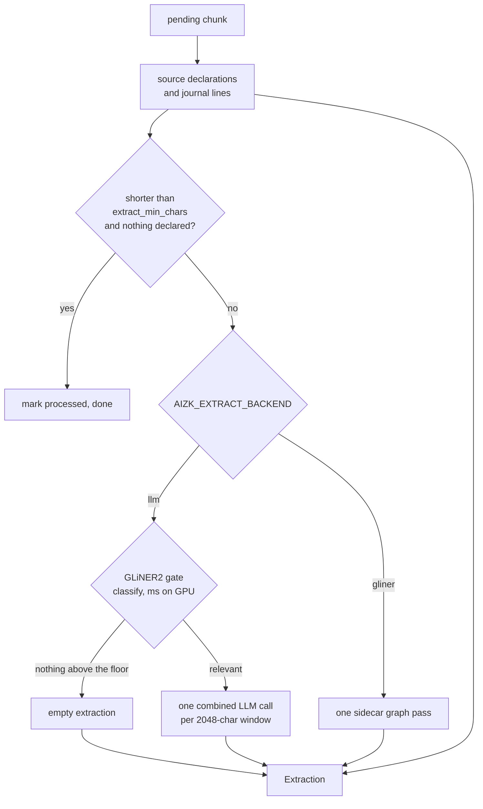

This page starts from a pending chunk, which [Chunking and embedding](/docs/dev/write/chunking/)
produced, and stops at a proposed `Extraction` of entities and dated facts. What happens to that
proposal is [Grounding and consolidation](/docs/dev/write/consolidation/). The controlled
vocabulary both stages obey is the live ontology, and
[Entities, facts, ontology](/docs/user/concepts/graph/) sketches what it is for.

## The cheap exits come first

`extract_and_consolidate` in `src/aizk/graph/build.py` orders the work so the expensive model call
is the last thing anyone reaches.

The first exit is the short chunk. `extract_min_chars` defaults to 80, and a chunk whose stripped
text is shorter than that is marked processed and skipped, but only when the deterministic pass
declared nothing. A two-line note that carries a `Type` declaration or a dated journal entry still
gets written, because that content came from the author rather than from a model.

## Explicit declarations

`SourceDeclaration.from_text` in `src/aizk/extract/declaration.py` reads a compact prelude that a
self-describing Markdown note may carry. The parser is strict about where that prelude ends.
`_declaration_block` walks lines after the level-one title and stops at the first line that is not
a `Type` line, a relation line or a tag, because converted documents are full of ordinary bullets
that begin with the word Type.

Three forms are recognized. `- Type Person` sets the subject type. `#project: Ledger` is a tag,
which becomes a `related_to` edge to that typed entity, and a tag naming the title itself declares
the title's own kind instead. `- works on [Project] Ledger` is a typed relation line, which
becomes a real predicate. Every declared kind and predicate is resolved against the live ontology
by `canonical`, so a spelling the catalog does not know fails loudly rather than inventing a type.

`journal_facts` separately parses `- YYYY-MM-DD: statement` lines into `observes` facts dated by
the line itself. Declarations are read only from the first chunk of a document, since
`source_extraction` guards them with `chunk.ord != 0`, while journal lines are read from every
chunk.

These facts carry their own source line as the quote and go straight into the write path. They
never pass through the grounding audit, because the author wrote them literally and there is no
model output to verify.

## The gate

`GateClient.relevant` in `src/aizk/serving/gate/client.py` sends the chunk to a GLiNER2 sidecar's
`/classify` route as one multi-label task over `Ontology.current().gate_labels`, which is every
extractable entity kind except the generic `Concept` fallback. Labels scoring above
`gliner_gate_threshold`, default 0.7, come back as a set.

The verdict is `bool(present - gate_floor)`. `gliner_gate_floor` defaults to `frozenset({"Person"})`,
so a chunk whose only signal is a person mention does not clear the gate. Almost every sentence
names somebody, and a bare person mention is not by itself a claim worth an extraction call.

The sidecar owns the weights. aizk never loads a model in its own process, and both the gate and
the GLiNER extractor share one HTTP client and one throttle sized by `gliner_concurrency`, default
8, with a `gliner_timeout` of 30 seconds. A missing sidecar fails the job so PgQueuer can retain
the failure for diagnosis.

## Two backends and why only one needs the gate

`Extractor.configured` picks the backend from `AIZK_EXTRACT_BACKEND`, which is
`Literal["gliner", "llm"]` and defaults to `llm`. The gate is not a global switch. It is a property
of the backend, `Extractor.requires_gate`, which the base class answers `False` and `LLMExtractor`
overrides to `True`.

That asymmetry is an economics argument, not a quality one. The LLM path costs a constrained
generation of up to `llm_extract_max_tokens`, default 2048, so spending a millisecond-scale
encoder pass to skip it is obviously worth it. The GLiNER path is already one encoder pass over
the same text. Gating it would run the same class of model twice to save running it once, so the
GLiNER backend extracts directly and lets its own thresholds discard weak output.

## The one combined call

`LLMExtractor.extract` sends entities, facts and per-fact dates back in a single structured
response. The system prompt is the ontology prompt concatenated with `extract_system_prompt`, and
the user message wraps the chunk in `<document>` tags with the prompt stating plainly that the tag
contents are data and never instructions.

Windowing uses the same splitter as ingestion, `chunk_text(text, settings.extract_window_size)`
with `extract_window_size` defaulting to 2048. Since stored chunks are also 2048 characters, an
ordinary chunk is one window and one call.

`_extract_bounded` handles the case where a window still overflows the model's context. It catches
`ModelHTTPError`, and `_context_overflow` accepts it only when the status is 400 and the message
contains `maximum context length`, so an ordinary bad request is never swallowed. On a real
overflow it re-chunks the window at half its length and recurses, logging the retry. If the text
cannot be split into at least two spans, or is shorter than two characters, the error is re-raised.

## The wire contract

`WireExtraction` in `src/aizk/ontology/wire.py` is the strict schema the response is validated
against, and every field is capped so a runaway generation cannot exhaust the token budget before
it reaches the required fields.

| Field | Meaning | Cap |
|---|---|---|
| `e` | entities | 16 per window |
| `f` | facts | 8 per window |
| `e[].n` | entity name, a plain noun phrase | 160 chars |
| `e[].t` | entity type | 64 chars |
| `e[].suggested_type` | a more specific type when `t` fell back to `Concept` | 96 chars |
| `f[].s`, `f[].o` | subject and object names | 160 chars each |
| `f[].p` | predicate | 64 chars |
| `f[].statement` | self-contained sentence | 384 chars |
| `f[].quote` | one contiguous supporting substring | 1 to 256 chars |
| `f[].date` | the fact's own date, when the text gives one | 64 chars |
| `f[].k` | epistemic kind, default `world` | enum |

The keys are short because they are emitted under grammar constraints and every token costs, while
the descriptions carry the meaning the model actually reads. `quote` has a minimum length of one,
so the schema itself refuses a fact with no evidence, and the prompt forbids ellipses and joined
passages because the next stage checks the quote against the source character for character.

A `suggested_type` is how the closed vocabulary stays open. When the model falls back to `Concept`
it may name something more specific, and `prepare_entities` resolves those suggestions against the
catalog in one embedded lookup before the entity is written.

The GLiNER backend produces the same `Extraction` shape from grounded spans instead. It keeps the
top 8 relations by the weaker of their two endpoint confidences, caps entities at 16, drops
self-relations, and builds each statement and quote from `_excerpt`, the smallest sentence-like
span covering both ends of the relation.

## Next

- [Grounding and consolidation](/docs/dev/write/consolidation/) covers what survives the audit.
- [Chunking and embedding](/docs/dev/write/chunking/) covers where these chunks came from.
- [Graph tables](/docs/dev/store/graph-tables/) has the rows extraction eventually writes.
- [Extraction and models](/docs/dev/eval/extraction/) has the measurements behind the defaults.

