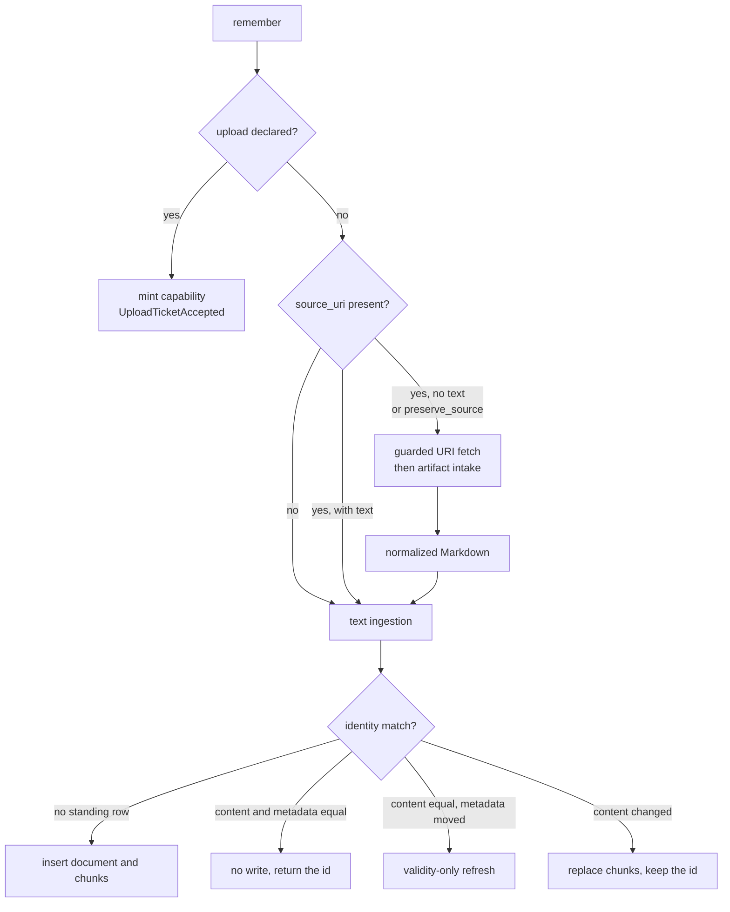

Every write starts here. This page assumes you know what a
[scope set](/docs/dev/identity/scope-sets/) is and how content and claims split, which
[The data model](/docs/dev/store/data-model/) explains. It stops where normalized text becomes
chunks, and [Chunking and embedding](/docs/dev/write/chunking/) picks up there.

import FlowMap from '../../../../../components/FlowMap.svelte';

The whole write path in one picture. Click any stage to see what it does and where it is
documented. This page owns the top three boxes and the rest have their own pages.

<FlowMap client:only="svelte" flow="write" height="36rem" />

## Three doors

`Memory.remember` in `src/aizk/memory.py` is the single entry point every transport calls, and it
routes on what the caller supplied.

| Caller supplied | Path | Result |
|---|---|---|
| `text` alone | `extract.ingest.ingest_text` | a `document` row and its chunks |
| `source_uri` without text, or with `preserve_source` | `ArtifactIntake.uri` | an `artifact_content` row |
| an `upload` declaration | `UploadBox.mint` | one short-lived private upload URL |

Nothing else is accepted. `preserve_source` without a URI raises, and an upload declaration
combined with `source_uri`, `preserve_source`, `observed_at` or `expires_at` is rejected in
`remember_tool` before any work happens.

The MCP boundary in `src/aizk/mcp/server.py` bounds these inputs from settings rather than from
constants in the tool, so a deployment can tighten them. Text is capped at
`mcp_remember_max_chars`, default 5,000,000. A URI is capped at `mcp_source_uri_max_chars`,
default 4096. A caller may name at most `mcp_scope_names_max` organizations, default 32. Scope
names are resolved and authorized by `User.write_scope` before anything is read or stored, so
intake writes to exactly the scopes the caller already held.

## What the URI door validates

A remote source is fetched by aizk itself through `ArtifactReader` in
`src/aizk/integrations/docling/client.py`, so the rules live in one place.

`URISource` rejects a non-HTTPS scheme and any URI carrying a username or password before a socket
is opened. `validate_public_url` then repeats the scheme and credential check, requires a host,
resolves it with `getaddrinfo` off the event loop, and refuses the fetch unless every returned
address is global. A host that resolves to a private, loopback, link-local or otherwise
special-purpose address is refused even when one of its records looks public, because the test is
`any(not address.is_global)` rather than a first-record test.

Redirects are not delegated to httpx. `read_uri` streams with `follow_redirects=False` and walks
the chain itself, so `validate_public_url` runs again on every hop and a redirect cannot smuggle
the fetch onto a private address. The recognized statuses are 301, 302, 303, 307 and 308. The
budget is `artifact_uri_max_redirects`, default 3, and a missing `Location` header or an exhausted
budget raises `UnsafeArtifactError`. The whole fetch is bounded by `artifact_uri_timeout`, default
30 seconds.

Size is checked twice. A declared `Content-Length` above the limit is refused before any body is
read, and the streaming loop refuses again as soon as accumulated bytes cross it. The limit is
`object_store_upload_byte_limit`, and [Artifacts](/docs/dev/write/artifacts/) explains why the
real practical ceiling sits well below that setting.

The docstring on `ArtifactReader` is honest about the residual risk. DNS validation blocks ordinary
SSRF, but only a network egress policy around the process closes the DNS rebinding race, so a
deployment that cares needs both.

There is also a local file door, `FileSource`, used by operator tooling rather than by callers. It
resolves the path, refuses anything that is not a regular file inside `artifact_staging_root`, and
reads one byte past the limit so a file that grows during the read is caught too.

## Document identity

Text ingestion is deliberately idempotent, so `TextIngestor` has to decide whether an incoming
source is a row it already holds. `Document.identifies` in
`src/aizk/store/models/tables/document.py` builds that predicate and `Document.identity_key`
builds the matching batch lookup key. They agree on three cases.

An `artifact_id` wins outright, so every revision of one preserved file keeps landing on the same
document. Otherwise the locator is the `source_uri` when there is one and the `content_hash` when
there is not. On top of the locator, a source that declared an ontology subject also matches on the
pair of `subject_type` and `title`, which is what lets a renamed note keep its identity when its
declared subject did not change.

Matching is always inside one exact scope set. `DocumentStore.find` adds
`Document.scopes == sorted(plan.scopes)`, so the same note remembered privately and again into an
organization is two documents rather than one widened row.

The content hash is a UUIDv8 of the UTF-8 bytes computed in PostgreSQL through `pgcrypto` by
`DocumentStore.hash_texts`, for the whole batch in one statement. An artifact-linked source skips
that and passes the blob's own hash as `original_content_hash`, so the document's identity follows
the exact preserved bytes rather than whatever Markdown the converter happened to produce.

## Refresh, replace, or nothing

`TextIngestor._store` picks one of four outcomes per source, in this order.

**Nothing.** `PreparedText.matches` compares content identity and the management metadata, meaning
`source_uri`, `artifact_id`, `artifact_content_id`, `observed_at` and `expires_at`. When all of it
agrees the row is returned untouched and the caller sees `created=False`. Re-remembering an
unchanged note costs one hash and one lookup.

**Validity-only refresh.** When `content_matches` holds but the metadata moved, the text is the
same, so re-embedding would be waste. `DocumentStore.update_metadata` writes the new `source_uri`,
artifact pair, `observed_at` and `expires_at`, retracts the document's fact claims with the reason
`source_metadata_changed`, and sets every chunk's `processed_at` back to null with refreshed
provenance. The vectors stay exactly as they were and the graph re-projects the same text under the
new validity window.

**Replace.** When the text itself changed, `DocumentStore.refresh` keeps the row and its id,
overwrites the columns, retracts fact claims with the reason `source_refreshed`, deletes the old
chunks and attaches the new ones. Everything pointing at the document id survives the edit.

**Insert.** With no standing row, the document and its chunks are added together.

Embedding is planned around this split. `TextIngestor._vectors` embeds only the plans whose content
actually changed, so a batch of mostly unchanged sources sends almost nothing to the embedder. The
two retraction reasons are worth remembering when reading history, because they tell you whether a
fact disappeared because its source was edited or only because its validity moved.

## Next

- [Artifacts](/docs/dev/write/artifacts/) covers scanning, storing and converting original bytes.
- [Chunking and embedding](/docs/dev/write/chunking/) covers what happens to the normalized text.
- [Content and artifact tables](/docs/dev/store/content-tables/) has the columns these writes fill.
- [The MCP server](/docs/dev/interfaces/mcp/) has the tool surface that calls into this path.

