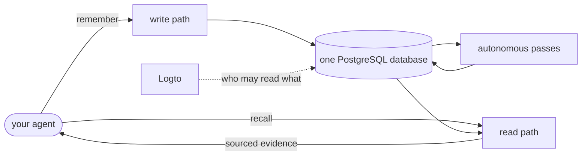

import { CardGrid, LinkCard } from '@astrojs/starlight/components';

These docs come in two halves. The **user half** is for anyone whose agent talks to aizk. It
explains what memory is, how sharing works, and how to write and ask for things so the answers
stay useful. It assumes no database knowledge at all. The **developer half** is for anyone
changing aizk or running a deployment, and it goes down to table columns, job schedules and GPU
budgets.

Every page here is written to be read on its own in ten minutes or less. When a page needs an
idea it does not own, it links the one page that does rather than explaining it again.

## Start here

<CardGrid>
  <LinkCard title="What aizk is" href="/docs/user/what-is-aizk/" description="The shortest complete explanation, in plain language." />
  <LinkCard title="Quickstart" href="/docs/user/quickstart/" description="Connect a client and store your first memory in five minutes." />
  <LinkCard title="Your first hour" href="/docs/user/first-hour/" description="A guided walk from an empty memory to a shared, useful one." />
  <LinkCard title="Glossary" href="/docs/user/reference/glossary/" description="Every term these docs use, defined once." />
</CardGrid>

## Understand what it does

<CardGrid>
  <LinkCard title="Sources and derived knowledge" href="/docs/user/concepts/sources/" description="Why only one of the two kinds of stored thing is authoritative." />
  <LinkCard title="Scopes" href="/docs/user/concepts/scopes/" description="Who can read a memory, expressed as a set rather than a permission list." />
  <LinkCard title="Time and history" href="/docs/user/concepts/time/" description="When something was true, when aizk learned it, and how corrections keep the past." />
  <LinkCard title="Evidence and provenance" href="/docs/user/concepts/evidence/" description="What recall gives back, and why it is never an answer." />
</CardGrid>

## Build on it

<CardGrid>
  <LinkCard title="System map" href="/docs/dev/architecture/system-map/" description="Every moving part on one interactive diagram." />
  <LinkCard title="The data model" href="/docs/dev/store/data-model/" description="The content and claim union behind the whole store." />
  <LinkCard title="How recall runs" href="/docs/dev/read/overview/" description="The seven steps between a question and its evidence." />
  <LinkCard title="Development setup" href="/docs/dev/contributing/setup/" description="A working checkout, a database and the model lanes." />
</CardGrid>

## Run it

<CardGrid>
  <LinkCard title="Hardware and cost" href="/docs/dev/run/hardware/" description="What it takes to run, and how model choices move that number." />
  <LinkCard title="First start" href="/docs/dev/run/first-start/" description="From an empty host to a working deployment." />
  <LinkCard title="The security model" href="/docs/dev/run/security/" description="What a deployment protects, trusts, and fails closed on." />
  <LinkCard title="Backups and recovery" href="/docs/dev/run/backups/" description="What is backed up and what restoring really restores." />
</CardGrid>
