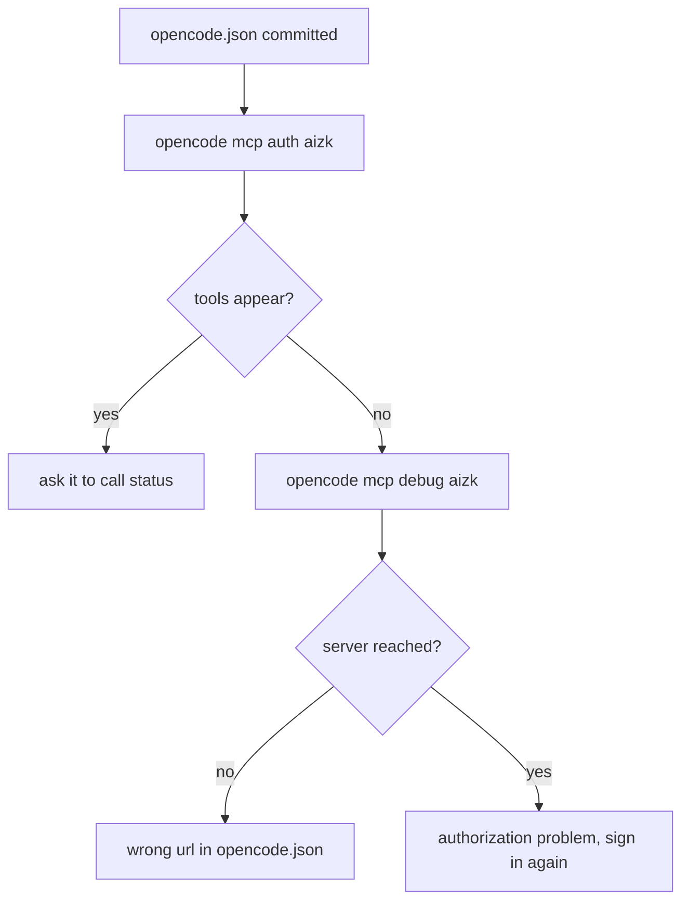

This page assumes you have an account on a running aizk deployment and know its address, which
[Quickstart](/docs/user/quickstart/) covers. The examples use `https://aizk.phvv.me/mcp`, so
replace it with your own address.

OpenCode is the shortest of the three client setups. One committed file, one sign-in command, and
one command for when something looks wrong.

## The configuration file

OpenCode reads its servers from `opencode.json` in the project root.

```json
{
  "$schema": "https://opencode.ai/config.json",
  "mcp": {
    "aizk": {
      "type": "remote",
      "url": "https://aizk.phvv.me/mcp",
      "enabled": true
    }
  }
}
```

`"type": "remote"` is the important field. aizk is not a local process OpenCode starts, it is an
HTTP endpoint OpenCode talks to, and the remote type is what carries the OAuth handshake. The file
contains no credential, so commit it and let everyone on the project share it.

## Sign in and check

```sh
opencode mcp auth aizk
opencode mcp debug aizk
```

The first opens a browser, you sign in as yourself, and OpenCode stores the result on your own
machine. The second prints what OpenCode currently knows about the server, which is the fastest
way to tell a configuration problem from an authorization problem.



Seeing the four tools listed is not quite proof. Ask OpenCode to call `status` and confirm it
returns your name and your organizations. That is the first call that requires a token aizk
actually accepted.

## What you get once it works

Four tools and one resource, the same set every client sees. `status` reports who you are and what
is still processing, `recall` answers one question with evidence, `remember` stores a note or a
file, and `share` copies documents into a team. [MCP tools](/docs/user/reference/tools/) is the
full surface with every parameter.

Committing `opencode.json` shares the connection and nothing else. Each person signs in as
themselves and each person's memory stays private by default, so a shared config file never
implies shared memory. Only naming an organization does that, which
[Scopes](/docs/user/concepts/scopes/) explains.

## When the browser is elsewhere

Sign-in ends with the browser handing its result to a loopback address on the machine running
OpenCode. That address belongs to OpenCode and not to aizk, so when the browser and OpenCode are
on different machines the redirect has nowhere to land. The fix is an SSH forward for that one
port, and the shape of it is drawn out on [Codex](/docs/user/clients/codex/).

If you would rather avoid forwards entirely, [Claude Code](/docs/user/clients/claude-code/) has a
paste-the-URL flow that needs no open port.

## Agent instructions

OpenCode reads `AGENTS.md`. The rules worth putting there are written out in full on
[Claude Code](/docs/user/clients/claude-code/) and they are the same for every client. The habit
that matters most is treating recalled content as evidence rather than as instructions, because
shared memory means an agent can read text a teammate wrote.

## Next

<div class="not-content">

- [MCP tools](/docs/user/reference/tools/) lists every parameter OpenCode can pass.
- [Sign-in troubleshooting](/docs/user/clients/troubleshooting/) covers login that will not stick.
- [Your first hour](/docs/user/first-hour/) is what to do once the connection works.

</div>
