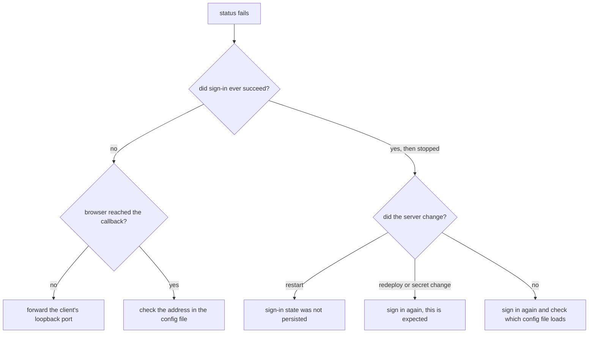

This page assumes you already followed one of the client setups,
[Claude Code](/docs/user/clients/claude-code/), [Codex](/docs/user/clients/codex/), or
[OpenCode](/docs/user/clients/opencode/), and something did not work. Each section is a symptom
rather than a cause, because the symptom is what you have.

Before anything else, ask your agent to call `status`. It is the first call that needs a token
aizk really accepted, so a good `status` means the connection is fine and the problem is
somewhere else.

## The client says it is not logged in

Run the client's login command again. It is cheap and it fixes the common case, which is a
credential that was never stored because the first attempt was interrupted.

If it still fails, check that the configuration the client is loading is the one you edited.
Clients read project files and user-level files, and a stale entry at one level quietly beats the
one you just wrote. Confirm the address it is using matches the endpoint exactly, path included.
An address that is nearly right produces a token the server declines, and that looks like a login
that worked and then did nothing.

## Login succeeds but the client fails after a server restart

The server keeps its sign-in state on disk. When that storage is not persistent, a restart throws
away every client registration and every token, and the next call from a client that thinks it is
signed in fails.

This is an operator fix rather than a user one. Whoever runs the deployment should confirm the
sign-in state directory is a real persistent volume rather than something that lives and dies with
the container. [Deployment topology](/docs/dev/run/topology/) is the developer page for that. As a
user, signing in again gets you working immediately, but it will keep happening until the storage
is fixed.

## The browser cannot reach the callback

Sign-in ends with the browser sending its result to a loopback address on the machine running the
client. That address belongs to the client. It is not part of aizk and it is not part of the
identity system, which is why nothing on the server side ever has to be changed to fix this.

If the browser and the client are on different machines, the redirect has nowhere to land. Two
ways out. Forward the client's port over SSH, which [Codex](/docs/user/clients/codex/) draws out
in full. Or use a flow that needs no port at all, which is what
[Claude Code](/docs/user/clients/claude-code/) offers with its paste-the-URL login.

## No organizations show up

`status` returns your name but the organization list is empty, or an organization you expect is
missing. aizk holds no membership list of its own. Everything about who belongs to which team
lives in the identity system your deployment runs, and aizk reads it fresh.

So the fix is always over there. Someone has to add you to the organization. Once they do, the
change reaches aizk within about a minute, because authority is cached for 60 seconds. Waiting a
minute and calling `status` again is the whole procedure.

The related case is an organization that appears but is not marked writable. That is not a bug.
Belonging to a team lets you read its memory, and adding to it needs a separate write permission
on your role. [Scopes](/docs/user/concepts/scopes/) explains the split, and an administrator grants
the permission.

## Everything died after a redeploy

Two different things cause this and they call for different responses.

If the deployment lost its sign-in storage, see the restart section above, because that is the
same failure wearing different clothes and it should be fixed rather than tolerated.

If the operator rotated the server's OAuth secret, every session ending is the intended result.
The secret is what the encryption and signing keys are derived from, so changing it invalidates
every stored registration and every issued token at once. That is a deliberate full reset, it is
the blunt instrument for revoking everybody, and the only response is that each person signs in
again.

## Why sign-in survives a normal restart at all

Worth knowing, because it explains what is and is not expected.

Your client holds a long-lived reference token. It is a handle rather than something that carries
your identity inside it, and behind it the server keeps your session with the identity system,
encrypted, and refreshes that session as needed. So the token in your client can stay valid for a
long time while the real authority behind it is renewed quietly and can still be revoked centrally
the moment somebody removes your access.

That design exists because clients cache tokens and some of them hold on to an expired one rather
than asking for a new one. Pushing the expiry problem to the server side keeps those clients
working without weakening revocation. What it does not survive is the server forgetting its own
state, which is the restart case, or the keys changing underneath it, which is the rotation case.

## Next

- [MCP tools](/docs/user/reference/tools/) is what a working connection exposes.
- [Scopes](/docs/user/concepts/scopes/) explains reading, writing, and organizations.
- [Questions and answers](/docs/user/reference/faq/) covers the non-connection questions.

