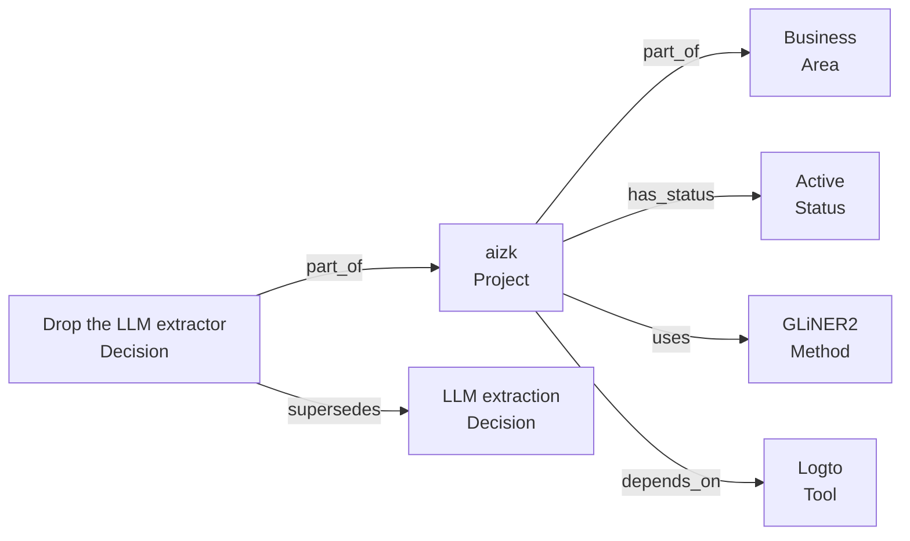

This page is about the derived layer, so it assumes you have read
[Sources and derived knowledge](/docs/user/concepts/sources/). It is also the page that owns the
source tag syntax, so every other mention of tags and declarations links here.

## Named things and statements about them

Reading a note, aizk pulls out two things.

An **entity** is a named thing the note talks about. A person, a project, a paper, a tool, a
method. In the web app these are called Subjects.

A **fact** is one statement linking named things, kept together with the sentence it came from.
Facts are called Findings in the web app. A fact is not a free-floating sentence, it has a
subject, a predicate, and usually an object, which is what makes it something you can traverse
rather than only read.



Every edge in that picture came out of somebody's prose, and every edge remembers the quote it
came from.

## The vocabulary is a live catalog

aizk does not accept arbitrary types. Entity kinds and relation predicates come from a catalog
stored in the database, and a deployment can extend it without touching any code.

The catalog ships seeded across a handful of families. General work has **Project**, **Area**,
**Status**, **Tool**, **Person**, **Decision**, **Pattern**, **Gotcha** and **Goal**. Research
adds **Paper**, **Author**, **Method**, **Model**, **Dataset**, **Benchmark**, **Metric**,
**Result**, **Experiment**, **Theorem** and more. There are coding, finance and personal families
too. Predicates come seeded the same way, with **part_of**, **has_status**, **depends_on**,
**supersedes**, **because**, **contradicts**, **uses**, **proves**, **cites** and **owns** among
them.

Two things follow. Anything the engine reads out of your prose gets mapped onto a kind that
actually exists, and if nothing fits, it lands on the generic **Concept** rather than inventing a
type. And when you declare a type yourself, that name has to be in the catalog or the write is
rejected outright with a message naming the unknown kind.

## Declaring things yourself

The engine will read a plain note and do a decent job. Declaring is how you get an exact result
instead of a decent one, and it costs three lines.

A declaration is a compact block right after the note's level-one heading. Three line shapes are
recognized, and the first line that is none of them ends the block, so ordinary prose below is
safe from being read as metadata.

### `#<kind>: <name>` associates the note with something

```md
# Upload security decision

#project: aizk
#area: Business
```

Each tag connects the note's title to a typed entity through the generic `related_to` predicate.
Tags say "this note belongs in that neighborhood" and nothing more. They never imply status,
ownership, access, or write scope. Tagging a note `#project: aizk` does not put it in that
project's scope and does not mark the project active.

A tag whose name matches the level-one heading is special. It declares the heading itself to be
that kind, so a note titled `aizk` tagged `#project: aizk` becomes the Project entity rather than
merely relating to it.

### `- Type <kind>` declares what the note is about

```md
# aizk

- Type Project
```

This is the explicit form of the same-name tag trick, and it is the clearer one. The kind must
exist in the live catalog. Declaring a type also needs a level-one heading, because the heading
supplies the entity's name.

### `- <predicate> [<object kind>] <object name>` states a relation

```md
# aizk

- Type Project
- part_of [Area] Business
- has_status [Status] Active
- uses [Method] GLiNER2
```

The predicate and the object kind both have to be in the catalog. Relation lines only take effect
when the note has declared its own type, either through `- Type` or through a same-name tag,
because a relation needs a subject to hang from.

Nothing here is mandatory. A note with no declarations is stored as an ordinary note and the
engine reads what it can from the prose. A note with a type and no relations leaves those
connections as honest gaps rather than guesses.

## Perspective, or who a statement belongs to

Not every statement is about the world. Some are about a person.

"The Leech lattice reaches the best known packing in 24 dimensions" is world knowledge. It is true
or false independently of who says it, and two people asserting it are asserting one thing.

"I prefer the smaller model because the latency is easier to live with" is not. It is a
preference, and it belongs to whoever said it. So does an observation somebody made, an experience
somebody had, and an opinion somebody holds.

aizk keeps that distinction on every fact. A statement is either world knowledge or it is bound to
a speaker, and speaker-bound statements are kept apart per person rather than merged. The
practical effect is that two teammates can hold opposite preferences without either of them
looking like a contradiction to be resolved, while two teammates asserting different world facts
genuinely do conflict and should be treated that way.

Alongside perspective, facts also carry the shape of the claim, whether it is a procedure, a
negative result, an observation, and so on. A negative result is worth as much as a positive one
and gets kept as deliberately.

## When the graph earns its keep

Plain search is fine when you know the words you are looking for. The graph is what handles the
questions where you do not.

Asking what a project depends on, what a decision replaced, or which papers used a given method
means walking edges rather than matching strings. Recall does exactly that behind the scenes,
starting from the things your question mentions and pulling in what sits one or two steps away.
That is why a well declared note pays back later, and why the effort belongs at write time.

## Next

<div class="not-content">

- [Writing memory well](/docs/user/using/remember/) puts the tag syntax to work on real notes.
- [Notes that stay useful](/docs/user/using/habits/) covers the writing habits that produce good graphs.
- [Evidence and provenance](/docs/user/concepts/evidence/) shows how facts come back at recall time.

</div>
