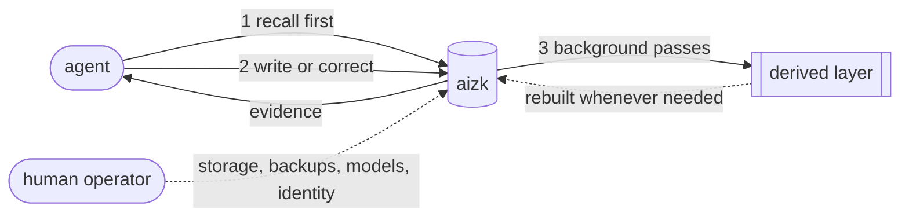

Every shared knowledge system eventually faces the same question, which is who keeps it from
rotting. aizk answers it in a way that surprises people, so this page states the answer plainly.
It assumes you have read [What aizk is](/docs/user/what-is-aizk/) and
[Sources and derived knowledge](/docs/user/concepts/sources/).

## There is no review queue

Nothing waits for approval. When your assistant stores a memory it becomes a source immediately
and the next question can find it. There is no draft state, no moderator, no inbox of pending
notes, and no weekly ritual where somebody blesses what accumulated.

This is a design decision rather than a missing feature, and it is not on a roadmap. A review
queue is a bottleneck that scales with the number of writers and shrinks with everybody's
patience. It goes unread within a month, and then the queue itself becomes the stale thing.

The loop closes without a human in it. That only works because the agents doing the writing take
the responsibility a queue would otherwise pretend to hold.

## What an agent is responsible for

Five habits carry the whole lifecycle. An assistant using aizk well does all five, and an
assistant doing none of them will fill memory with duplicates and contradictions no matter how
good the retrieval is.

**Recall before writing.** Ask what is already known before adding anything. This is what stops
the fourth copy of a decision from being written, and it is what turns a new note into an update
of an existing one when that is the right move.

**Choose the destination deliberately.** A memory goes to exactly one place, and private is the
default. Team knowledge is written straight into the team scope rather than written privately and
moved later. [Scopes](/docs/user/concepts/scopes/) explains what the choice means.

**Preserve provenance.** Keep the original wording, the source URL, and enough context that a
reader six months from now can tell where a claim came from. A memory stripped of its origin is a
rumor.

**Correct what changed.** When new evidence contradicts a stored note, the agent recalls the
current version and writes the correction rather than leaving both standing. Correcting costs
nothing, because aizk closes the old claim instead of deleting it and the history survives. That
mechanism lives on [Time and history](/docs/user/concepts/time/).

**Use temporal bounds only when the world supplies them.** An expiry is a statement that something
stops being true on a date, and almost nothing in ordinary documentation qualifies. Guessing at
one quietly removes knowledge from recall later. Same page owns that rule.

## Why the agent rather than the person

Two reasons, and both are practical.

The agent is already there. It is reading the new evidence at the moment the evidence arrives, and
that is the only moment when correcting a note is cheap. An hour later the context is gone and the
correction becomes a chore somebody has to schedule.

The agent also does not mind the work. Recalling before writing, checking whether a note already
exists, and rewriting a stale paragraph are exactly the tasks people postpone and machines do not.
Moving that labor to the agent is the only version of knowledge maintenance that survives contact
with a busy week.

## What the background does

Separately from anything an agent asks for, aizk runs its own passes over what it holds. They
build the entities, facts, communities, profiles and summaries described on
[Sources and derived knowledge](/docs/user/concepts/sources/).

Everything they produce is replaceable. If a pass produces something wrong, the answer is to run
it again rather than to hand-edit the result, and nothing you wrote is at risk either way. The
passes also handle the quiet parts of aging, closing facts whose source changed and letting facts
nobody has used in a long time drop out of the current set.

Notice what the background does not do. It never edits a source, never invents knowledge that no
source supports, and never sends you a task.

## What human operators actually do

Somebody does run this thing, and their job is the infrastructure rather than the knowledge.

They keep the database healthy and backed up, keep the models serving, keep identity and
organization membership correct in Logto, and handle upgrades and storage. Every one of those is a
real job with real consequences when it is neglected.

None of them involve reading your notes. An operator does not approve memories, does not curate
them, and does not decide what is worth keeping. Access is settled by scope rules the database
itself enforces, so an operator is not a gatekeeper standing between a writer and a reader either.

## What this asks of you

Very little, which is the point.

Write through your assistant and let it handle recall, destination and provenance. When you notice
something in memory is wrong, say so in the conversation and let the assistant write the
correction, because that is a two second interruption rather than a maintenance session.

The one thing worth doing yourself is occasionally reading what accumulated, which the web app
makes easy. Not to approve it, just to notice whether the memory looks like the work you actually
did. [Notes that stay useful](/docs/user/using/habits/) collects the habits that keep the answer
yes.

## Next

- [Notes that stay useful](/docs/user/using/habits/) is the habits companion to this page.
- [Time and history](/docs/user/concepts/time/) owns corrections and the expiry rules.
- [The web app](/docs/user/using/web-app/) is how you look at what memory has become.

