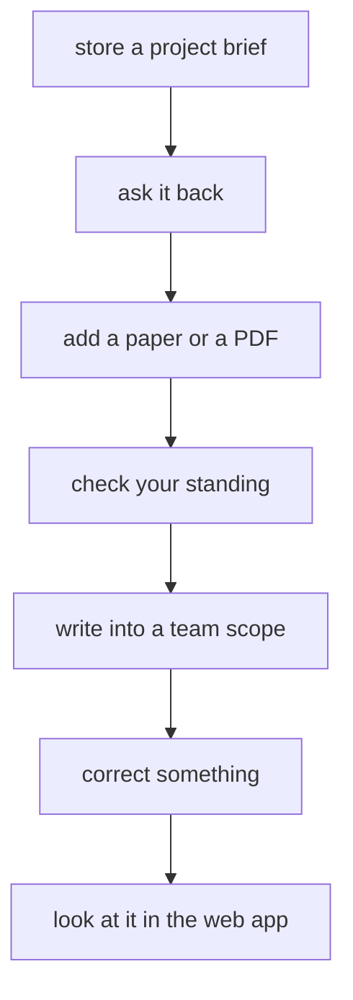

This page picks up where [Quickstart](/docs/user/quickstart/) stops, so it assumes you have a
client connected and one note stored. Nothing here needs to be done in order, but doing it in
order is the fastest way to find out whether aizk is worth keeping.

You will be talking to your assistant the whole time. The tool calls shown are what it sends on
your behalf, and you never have to type them yourself.



## Store a brief worth recalling

Start with the thing you would otherwise explain to a new teammate. One project, its purpose, the
choices already made, and the reasons behind them.

```json
{
  "text": "# Assay validation\n\n#project: Assay validation\n#area: Research\n\n- part_of [Area] Research\n- has_status [Status] Active\n\nWe validate the new binding assay before the summer run. We picked the plate reader over the imaging rig because the imaging rig cannot hold temperature for a nine hour plate."
}
```

Two things are happening. The prose is what recall will hand back later, and the tagged lines
attach the note to named things so related notes find each other.
[Entities, facts, ontology](/docs/user/concepts/graph/) explains the tag syntax and what kinds are
available, and you can safely skip all of it and write plain prose while you are starting out.

Keep it to one topic. If you find yourself writing about a second project halfway down, that is a
second call. [Writing memory well](/docs/user/using/remember/) covers where the line is.

## Ask it back in your own words

Ask straight away, because a text note is searchable as soon as the call returns. Use words you did
not write verbatim.

```json
{ "query": "why did we choose the plate reader for the assay?" }
```

You should get your own sentence back, labeled as a source excerpt. Derived items take longer to
appear, because the statements aizk pulls out of your text are built in the background after the
call returns. They exist to help find the right note faster, and sources always outrank them.
[Sources and derived knowledge](/docs/user/concepts/sources/) explains why both exist.

## Add a real document

A URL is enough. Pass it and no text, and aizk fetches the page or file, scans it, keeps the exact
original, and converts it into something recallable.

```json
{ "source_uri": "https://example.org/binding-assay-protocol.pdf" }
```

This one comes back queued rather than done, because conversion happens in the background. A large
PDF takes a while, and the note becomes recallable when conversion finishes rather than instantly.
[Files, PDFs and web sources](/docs/user/using/files/) covers the size limits and what happens when
a file cannot be converted.

## Check where you can write

Before the first shared write in a session, your assistant should call `status`. It returns who you
are and every organization you belong to, each with a `writable` flag that says whether you may add
to it.

```json
{ "days": 30 }
```

Read the flag rather than guessing. Being able to read a team's memory does not mean you can write
to it, and organization names have to match exactly what identity says they are.

## Write something into the team

Now write a note the team actually needs, straight into the team scope rather than privately.

```json
{
  "text": "# Plate reader booking\n\nThe reader is booked Tuesdays and Thursdays for the assay run through August.",
  "scopes": ["Research Lab"]
}
```

Naming one organization puts it in that team's memory. Naming two produces a note only people in
both can read, which is narrower than either one and not wider.
[Scopes](/docs/user/concepts/scopes/) is the full model, and
[Sharing and organizations](/docs/user/using/sharing/) is the practical side.

If you have something private that turns out to be worth sharing, `share` copies it into a team
scope using the ID `remember` gave you. It makes a snapshot rather than moving the note, so your
private copy stays yours and later edits to it do not travel.

## Correct something

Change your mind about the reader booking and write the corrected version. Do not delete anything
and do not add a note saying the old one is wrong.

```json
{
  "text": "# Plate reader booking\n\nThe reader moved to Mondays and Wednesdays from July, because the Tuesday slot collides with the imaging rig maintenance window.",
  "scopes": ["Research Lab"]
}
```

Ordinary recall now favors the current version. The old one keeps its dates and stays in history,
so asking what the schedule was in June still works.
[Time and history](/docs/user/concepts/time/) explains the two clocks that make this work, and
[Notes that stay useful](/docs/user/using/habits/) explains why correcting beats duplicating.

## Look at what you built

Sign in to the web app and open the dashboard. You will see counts for your sources, findings,
subjects, and themes, a live view of what is still converting, and the newest sources with a badge
showing who can see each one.

The names are friendlier than the ones in these docs. Findings are the facts aizk extracted,
subjects are the named entities, and themes are clusters it found on its own.
[The web app](/docs/user/using/web-app/) tours every screen.

## What an hour should leave you with

Four or five real notes, one converted document, one thing written where a teammate can find it,
and one correction. That is enough to tell whether recall gives back something you would have had
to go looking for otherwise, which is the only test that matters.

## Next

<div class="not-content">

- [Writing memory well](/docs/user/using/remember/) is the next thing to read.
- [Scopes](/docs/user/concepts/scopes/) explains who can read what, properly.
- [Questions and answers](/docs/user/reference/faq/) covers what usually comes up next.

</div>
