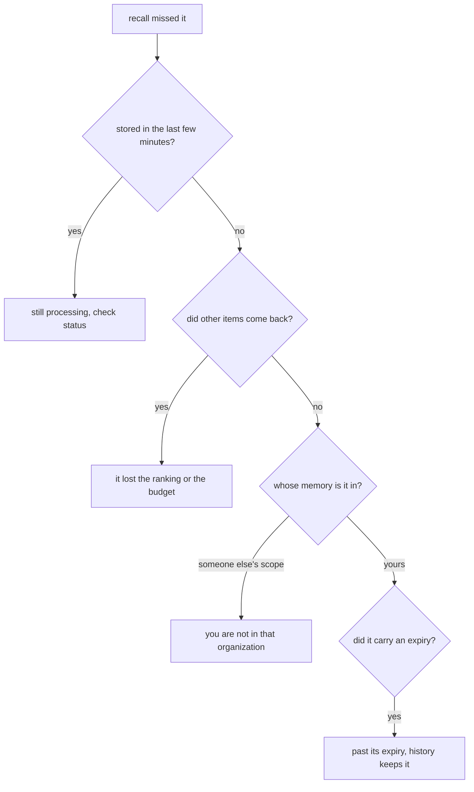

The questions that come up in the first week, answered plainly. This page assumes you have read
[What aizk is](/docs/user/what-is-aizk/). Where the honest answer is a limitation, it says so.

## Does it read my files?

No. aizk never scans a disk, a repository, or a folder. It holds exactly what was handed to it
through `remember` and nothing else.

The honest version of the boundary is one step further out. Your agent can read your files, and
your agent decides what to send. So the rule that actually protects you is the one in your own
agent instructions, which [Claude Code](/docs/user/clients/claude-code/) writes out, including the
line about never storing credentials or secrets. aizk enforces nothing about what your agent
chooses to hand it.

## What happens if I delete something?

There is no delete tool, and that is a real limitation rather than a design flourish. Correction
is the mechanism instead. You store an updated statement, the new version becomes current, and the
old one keeps its dates and stops appearing in ordinary recall.
[Time and history](/docs/user/concepts/time/) covers how that works.

If something genuinely has to go, an operator can retract the derived knowledge a source
contributed and remove the source itself at the database. It is a real capability but it is an
operator command, not something you or your agent can do from a chat. Plan around that when
deciding what to store.

## Can I get my data out?

Yes, and this is one of the better answers on the page. Everything you can see exports to a plain
JSONL file, sources and chunks and derived knowledge together, and preserved originals were kept
byte for byte so they come back exactly as they went in. Underneath it all there is one PostgreSQL
database that you own.

The limitation is that the export is an operator command today rather than a button in the web
app, so getting a copy means asking whoever runs the deployment.

## Why did recall not find my note?

Four usual causes, roughly in order of how often they turn out to be the real one.

Writing returns before the note is searchable. `status` reports how long the queue is and gives a
range for when new material becomes recallable, so check it before concluding anything is wrong.

If other things came back but not the one you wanted, it was found and beaten. Recall returns the
best items that fit inside a token budget, so a thinner note on the same subject can lose to a
richer one. Asking a more specific question usually fixes it, and
[Asking memory well](/docs/user/using/recall/) has the phrasing advice.

If nothing relevant came back at all, check whether the note lives in an organization you belong
to. Recall searches everything you can see, so anything missing was never visible. And check
whether it carried an expiry, because past that time ordinary recall skips it on purpose.

## Why does it return evidence instead of an answer?

Because an answer cannot be checked and evidence can.

A single sentence back from a memory system hides which note produced it, when that note was
written, and whether it was your words or something the engine inferred. Evidence keeps all three.
Each item names its provenance and its scope, so your agent can prefer a source excerpt over an
inference, notice that two items disagree, and tell you which one is newer.

It also keeps aizk out of the reasoning business, which is a job the assistant already does well.
[Evidence and provenance](/docs/user/concepts/evidence/) goes into the labels.

## How is it different from putting notes in a repository?

Four differences that matter, and one honest concession.

A repository note is findable by exact string. aizk is findable by meaning, which is what you
actually have when you half remember a decision from six months ago.

A repository has no notion of who may read what beyond the whole repository. aizk carries a scope
on every row, including the overlap of two organizations, and the database enforces it. See
[Scopes](/docs/user/concepts/scopes/).

A repository has one timeline, the commit log, and it tells you when a file changed rather than
when a statement was true. aizk tracks both separately.

A repository note is trapped in one project. aizk answers across everything you can see at once.

The concession is that for a small project, files plus grep are simpler, faster, and have fewer
moving parts. aizk is not trying to replace them and is worth the setup when memory has to cross
projects, people, or years.

## Does the model see my private memory?

The models aizk itself runs, for embedding and extraction, run on the deployment's own hardware.
Your text is not sent to a model vendor by aizk.

Your assistant is a different matter and worth being clear about. When your agent calls `recall`,
the evidence comes back into that agent's context, and if the agent is a hosted assistant then
that text travels to its provider like everything else in the conversation. aizk does not change
what your assistant does with what it reads. If that matters for a particular note, the decision
belongs at the point of asking rather than at the point of storing.

## What happens when two people write the same thing?

Both sources are kept. Nobody's words overwrite anybody's words.

The derived knowledge converges instead. When two notes produce the same statement, one shared
copy of that statement exists and each scope holds its own claim on it, with its own dates. Inside
a team, that means the fact stops being duplicated even though two people said it.

Statements tied to a speaker behave differently on purpose. An opinion, a preference, an
observation, and a personal experience all stay attached to whoever said them, so two people can
hold opposing views without one erasing the other. Statements about the shared world do not get
that treatment, and a later one supersedes an earlier one.
[Entities, facts, ontology](/docs/user/concepts/graph/) has the detail.

## Is there a review step?

No, and there is not going to be one. Nothing sits in a queue between `remember` and the moment
that memory can be recalled. There is no approval state and no human gate.

That is a deliberate choice rather than missing work. A review queue only functions if somebody
drains it, and a memory that fills faster than a person can approve becomes a backlog instead of a
memory. The correctness work moves to the agents instead. They recall before writing, update a
maintained note rather than adding a competing one, and correct what changed.
[Who maintains memory](/docs/user/concepts/lifecycle/) explains the arrangement, and
[Notes that stay useful](/docs/user/using/habits/) is the practical habit list.

## Next

- [Glossary](/docs/user/reference/glossary/) defines every term used here.
- [Notes that stay useful](/docs/user/using/habits/) is how to keep memory worth reading.
- [Sign-in troubleshooting](/docs/user/clients/troubleshooting/) covers connection problems.

