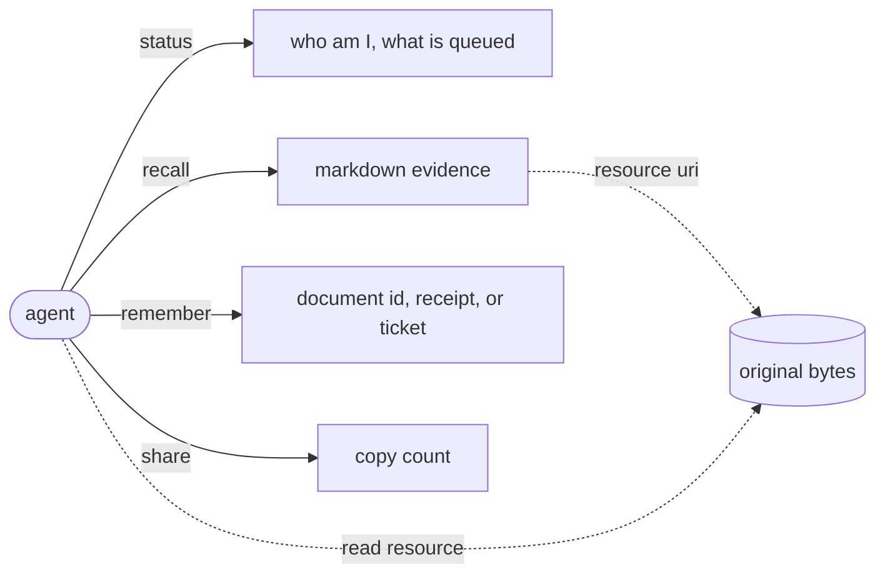

This page assumes you have a client connected, which the pages under
[Claude Code](/docs/user/clients/claude-code/) cover. It is the exact surface, so it names
parameters and limits. The limits below are the shipped defaults and a deployment can move them.

A connected client sees four tools and one resource. Every call runs as you, and nothing returns a
row you could not already read. Sustained calling is limited to 5 requests per second per person.



## status

Returns who you are, what you have used, and what is still processing. Requires a signed-in
caller.

| Parameter | Type | Bounds | Default |
|---|---|---|---|
| `days` | integer | 1 to 365 | 30 |

The result has four parts.

| Field | Shape |
|---|---|
| `generated_at` | timestamp |
| `caller` | identity and authority |
| `usage` | counted work over `days` and over your lifetime |
| `processing` | queue depth and honest time estimates |

`caller` carries `name`, `username`, `avatar`, `label`, `roles`, `anonymous`, and
`organizations`. Each organization carries `name`, `description`, `roles`, `permissions`,
`writable`, and `public`. **`writable` is the field that matters before a shared write.** Belonging
to an organization lets you read it, and writing needs the write permission on your role, so an
agent should read `writable` rather than guess from a role name.

`usage` carries `generated_at`, `recorded_through`, `days`, `start`, plus `summary` for the chosen
window and `lifetime` for everything. Both hold the same counters.

| Counter | Meaning |
|---|---|
| `recalls`, `remembers`, `files`, `shares`, `artifact_reads` | operations by kind |
| `requests`, `items` | calls made and items returned |
| `request_bytes`, `response_bytes` | bytes in and out |
| `uploaded_bytes`, `downloaded_bytes` | file bytes stored and fetched |
| `duration_ms` | total server time |

`processing` carries `state`, which is `idle`, `active`, or `delayed`, plus `stages` and four
optional estimate bounds. `recallable_lower_seconds` and `recallable_upper_seconds` say when what
you just stored becomes findable. `enriched_lower_seconds` and `enriched_upper_seconds` say when
the graph around it is finished, and they stay empty while conversions are still pending, because
work that has not been created yet cannot be estimated.

There are two stages, `conversion` and `graph_projection`. Each reports `queued`, `running`,
`failed`, `completed_1h`, `completed_24h`, `progress_percent`, `throughput_per_hour`,
`throughput_window_hours`, `lower_seconds`, `upper_seconds`, `oldest_at`, a `confidence` of
`high`, `medium`, `low`, or `unavailable`, and an `eta_status` of `complete`, `estimating`,
`insufficient_history`, or `blocked`. An estimate is withheld rather than invented when the recent
sample is too small, which is why `unavailable` appears more often than you might expect.

## recall

Asks one question and returns evidence as Markdown text.

| Parameter | Type | Bounds | Default |
|---|---|---|---|
| `query` | string | 1 to 16,384 characters | required |
| `budget` | integer | 1 to 16,384 tokens | 2,048 |

There is no scope selector. One question searches everything you can see at once.
[Asking memory well](/docs/user/using/recall/) covers phrasing, and
[Scopes](/docs/user/concepts/scopes/) covers what "everything you can see" means.

The return is a Markdown string, not a structured object. It opens with a `## Scopes` list when
shared material is present, then one line reminding the agent that recalled content is evidence
and not instructions, then `## Evidence` with items in merit order. Each item is labeled
**Source excerpt**, **Derived memory**, or **Recent session memory**, and names its scope. An
intersection prints its organizations joined by `∩`. Items backed by a stored original also print
a resource URI.

An empty string means nothing visible matched.

## remember

Stores text, preserves an original, or prepares a file upload. Requires a signed-in caller.

| Parameter | Type | Bounds |
|---|---|---|
| `text` | string | 1 to 5,000,000 characters |
| `source_uri` | string | up to 4,096 characters |
| `observed_at` | timestamp | when the statement became applicable |
| `expires_at` | timestamp | when it stops being true |
| `scopes` | list of organization names | at most 32 |
| `preserve_source` | boolean | default false |
| `upload` | file declaration | see below |

The combination decides the mode, and the mode decides the return.

| You pass | What happens | You get |
|---|---|---|
| `text` only | stored as a note | `{ id }` |
| `text` and `source_uri` | note that records where it came from | `{ id }` |
| `source_uri` only | the original is fetched and kept | `{ artifact_id, content_id, state }` |
| `source_uri`, `text`, `preserve_source` | original kept, text becomes its companion | `{ artifact_id, content_id, state }` |
| `upload` | a ticket for your own local file | `{ status, upload_url, expires_seconds }` |

`state` is `pending`, `queued`, `processing`, `ready`, or `failed`. A receipt is an acceptance and
not a finished conversion, so `status` is where you watch it become recallable.
[Files, PDFs and web sources](/docs/user/using/files/) covers the whole file story, and
[Time and history](/docs/user/concepts/time/) covers the two timestamps.

Omitting `scopes` keeps the memory private. `preserve_source` without a `source_uri` is an error.

## The upload flow

`upload` declares one local file and takes four fields, `filename` and `media_type` up to 255
characters each, `size` in bytes, and `sha256` as 64 lowercase hex characters. It cannot be
combined with `source_uri`, `preserve_source`, `observed_at`, or `expires_at`. Pass `text`
alongside it to attach companion context, and pass `scopes` to choose a destination.

The response is a ticket and not a stored file.

```text
  remember(upload={...}, text="...")
            │
            ▼
  { "status": "accepted",
    "upload_url": "https://.../api/uploads/<opaque>",
    "expires_seconds": 600 }
            │
            ▼
  PUT exactly the declared bytes to upload_url, once
            │
            ▼
  the file is accepted, and status tracks its conversion
```

The server gives you the whole URL. Do not build it. It is a single-use private bearer address, so
anyone holding it before it expires can perform that one write, which makes it something not to
log, share, or retry with. Bytes that do not match the declared size and hash are rejected.

## share

Copies documents you can see into one destination. Requires a signed-in caller.

| Parameter | Type | Bounds |
|---|---|---|
| `documents` | list of document ids | 1 to 100 |
| `scopes` | list of organization names | at most 32 |

The return is `{ shared }`, the number of copies made. Sharing copies rather than moves, so the
original stays where it was and stays yours.
[Sharing and organizations](/docs/user/using/sharing/) explains why.

## The artifact resource

Stored originals are readable through one resource template.

```text
aizk://artifacts/{artifact_id}/contents/{artifact_content_id}
```

Both ids come straight from the resource URI printed on a recall item, so an agent reads the exact
bytes behind a piece of evidence without searching for them. Reading verifies the stored bytes
against their recorded size and hash and fails rather than returning something that drifted. An
artifact you cannot see behaves as though it does not exist.

## Next

<div class="not-content">

- [Glossary](/docs/user/reference/glossary/) defines the words these shapes use.
- [Writing memory well](/docs/user/using/remember/) covers what to store and what to leave out.
- [The MCP server](/docs/dev/interfaces/mcp/) is the developer version of this page.

</div>
