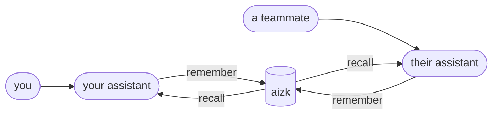

aizk is a memory that you and your AI assistants share. You tell it things worth keeping, it
keeps them, and later any assistant you use can ask for what is relevant and get it back with
the original wording and a note about where it came from.

This page assumes nothing. It is the one to read first.

## The problem it solves

An assistant forgets everything when the conversation ends. You compensate by pasting the same
background in again, or by keeping notes in files that only you can find, or by explaining a
decision for the fourth time because the fourth assistant was not there for the first three.

Meanwhile the useful things are scattered. Some live in a document, some in a chat, some only in
somebody's head. When a teammate needs the reason a choice was made six months ago, there is no
one place to ask.

aizk is that one place, and it is designed so an assistant can use it without you doing anything
by hand.



## What it stores

Two different things, and the difference matters.

The first is **what you actually wrote**, kept exactly as you wrote it. A note, a decision, a
paper, a PDF. aizk never edits this. It is the record.

The second is **what aizk worked out from it**. Reading your notes, it pulls out the things being
talked about, people, projects, tools, results, and the statements connecting them, such as "the
team chose GLiNER2 for extraction". These are derived, they can be thrown away and rebuilt from
your text at any time, and they exist only to help find the right source faster.

Only the first kind is authoritative. If the two ever disagree, your words win.
[Sources and derived knowledge](/docs/user/concepts/sources/) goes into this properly.

## Who can read it

Everything you store is private to you unless you say otherwise. There is no shared pool that
notes drift into.

When you do want to share, you name the organizations a note belongs to. Naming one puts it in
that team's memory. Naming two produces a note that only people who belong to both can read,
which is how knowledge about one collaboration stays inside that collaboration. Reading requires
standing in every organization the note names, and the database itself enforces that rule rather
than the application asking nicely. [Scopes](/docs/user/concepts/scopes/) explains it fully.

## What you get back

Asking aizk a question does not produce an answer. It produces **evidence**, which is a short
ranked list of the most relevant things it holds, each labeled with where it came from.

That distinction is deliberate. An answer hides its reasoning and cannot be checked. Evidence
can be. Your assistant reads the evidence and forms the answer itself, and because each item
names its source and its scope, both you and the assistant can tell a note you wrote last week
from something the engine inferred.

```text
  you ask   "why did we drop the LLM extractor?"
                     │
                     ▼
  ┌──────────────────────────────────────────────────────┐
  │ ## Evidence                                          │
  │                                                      │
  │ - Source excerpt · scope Toshiba                     │
  │     We moved extraction to GLiNER2 because the LLM   │
  │     lane cost 4.1 s per chunk and GLiNER2 costs      │
  │     0.3 s at the same grounding rate.                │
  │                                                      │
  │ - Derived memory · scope Toshiba                     │
  │     [aizk, world] (uses) aizk uses GLiNER2.          │
  └──────────────────────────────────────────────────────┘
                     │
                     ▼
  your assistant writes the answer, and can show its work
```

The response is also budgeted. aizk returns the most relevant items that fit inside a token
limit, so it never floods your assistant's context window with everything it knows.

## It remembers when things were true

A memory is not just text, it also carries time. aizk records when something was true in the
world and, separately, when it was told. Correcting an old note does not erase it. The old
version keeps its dates and the new one starts its own, so you can still ask what the team
believed in June and get June's answer. [Time and history](/docs/user/concepts/time/) covers
this.

## Where it runs

On your own hardware. One PostgreSQL database holds every byte, the language models run locally
on your own GPUs, and nothing is sent to a vendor. If you turn it off, your memory is still a
database file that you own.

## What it is not

It is not a search engine for your files. Plain text search is faster and simpler when you know
the exact string you want, and aizk is not trying to replace it.

It is not a chatbot. It stores and retrieves, and the assistant does the talking.

It is not a document manager. Original files are kept safely and immutably, but the point is the
knowledge in them, not the filing.

## Next

<div class="not-content">

- [Quickstart](/docs/user/quickstart/) connects a client and stores your first memory.
- [Your first hour](/docs/user/first-hour/) walks from an empty memory to a shared, useful one.
- [Glossary](/docs/user/reference/glossary/) defines every term these docs use.

</div>
