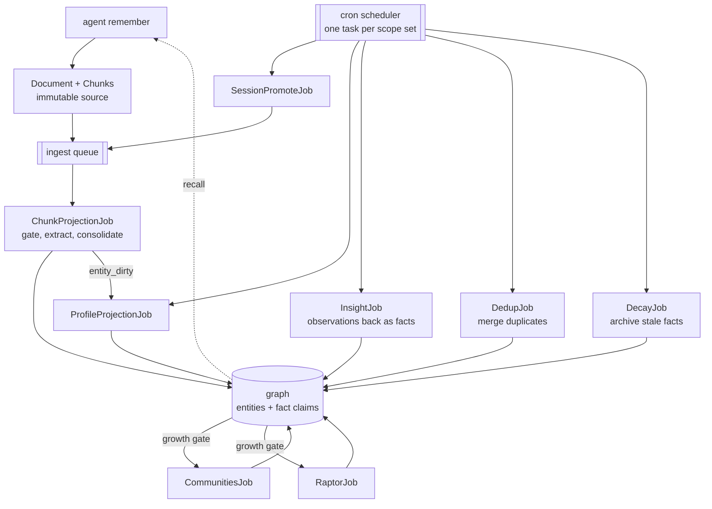

AIZK has no review system and will not gain one. Agents decide what to remember, where it belongs,
and when changed evidence requires a correction. A successful write becomes a source immediately.
The autonomous engine maintains rebuildable projections and operational health rather than judging
whether knowledge deserves acceptance. Human operators maintain infrastructure rather than process
memory.

A write drops an immutable source into the store, the ingest queue projects it into the graph, and
scheduled passes keep that graph correct and current. The loop has two entry points, the on-write
queue and the cron scheduler, and every derived pass feeds the same graph that recall reads back.

Maintenance never runs in a caller request. A pgqueuer worker drains durable jobs and a cron
scheduler fans scheduled passes out once per exact scope set. Each job binds authority for only
that scope set before it opens an application session.

Application jobs declare a typed payload, a stable entrypoint, priority, concurrency, and retry
budget through the shared queue package. The package owns serialization, deduplication, database
connections, and PgQueuer registration. New background behavior therefore states policy in one
job class instead of repeating queue plumbing.

The scheduler discovers its roster from stored documents and unpromoted working memory under the
database administrator role. It does not need a user or organization table. Scope-keyed
watermarks debounce passes whose corpus has not changed.

Graph consolidation ranks only a bounded current fact set in PostgreSQL. The final transaction
locks each exact scope, subject, and perspective slot, reruns that ranking, and writes only when it
still matches the model-time snapshot. A concurrent change replans the candidate instead of
applying a stale ADD or UPDATE. Content rows mint in one batch on the normal path, while an actual
deterministic ID race falls back to isolated savepoints because RLS-hidden content cannot safely
use `ON CONFLICT`.

| Pass | Work | Trigger |
|---|---|---|
| graph build | gate, extract, consolidate, and write each pending chunk | ingest queue |
| session promotion | copy old or overflowing working memory into the graph pipeline | schedule |
| dedup | merge duplicate entity content without losing any scoped claim | schedule |
| decay | archive stale and rarely accessed facts from default recall | schedule |
| communities | detect entity clusters and write thematic summaries | growth gate |
| RAPTOR | build recursive summaries above communities | growth gate |
| profiles | refresh rolled-up entity descriptions | schedule and write queue |
| insights | derive higher-level observations and write them back as facts | schedule |
| backup | write and prune database backups | schedule |

Profile projections run at priority 100 with a small fleet-wide concurrency limit. Chunk graph
projections run at priority 50. Scheduled maintenance runs at priority 10 and allows one active
job of each kind. A job retries from the database up to five times. Exhausted jobs remain held
with their deduplication key, which prevents a poison job from being silently recreated until an
operator or agent deliberately resolves or requeues it.

An A-and-B job binds A and B as its read authority, so RLS supplies A, B, and bridge knowledge. It
writes derived artifacts to the exact A-and-B scope set. Creator identity is provenance only and
is not the maintenance partition.

## Operations

`aizk admin database setup` migrates to head, installs the queue schema, and grants the application role.
Compose runs it in the one-shot `setup` service before either long-lived Aizk process starts. The
public `server` has `AIZK_AUTO_SETUP=0` and no owner credential. The private `worker` owns queue
execution, scheduled maintenance, and backups.

`aizk admin health` reports migration currency, row security drift, row counts, queue depth, model
identity, per-scope projection progress, and one bounded recall. Operational commands are CLI-only
and are not registered on the network MCP server. In Compose, run the command inside `worker`
because only that private process carries owner maintenance authority.
