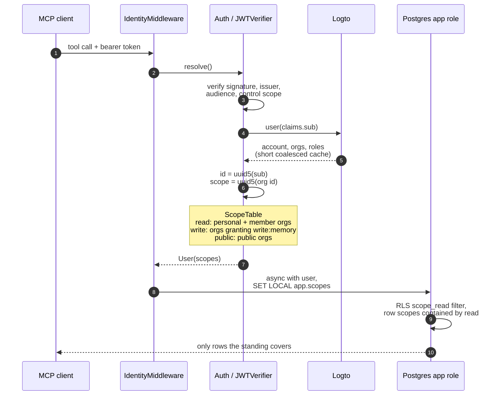
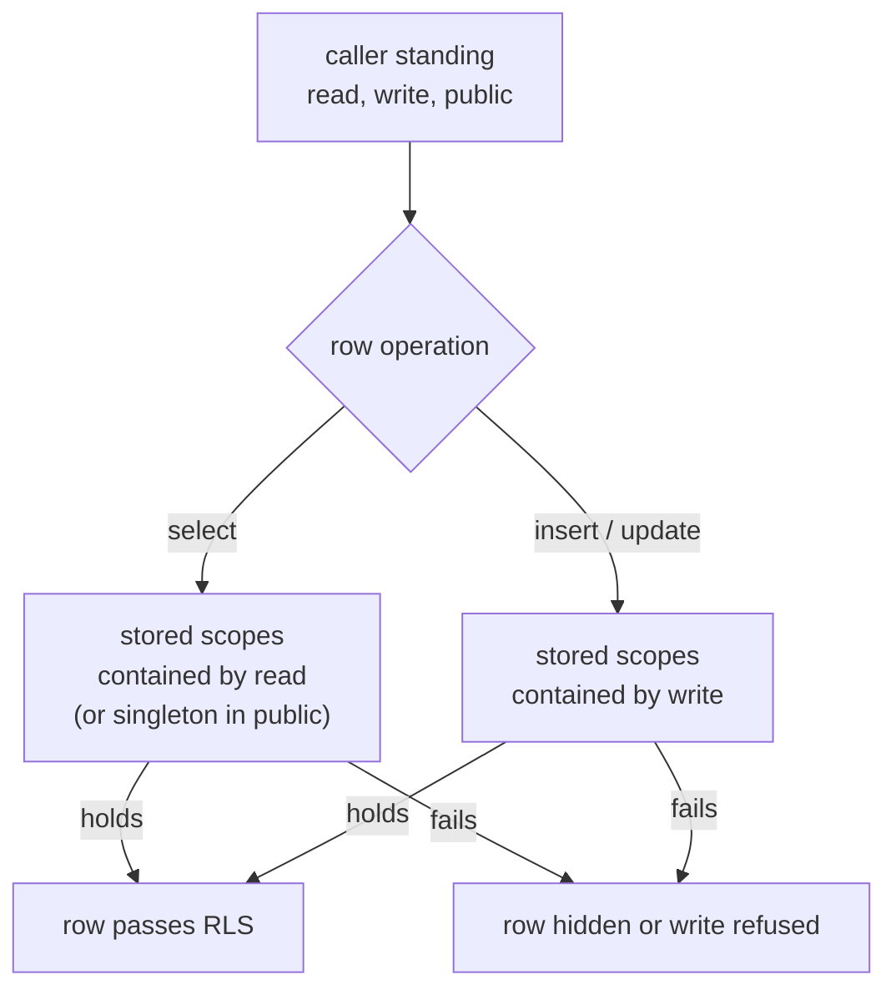

This page records the implemented identity boundary. The consolidated `0001_init` schema contains
no user, organization, membership, role, or owner authorization table. The Logto boundary and
multi-organization scope lattice are durable product rules.

One request walks the whole boundary. A verified token names a subject, Logto returns that
subject's current organizations, both become stable UUID5 scopes, and those scopes ride into the
transaction where PostgreSQL turns them into a row filter it enforces itself.

## Logto owns identity

Logto is the only source of truth for users, organizations, memberships, roles, and permissions.
aizk must not add mirror tables for any of them. A verified Logto access token establishes the
subject while the Logto Management API returns that subject's current organizations and roles.
Stable UUID5 values derived from the signed `sub` and Logto organization IDs let Postgres use UUID
columns without a lookup table. `settings.identity_url` owns the namespace base while
`settings.subject_id()` and `settings.scope_id()` make the Aizk-owned mapping explicit.

An MCP resource token must pass signature, issuer, expiration, audience, and required `control`
scope checks. It does not need a custom multi-organization claim. MCP authority uses a short
coalesced cache so repeated tool calls do not query the Logto Management API for the same directory
on every request. Membership and role changes therefore reach MCP after that bounded cache expires.

Browser and organization-management authority is deliberately different. It is loaded without the
MCP authority cache for each browser identity resolution and each management decision. A browser
request therefore sees account suspension, account deletion, global role removal, membership
changes, and effective organization permission changes on its next protected request. Successful
organization mutations also evict cached authority for the acting user, the affected user, the
organization member directory, and the public organization catalog.

## One subject resolves multi-organization standing

A standard Logto organization access token represents one organization. It carries one
`organization_id` and the effective scopes for that organization. That shape cannot prove that a
caller belongs to both organization A and organization B in one MCP bearer token.

Instead of changing the token, MCP `Auth` validates the ordinary Aizk resource token and passes its
claims to `LogtoClient`. The cached MCP path reads the user profile and global roles, then calls
`GET /api/users/{userId}/organizations` for current memberships. For each organization it reads
the complete member directory and calls `GET /api/organizations/{id}/users/{userId}/scopes` for
effective permissions. A short coalesced TTL cache bounds request volume and membership staleness.
A failed refresh closes shared authority instead of constructing authority from incomplete Logto
data. The personal scope remains valid on the MCP path because it comes from the verified subject,
not from an organization lookup.

Only the trusted Logto endpoint is configured. `LogtoClient` obtains the issuer, JWKS URI, token
endpoint, and accepted signing algorithms from its validated discovery document. The public MCP
base URL remains configured because it is the server's own trust boundary and cannot safely be
learned from an unverified token. Aizk derives its audience by adding `/mcp` to that URL.

Organization role names have no direct authorization meaning inside AIZK. Every returned
membership grants read standing. Logto's effective organization permissions determine write
standing through the deployment-configured `write:memory` permission. The MCP `status` tool
returns the same cached MCP `User`. Its Pydantic organization models preserve Logto names,
descriptions, custom data, members, roles, and effective permissions. Cached properties index
writable and public organizations without creating identity tables. Status omits emails, phone
numbers, linked identities, and internal IDs because they do not help an agent choose a memory
scope.

Global roles and organization roles are separate authorization layers. The default global
`aizk-user` role grants the AIZK API `control` permission used by MCP and is also the explicit
application-access gate for the browser. A fresh browser resolution rejects a user when the
account is missing, `isSuspended` is true, or the current global roles do not include
`aizk-user`. This role never grants a write into every organization. An organization role such as
editor becomes writable only when its organization template assigns `write:memory`. The distinct
checks keep service access separate from collaboration writes.

`src/deploy/logto.conf` declares the AIZK-owned API resource, API permissions, default global user
role, organization roles, and organization permissions. Admin receives `write:memory`,
`manage:member`, and `delete:member`. Editor receives only `write:memory`, while viewer receives no
write or management permission. AIZK has no invitation workflow. The retired `invite:member`
permission is revoked from managed roles and removed by policy reconciliation.

Every field is an `AIZK_` setting that `.env` can override. `aizk logto audit` reports drift and
exits nonzero when repair is needed. `aizk logto apply` reconciles the policy through the Logto
Management API. It deletes obsolete global user roles under the configured managed prefix and
explicitly retired AIZK organization permissions while preserving unrelated roles and permissions.

## Scope sets are the collaboration model

The `scopes uuid[]` column is intentional. It is not a denormalized substitute for one
organization foreign key.

- A personal scope derived from `sub` holds private memory.
- One organization scope holds ordinary team memory.
- The set containing A and B holds the bridge visible only to members of both.

Every target row has a nonempty, sorted, duplicate-free scope set. The caller standing contains
their personal scope and every organization scope currently returned by Logto. A row is readable
when its whole scope set is contained by the caller's readable standing. Retrieval never accepts a
second scope selector. A user in A and B automatically reads personal, A, B, and A-and-B rows.
Writes choose one destination separately and require its complete scope set to be contained by the
caller's writable standing.

The same containment test decides both directions, so read standing and write standing become one
enforced row filter rather than an application check.

The application represents this once as `User.scopes`. Its `read`, `write`, and `public` fields are
frozen sets validated by Pydantic. `async with user` opens one short app-role transaction, applies
the user's RLS settings transaction-locally, and exposes the caller as `Session.user`. `user.app`
provides the same explicit transaction object. `user.session()` exists only for workflows that
need several explicit transactions or savepoints on one session. `user.exec[Model]` runs one typed
statement and validates its rows into the selected Pydantic model.

Background work uses `User.system(scopes)` over an explicit scope set. Only that system identity
may open `user.owner`, which connects through the database owner for migrations, backups, or the
scope roster. Owner authority is a connection privilege and never a stronger bearer token. The
public MCP process receives no usable owner URL or password, so request handling cannot choose
this path even after an application defect.

`User.write_scope()` defaults to the personal singleton. MCP writes may pass Logto organization
names to select one organization or an explicit intersection. The method resolves those trusted
names to stable scope IDs and refuses any destination outside `User.scopes.write`.

This removes `owner_id` from authorization without removing private memory. `created_by` remains
as immutable provenance derived from the signed subject, never as an access-control shortcut.

## Public organizations stay singleton public

An organization may set `customData.public` in Logto. Public status makes only that
organization's singleton scope world-readable. It must not satisfy one member of a compound
scope. A row in A and B remains restricted to authenticated members of both even when A itself is
public.

Public status never grants write standing. A caller may write into a public organization only when
they are a member and their effective Logto organization permissions include the configured
`write:memory` permission. A public reader who is not a member has the organization ID only in
`User.scopes.public`. A writer has it independently in `User.scopes.write`. `User.write_scope()`
checks the write set before opening a transaction, and forced PostgreSQL row security repeats that
check for insert and update.

The client lists organizations through the Management API and retains only entries whose
`customData.public` value is exactly true. It uses an M2M application with the Management API
`all` permission and HTTP Basic client authentication. Failure closes access by yielding no public
organizations. FastMCP's OAuth proxy still requires a valid bearer, so public means visible to
every authenticated caller rather than an unauthenticated internet endpoint. The anonymous User
exists for local auth-off operation and policy tests.

## Browser signup and current account access

The optional browser has separate login and email-first signup actions. Both delegate credentials,
verification, consent, and session establishment to Logto. A successful callback stores only a
signed Logto subject and expiry in the AIZK HttpOnly cookie. Before that cookie is issued, AIZK
requires a current, unsuspended Logto account with the global `aizk-user` role. Every protected
browser action repeats that fresh check rather than trusting account state or roles captured at
login. A confirmed access failure returns an unauthorized response. An unavailable Logto authority
returns a service-unavailable response instead of silently granting or removing access.

A new account receives the default `aizk-user` role, its private memory scope, and read access to
singleton public organizations. It receives no organization membership and no shared write access.
The browser adds only an existing Logto account. An administrator enters the account's exact email,
AIZK resolves one exact match without exposing the tenant directory, adds that user to the chosen
organization, and assigns one configured organization role. It does not create an account or send
an invitation. The administrator can replace a current member role or remove another member only
when fresh effective permissions allow it. AIZK refuses self-removal and any demotion or removal
that would leave the organization without an administrator.

Deployers can disable Logto self-registration and provision accounts separately while keeping the
same login flow. Email verification, request throttling, and abuse controls should be enabled
before opening registration because recall invokes database and model work.

`Sign out of AIZK` clears only the AIZK cookie. The browser intentionally does not retain the ID
token required for OpenID Connect relying-party logout, and it does not pretend that a local action
ended the user's centralized Logto session. The hosted Logto Account Center owns profile,
credential, MFA, authorized application, and global session management. A later AIZK sign-in may
therefore complete immediately while the Logto single sign-on session remains valid.

True unauthenticated reading is a different feature and is not enabled. The safest public interface
for general documentation remains the static website. If unauthenticated semantic recall is added,
it should use a separate read-only surface that exposes only `recall`, binds the anonymous sentinel
with no personal or writable scopes, reads singleton public organizations only, and carries strict
rate and budget limits. It must not expose `status`, `remember`, or `share`.

## Background work follows the same scope set

The unit of maintenance is a canonical scope set rather than a row creator. Queue payloads,
watermarks, profiles, communities, RAPTOR reports, and insights must all use that scope set as
their partition key.

An A-and-B job binds read authority for A and B, which composes A, B, and bridge knowledge through
the same RLS containment rule. Derived artifacts from that pass are written into the exact A-and-B
scope set. A queued job must carry its authorized scope set. A user ID alone is insufficient
because it loses the organization standing needed for shared writes. Unique constraints,
deduplication, watermarks, profiles, queue payloads, and background rosters therefore all use the
same canonical scope key.

## Logto references

- [Python integration](https://docs.logto.io/quick-starts/python)
- [Get organizations for a user](https://openapi.logto.io/dev/operation/operation-listuserorganizations)
- [Get user](https://openapi.logto.io/operation/operation-getuser)
- [Get roles for user](https://openapi.logto.io/operation/operation-listuserroles)
- [Get organization members](https://openapi.logto.io/operation/operation-listorganizationusers)
- [Get effective organization permissions for a user](https://openapi.logto.io/operation/operation-listorganizationuserscopes)
- [Management API](https://docs.logto.io/integrate-logto/interact-with-management-api)
- [Organization webhook events](https://docs.logto.io/developers/webhooks/webhooks-events)
