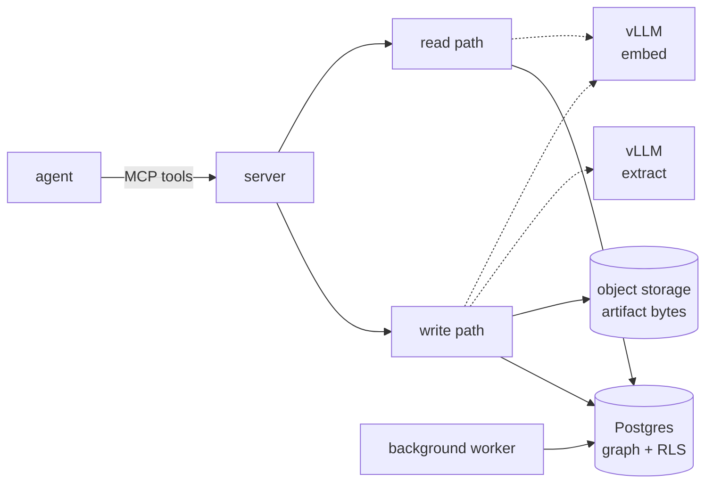

aizk is a self-hosted shared brain. One Postgres holds a bi-temporal knowledge graph under
forced row level security, so private notes, project scopes, and implicit intersection graphs
never cross, and every capability is an MCP tool an agent calls. Nothing leaves the building.
New to a term on this page? [Concepts](/concepts) covers the vocabulary in plain language
first.

The engine splits into six parts, each with its own page.

- [Write path](/engine/write-path), how text and guarded artifacts become a knowledge graph
- [Store](/engine/store), the content and claim union model, artifacts, and the bi-temporal core
- [Identity](/engine/identity), the Logto boundary and multi-organization authority lookup
- [Lattice](/engine/lattice), the scope-set visibility model row level security enforces
- [Read path](/engine/read-path), five retrieval lanes fused into one recall call
- [Autonomy](/engine/autonomy), the background passes that maintain the graph

The measured results live in [Benchmarks](/benchmarks), the honest side-by-side against
grep, qmd, and the engines the papers came from lives in [Comparison](/comparison), and
the map from every mechanism back to its source lives in [References](/references).

## Two governing principles

**Agentic first.** The memory contract lives once in the engine and is exposed over MCP. The
optional browser gives a person the same authorized recall, artifact intake, statistics, and
organization management without creating a second knowledge path.

**Minimize own work.** aizk builds only the differentiated core, the RLS temporal graph, and
rents everything else. Identity and organization authorization are Logto, serving is vLLM,
conversion is Docling, object bytes are SeaweedFS, malware scanning is ClamAV, the queue is
PgQueuer, and the ORM is SQLModel.
